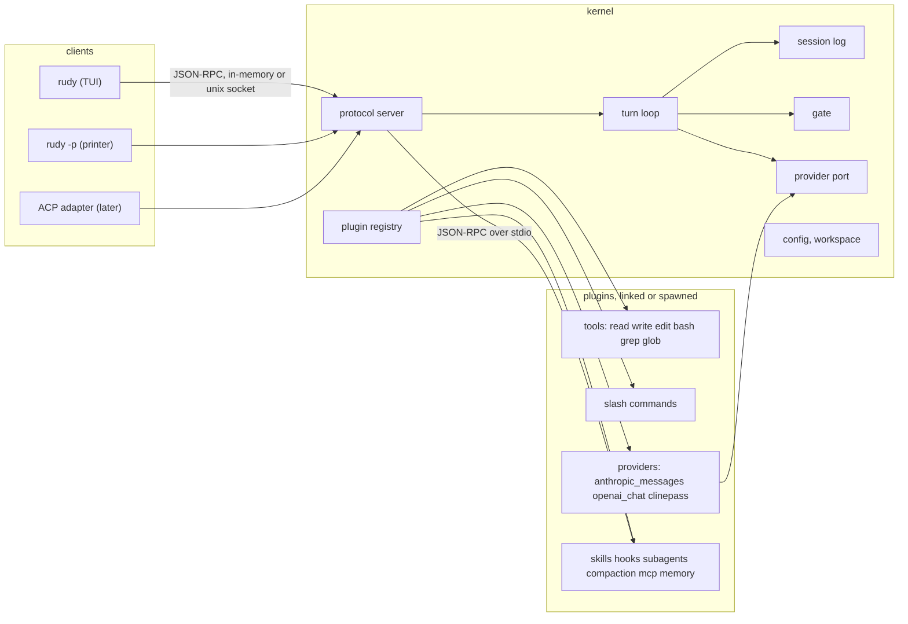

# rudy design

- Status: approved in design session, pass 1
- Date: 2026-09-07
- Companion artifacts: [context map](rudy-context-map.md), [domain model](rudy-domain-model.md), [contracts](rudy-contracts.md), [ADRs](../adr/)

## What rudy is

A coding agent harness in Go. One binary that runs a model-driven loop over a
workspace with tools, sessions, permissions and plugins, fronted by a terminal
client the owner controls down to the glyph, and runnable headless or as a
server without changing the loop.

## Bar

rudy replaces pi when all of these hold. They are the acceptance criteria, taken
from what the owner had to patch into pi.

- Render control is config, not patches: tool rows, spacing, header, footer,
  status and widget slots each have an owner and a config field.
- Mouse works for row expand and wheel scroll.
- Config lives under XDG and the harness never rewrites it.
- A plugin that fails to load degrades with a notice; it never refuses boot.
- Every provider request carries a session id and a real User-Agent.
- The model registry is discovered from each provider's `/v1/models` with
  prices and context windows; config holds only a default model.
- Headless mode and subagents run the same loop as the TUI.
- Skills, agent definitions and memory come from `~/.agents`, shared with every
  other harness on the machine.
- vim editing in the prompt by default.

## Non-goals for v1

- Claude subscription login. Every model the owner runs arrives through the
  aperture proxy or a local server. Third-party OAuth is a policy violation
  regardless.
- Allow and deny rule patterns for permissions. Modes only.
- LSP, tree-sitter, sandboxing, ACP for editors. Each is a plugin slot left
  open, not a v1 deliverable.
- WASM plugins. The interface admits them later without change.
- Postgres. The session log is a file. See ADR 0004.

## Architecture



One binary, one protocol. The TUI is a client. It embeds the server in-process
over an in-memory transport by default, attaches to a unix socket when
`rudy serve` is running, and a spawned plugin gets the same protocol over stdio.
This is the shape Codex moved to: its TUI depends on an app-server client and
tries an explicit endpoint, then a local daemon with a 50ms timeout, then an
embedded server. Claude Code stays single-process. rudy gets both from one
seam. ADR 0002.

The kernel is what a plugin needs to exist. Everything else, including every
built-in tool and slash command, is a plugin registered through the same
interface an external plugin uses. Built-ins have no private path. ADR 0005.

No framework under the loop. No agentcore, no ADK, no jess import. Two rules
from jess survive as code in the kernel: no asker means deny, and an unsafe
tool runs only after its allow entry is appended and fsynced. ADR 0003.

## Session

A session is a directory `$XDG_DATA_HOME/rudy/sessions/<ulid>/` holding one
append-only `entries.jsonl` and a `blobs/` directory of content-addressed
images referenced by hash. Model, mode, thinking level, title, workspace and
usage are derived from the log; nothing else is stored. A `flock` on the
directory keeps a second process out; it gets `unavailable` and the socket
path to attach through instead. A fork is a new session
whose first entry is a `fork_point`; entries before it are read from the parent
and never copied, and a parent with children refuses deletion. On resume, an
allow entry with no result gets a `tool_result` with outcome `lost`. Tool inputs
and thinking signatures are stored as raw bytes. ADR 0004, entry kinds and the
Turn state machine in the [domain model](rudy-domain-model.md).

## Permissions

Three modes, an enumeration. ADR 0009.

| mode | unsafe tool | safe tool |
|---|---|---|
| strict | ask the attached asker; no asker means deny | run |
| permissive | run, except the dangerous set, which asks | run |
| off | run | run |

Every tool carries a safety class, one switch that drives both the gate and the
durable-record rule. In all modes a `permission_decision` entry precedes an
unsafe tool's execution. An answer carries a scope, once or for the session;
session allowances live only in the log and are rebuilt from it on resume. A
client declares whether it can act as asker in its `client.hello`, so the gate
knows before the first tool call whether strict mode will ask or deny. The
dangerous set for permissive mode is open.

## Providers and registry

Two wire kinds as codecs: `anthropic_messages` and `openai_chat`. Provider
adapters are plugins that pick a codec and add a dialect. The first dialect is
clinepass, whose non-streaming responses arrive wrapped in `{"data": …}`,
whose errors arrive as `{"error", "success": false}` and whose reasoning
arrives in `reasoning` and `reasoning_details`. ADR 0010.

The registry is discovered from `/v1/models` per provider on session open, on
picker open and on a model-not-found error. No timer. The aperture proxy's
entries carry `context_window_tokens`, `max_output_tokens`, `pricing` and
`display_name`; bare providers get catwalk's embedded data as enrichment keyed
by id. Config names providers and one default model, never model lists. Secrets
are references resolved from the 1Password cache. ADR 0007.

Every request carries `X-Rudy-Session` and a User-Agent naming rudy, its
version and the platform. Transient failures retry with backoff and honor
`Retry-After` in both forms.

## Plugins

Linked plugins are Go packages compiled in. Spawned plugins are subprocesses
speaking the protocol over stdio, any language. Both implement one interface;
the protocol is a transport over it. A plugin registers tools, slash commands,
hook handlers, widgets, status items and providers. A duplicate tool name is
refused with a notice and the plugin still loads. The first built-in slash
command is `/init`, the Claude Code shape: it inspects the workspace and writes
`./AGENTS.md`, and `rudy -p "/init"` runs it headless.

Hook points, a closed set: `session_opened`, `before_turn`, `before_request`,
`after_response`, `before_tool`, `after_tool`, `turn_completed`,
`session_closed`. What each handler may return is in the
[contracts](rudy-contracts.md).

Spawned plugin manifests are discovered from `$XDG_DATA_HOME/rudy/plugins/`
(what `rudy plugins install` writes), then `$XDG_CONFIG_HOME/rudy/plugins/`,
then the workspace's `.rudy/plugins/`, the first manifest for a name
winning. A
user-installed plugin therefore shadows one a repository ships, not the other
way around. Other discovery roots, in precedence order: workspace `.rudy/`,
then `$XDG_CONFIG_HOME/rudy/`, then `~/.agents/`. Skills are read from
`~/.agents/skills` and the workspace's `.agents/skills` only. First boot offers
to migrate skills from `.claude/skills` and pi's skill directories, and
`rudy skills migrate` does it on demand. Agent definitions are read from
`$XDG_CONFIG_HOME/rudy/agents/` and the workspace's `.rudy/agents/`; whether
`~/.agents/agents/` joins them is open, since no cross-harness convention
covers agent definitions yet. `AGENTS.md` is read from the workspace and from
`~/.agents/AGENTS.md`.

The system prompt is the base paragraph, then a `## Tools` list of the tools that
turn actually offers, one line each from the tool's own description, then the two
`AGENTS.md` sections, then whatever a `session_opened` hook returned as context,
which is where the skills list comes from. An agent definition's body replaces the
base paragraph and nothing else, so a subagent keeps the workspace's instructions
and gets its own narrower tool list.

## Memory

A Go SDK for the OKF bundle, `memory-go`, living with the memory project so
every Go harness can use it. rudy's memory plugin imports it. Index and concept
rendering must be byte-identical to the Node implementation, proven by golden
tests, because both write the same git-synced bundle. Fold's model call is a
port the plugin satisfies from the Provider context. Sequenced before rudy's
memory plugin. ADR 0008.

## Client

The TUI is Bubble Tea v2 with the charm.land v2 stack pinned exactly. It opens
full screen, owning the terminal until it exits, and `ui.render = "inline"`
draws in native scrollback instead. The default screen, from the owner's spec:

```
 › fix the flaky fork test

   Looking at the test first.

 ▸ bash  go test ./internal/session -run TestFork -count=3
     --- FAIL: TestFork (0.01s)
     fork_test.go:41: want 3 entries, got 2
 ▸ edit  internal/session/fork.go
   -	entries := s.entries[:at]
   +	entries := s.entries[:at+1]

   Off by one in the slice bound. Fixed and green.

 ┃
 INSERT  sonnet-5  strict  42%  $0.12  rudy main*
```

Rules: no painted backgrounds, the terminal's black shows through. User message
is one prefix glyph and no padding. One blank line between assistant blocks.
Tool calls fold to one row plus a two-line preview; bash shows the last two
lines of output, edits show the first hunk as red and green text, read, grep and
glob show a one-line count. Thinking hidden. Every row and the status line sit
one column in, the gutter the screen above draws. Icons come from `[ui.icons]`: the branch
in the workspace cell, the model, the context, one per tool on a tool row and
one per notice level. Status under the input, vim
mode first and `turn` last: a spinner and one word for what the turn is doing
(`thinking` until an answer streams, then `streaming`, `tool`, `steering`,
`waiting`), drawing nothing at rest. Enter or a click expands a row. A permission
question renders inline where the tool row would be. Assistant markdown renders
through glamour with chroma on fences, sanitized on the way in so nothing a model
wrote can move the cursor.

Every choice is a config field with the default that produces that screen:

```toml
[ui]
render = "altscreen"
vim = true
double_press_ms = 500

[ui.layout]
slots = ["transcript", "input", "status"]

[ui.input]
rules = true

[ui.header]
show = true
animate = true
frame = true
greeting = true
mark = true
name = ""
facts = ["model", "thinking", "workspace"]
tips = 2
updates = 3
max_width = 120

[ui.transcript]
tool_collapsed = true
tool_preview_lines = 2
thinking = "hidden"
user_prefix = "›"
block_gap = 1

[ui.diff]
style = "text"

[ui.status]
items = ["vim_mode", "model", "permission_mode", "cost", "workspace", "turn", "cat"]

[ui.notices]
max = 3
ttl_ms = 8000

cats = true

[ui.icons]
set = "nerd"

[ui.theme]
name = "default"
accent = "#7aa2f7"
text = "#c0caf5"
muted = "#565f89"
user = "accent"
assistant = "text"
tool = "muted"
success = "#9ece6a"
error = "#f7768e"
warning = "#e0af68"
diff_add = "success"
diff_del = "error"
shell = "warning"
code = "chroma:tokyonight-night"
```

Slots have owners. A status item or widget is registered by a named plugin and
the config decides whether and where it shows. No plugin can clear another's.
A header is a slot a plugin or the config adds; a startup banner renders once.

Keys are pi's defaults under pi's action ids in a `[keys]` table, so an existing
`keybindings.json` translates one to one and `rudy keys migrate pi` does it. The
ids rudy binds are the closed set ADR 0013 decision 5 lists; an id outside it, or
a key string that does not parse, is a load error naming it and the client does
not open. vim normal and insert in the prompt via vimbubble ported to bubbles v2,
whose public cursor API removes the reflect-and-unsafe hack. Emacs editing keys
apply in insert mode.

Esc: in insert goes to normal and is consumed, in visual goes to normal. In
normal with a turn running, once interrupts the current step now, keeping what
streamed and killing a running tool with its partial output recorded, and the
turn enters steering: the next submitted message continues it. Twice within the
double-press window, or once while steering with an empty editor, cancels the
turn, drops queued follow-ups back into the editor and idles. Idle Esc only
closes a picker or a selection. ADR 0006.

Full screen keeps every row expandable for the life of the session.
`ui.render = "inline"` trades that for the terminal's own scrollback: a turn's
rows are committed there when it rests, and a committed row no longer expands.
Assistant text streams as plain text and renders through glamour once its entry
arrives. Queued follow-ups are held by the client and submitted when the turn
rests. ADR 0013, ADR 0015.

The client opens on a header: a framed two column box with a greeting, a cat
from `internal/cats`, the session's model and workspace on the left, and a tip
or two beside what the build carries as news, read from the `CHANGELOG.md` it
was compiled with. The cat materializes once, column by column, and any key
skips it. The composer sits between two rules: the upper one carries the
session's name and the lower one the context percentage. The box is the top of
the transcript rather than a slot, so the conversation scrolls it away; inline
prints it into the terminal's own scrollback instead. Every part is a
`[ui.header]` field, and the status line wears a face from the same package
under `ui.cats`. ADR 0016, ADR 0017, ADR 0019.

A draft that opens with `!` is a shell command, not a message: the composer changes
to the `shell` colour, Enter runs it in the workspace through the registered `bash`
tool with no gate, and the command with its output is recorded as one `user_message`
the model reads with the next thing sent. No turn starts. ADR 0023.

A draft that opens with `/` and carries no space yet lists the matching commands
above the editor, name and description, filtered as it is typed. The editor keeps
the keyboard: the arrows move the selection, tab or Enter completes the name, Esc
dismisses the menu. The list is `command.list`, asked once on connect, plus the
commands the client answers itself: `/exit` and its alias `/quit` close the
client, detaching from a daemon and ending an embedded server with the process,
and `/scoped-models` chooses the set `ctrl+p` cycles through, space toggling a
row and an empty set meaning the whole registry. ADR 0015, ADR 0020.

## CLI

Cobra with Viper. Noun then verb: `rudy skills migrate`, never
`rudy migrate skills`. Long flags take two dashes, short flags one, so
`-p` and `--print` are the same flag. The harness never rewrites
`config.toml`; the commands below that persist state write their own
dedicated files and nothing else.

| command | does |
|---|---|
| `rudy` | TUI; attaches to a running `rudy serve` when its socket answers within 50ms, else embeds the server; `--socket <path>` names one, `--embed` skips the probe (ADR 0014) |
| `rudy -p "prompt"`, `rudy --print` | headless printer client; `--output text|json|stream-json`, `--mode`, `--model`; attaches or embeds exactly as `rudy` does, with `--socket <path>` and `--embed` (ADR 0014) |
| `rudy serve` | server on `$XDG_RUNTIME_DIR/rudy/rudy.sock` (directory 0700, socket 0600, peer uid checked); `--socket <path>`; foreground, SIGINT or SIGTERM cancels active turns, shuts down and removes the socket |
| `rudy sessions list|resume|fork` | session management; `resume` and `fork` attach or embed as `rudy` does, with `--socket <path>` and `--embed` (ADR 0014); `list` reads the store directly and takes neither |
| `rudy models list` | the discovered registry with prices |
| `rudy mcp add|remove|list|get` | MCP servers, the Claude Code shape: `add <name> <command…>`, `add --transport http <name> <url>`, `--scope user|project`; writes `mcp.toml` under XDG config or the workspace's `.rudy/` |
| `rudy plugins install|uninstall|list|enable|disable|update` | spawned plugins, the Claude Code shape; installs under `$XDG_DATA_HOME/rudy/plugins/<name>/` with a lock file |
| `rudy skills list|migrate` | discovered skills; one-way import from `.claude/skills` and pi |
| `rudy keys migrate pi`, `rudy themes migrate pi` | one-way imports of pi keybindings and themes |
| `rudy update` | self-update the binary from the release channel, the Claude Code shape |

## Durability and errors

- Allow entries are fsynced before an unsafe tool runs. Every other append is
  buffered and flushed at turn boundaries and on shutdown.
- A provider failure after retries is a `turn_failed` entry, never a silent
  idle.
- A spawned plugin that dies is marked failed with its stderr tail in a notice;
  its tools disappear from the next request; the session continues.
- A killed tool records outcome `killed` and its partial output.
- `rudy serve` sessions survive client exit while a turn runs; a client
  reattaches by replaying entries, hearing the current turn state and any
  standing permission question, then following live. A session nobody is
  attached to closes at rest and resumes cold with the same transcript.

## Testing

- Protocol: table tests over the in-memory transport, the same suite replayed
  over unix socket and stdio.
- Session log: golden `entries.jsonl` fixtures, recovery tests that truncate
  mid-line and mid-turn.
- Provider codecs: recorded fixtures from the aperture probes for
  `openai_chat`, clinepass and `anthropic_messages`, streaming and not.
- TUI: teatest v2 goldens per config permutation that matters (collapsed and
  expanded rows, diff, permission prompt, each vim mode in the status line).
- memory-go: byte-for-byte goldens against the Node implementation's outputs.
- Gate: table tests over mode times safety class times asker presence.

## Dependencies, pinned exactly

| component | module |
|---|---|
| TUI | `charm.land/bubbletea/v2` 2.0.9, `charm.land/bubbles/v2` 2.2.1, `charm.land/lipgloss/v2` 2.0.6, `charm.land/glamour/v2` 2.0.1 |
| highlight, diff | `github.com/alecthomas/chroma/v2` 2.27.0, `github.com/aymanbagabas/go-udiff` 0.4.1 |
| terminal extras | `github.com/charmbracelet/x/ansi` 0.11.8, `golang.design/x/clipboard` 0.9.0, `github.com/charmbracelet/x/xpty` 0.1.4 |
| providers | `github.com/anthropics/anthropic-sdk-go` 1.71.0; `openai_chat` codec on `net/http` with the SSE reader lifted from the owner's `llm` module |
| enrichment | `charm.land/catwalk` embedded data |
| MCP | `github.com/modelcontextprotocol/go-sdk` 1.7.0 |
| CLI, config | `github.com/spf13/cobra`, `github.com/spf13/viper`, `github.com/pelletier/go-toml/v2` |
| frontmatter | `github.com/goccy/go-yaml` 1.19.2 |
| shell classification | `mvdan.cc/sh/v3` 3.14.1 |
| paths | `github.com/bmatcuk/doublestar/v4` 4.10.0 |
| ids, fuzzy, watch | `github.com/oklog/ulid/v2`, `github.com/sahilm/fuzzy`, `github.com/fsnotify/fsnotify` 1.10.1 |
| vim | `github.com/guygrigsby/vimbubble` ported to v2 |
| tests | `github.com/charmbracelet/x/exp/teatest/v2` |

Not used: fantasy (retags weekly chasing SDK minors), any ACP Go SDK (none
tracks the current schema with a community behind it), tree-sitter (cgo,
stale), Go `plugin` (cgo, dead).

## Sequencing

1. memory-go SDK with goldens.
2. rudy kernel: session log, turn loop, gate, protocol over in-memory, the
   `openai_chat` codec against aperture, `rudy -p`.
3. Plugins: built-in tools, slash commands, clinepass, anthropic_messages,
   skills, hooks, subagents, compaction, MCP, memory.
4. TUI: slots, transcript, vimbubble v2, keys, theme, Esc.
5. `rudy serve`, unix socket, reattach.
6. Migrations, `rudy models list`, `rudy plugins`.

The implementation plan breaks these into tasks.

## Open

- Contents of the dangerous set for permissive mode.
- Capabilities for a proxy model the enrichment does not match: assume tools
  and no vision until told otherwise?
- Workspace skills path `.agents/skills` is inferred from the `skills` CLI
  convention.
- Double-press window default 500ms is inferred.
- Whether a session title is also derived from the first user message when no
  `title_change` entry exists.
- Whether `~/.agents/agents/` is an agent-definition root.
- Whether session allowances survive a fork.
- Whether `note` entries from plugins are replayed to a reattaching client.
- Subagent model selection: a tier ladder from registry prices, as the owner's
  pi routing extension does, or per agent definition only.
- The matcher prefix rule for session allowances (today the first two words of
  the first command) is undecided. The dangerous set is checked before
  allowances (ADR 0011), so widening the prefix only widens what one allow
  covers among non-dangerous commands.
