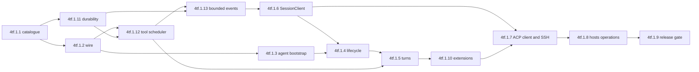

# ACP Remote Runtime Implementation Plan

Implement the accepted ACP boundary in
`docs/specs/2026-09-14-acp-remote-runtime-design.md` and the exact wire contract in
`docs/specs/rudy-contracts.md`. Keep Rudy protocol inside the daemon boundary, keep workspace
sync in Hosts and preserve `rudy bridge` until the compatibility release gate passes.

Tracking lives under bead `rudy-4tf.1`. Claim each child before its first code edit. For every
behavior change, write the failing test first, run it and record the expected failure, implement
the smallest complete behavior, run the focused gate, self-review for duplicate or misplaced
logic, commit, then close the child. Do not mix child issues in one commit.

The integration owner serializes bead claim, close and `.beads/issues.jsonl` export in the main
feature worktree. Parallel worker worktrees edit code and report the commit only; they never
mutate or export Beads state. Before every commit whose diff touches auth, identity, secrets or a
trust boundary, dispatch a fresh-context adversarial review from an agent that did not author the
change. Reproduce each verified finding in a failing test before fixing it.

ADRs 0033 through 0038 land with this plan. Later tasks implement the capability gate, bounded
scheduler, preserved shutdown proof, strict JSON profiles, Session quarantine fence and fail-closed
ACP diagnostic boundary recorded there.



After `rudy-4tf.1.1`, run `rudy-4tf.1.2` and terminal durability concurrently in isolated
worktrees. The Tool scheduler follows both because it reuses strict JSON admission and builds its
new terminalization paths on the durable-state quarantine contract. Bounded internal events
follows both safety prerequisites because its
capability depends on provider-input admission and its exact permission cancellation waits for
durable terminal state. Task 3 follows task 2. Task 6 follows bounded internal events so its local
adapter can require the complete daemon guarantees through a real hello. Task 4 waits
for tasks 3 and 6 because it consumes the bounded internal listing and replay APIs introduced with
the Client port. Task 5 also waits for the Tool scheduler. Task 8 waits for tasks 6 and 7. The
remaining dependencies are real protocol or API dependencies and stay ordered.

## 1. Pin the ACP boundary and generate the extension catalogue

Bead: `rudy-4tf.1.1`

Depends on no sibling bead.

Files:

- Modify `go.mod`, `go.sum` and `Makefile`.
- Add `internal/acpext/catalog.go` and `internal/acpext/types.go`.
- Add `internal/acpext/cmd/cataloggen/main.go` and generated
  `internal/acpext/catalog_gen.go`.
- Add `internal/acpext/catalog_test.go` and `internal/acpext/types_test.go`.
- Add the pinned stable schema, version, digest and validator helper under
  `internal/acpschema/`, with reusable wire fixtures under `internal/acptest/`.
- Add `internal/acptest/plan_dependencies_test.go`.
- Add `internal/protocol/capabilities.go`; modify the hello result and tests under
  `internal/protocol/` and `internal/server/`.

Steps:

1. Add failing guards that require ACP SDK imports to live only under `internal/acpagent/` and
   `internal/acpclient/`, and require the generated `_rudy` capability and method catalogue to
   match the normative extension table in `rudy-contracts.md` in both directions.
2. Pin `github.com/coder/acp-go-sdk` at `v0.13.5`. Record Apache-2.0 as the selected maintained
   library in the package documentation. Do not copy stable ACP wire structs into Rudy.
3. Define only Rudy-owned extension metadata and payload types in `internal/acpext`. Keep the
   package free of ACP SDK imports, daemon protocol envelopes and client rendering logic.
4. Generate sorted capability and method constants from the contract table. Make the test
   regenerate into a temporary file and compare bytes so stale generated code fails `make test`.
5. Extend `vendor-types` for the two allowed ACP adapter roots and prove an import in a scratch
   disallowed package fails the guard.
6. Check in the stable `schema/schema.json` shipped by ACP SDK `v0.13.5` under
   `internal/acpschema`, record its SHA-256 and
   fail if its version, digest or the `go.mod` SDK version drifts. Promote the existing
   `github.com/google/jsonschema-go v0.4.3` dependency to direct use for structural draft 2020-12
   validation. It is MIT licensed and already arrives through the MCP SDK. Keep explicit numeric
   width tests because that validator intentionally ignores JSON Schema `format`.
7. Add the closed internal daemon capability constants and the sorted, duplicate-free
   `client.hello.capabilities` field. The Server initially advertises no new guarantee. Preserve
   decoding of an old hello with the absent field as an empty set so later edge gates can fail
   closed deliberately. Parse the normative internal daemon capability table in the contract and
   compare it with the protocol constant set in both directions so a missing, extra or renamed
   security gate fails tests.
8. Add a plan dependency guard that parses every sibling `Bead` and `Depends on` declaration,
   every Mermaid edge and every `blocks` dependency in committed `.beads/issues.jsonl`. Compare all
   three edge sets in both directions and fail with the exact missing or extra edge. Every task,
   including one with no sibling prerequisite, must carry an explicit dependency declaration.

Focused gate:

```text
go test ./internal/acpext ./internal/acpschema ./internal/acptest
go test ./internal/protocol ./internal/server
make vendor-types
make fmt-check
```

Commit: `remote: pin ACP boundary`

## Safety prerequisite. Enforce terminal Turn durability

Bead: `rudy-4tf.1.11`

Depends on `rudy-4tf.1.1`.

Files:

- Add `internal/server/session_admission.go` and focused race tests.
- Modify `internal/turn/runner.go` and tests.
- Modify `internal/server/session_live.go`, `server.go`, `plugin_services.go` and their tests.
- Modify the internal capability advertisement and hello tests under `internal/server/`.

Steps:

1. Add failing tests around ordinary completion, runner failure and direct Steering cancel that
   make the matching terminal Entry sync fail. Prove the current path publishes terminal state
   without durability before changing it. Add deterministic races where attach and linked
   `Host.Note` pass the current availability check, pause, then a terminal sync failure
   quarantines the Session before they continue; prove both currently escape the refusal or
   subscriber closure.
2. Emit terminal `turn.state` only after the matching terminal Entry sync succeeds. Propagate the
   synchronous cancel error. Never publish a terminal state or let a blocking client operation
   complete from an unsynchronized terminal Entry.
3. On terminal sync failure, return a terminal durability error, quarantine the Session for the
   rest of that Server process in a Server-owned per-Session admission fence carrying the first
   durability cause. Route every protocol Session read, mutation and attachment commit, every Turn
   or Gate append and every plugin Host call through that same fence. Keep provider I/O and
   transport response waits outside and reenter for each commit. If a fenced commit returns a
   durability cause, install it before releasing the fence. An operation then either commits before
   quarantine and joins its cancellation or subscriber snapshot, or observes the cause and changes
   nothing.
   Expose the same quarantine operation to task 13's permission decision-batch append/sync path,
   cancel the Session's remaining
   work and close every subscribed connection with fixed failure text. Guard every later
   Session-targeting operation, including attach, answer and close, through that map. Detach,
   unload and reload cannot clear it; only a new Server process begins empty and recovers the log.
   Every method targeting that in-memory Session except bounded listing returns unavailable until
   a new Server process performs ordinary log recovery.
   Cover a linked plugin calling `Host.Note` after quarantine so the direct `appendNote` path cannot
   bypass the same Server-owned guard.
4. Advertise internal `terminal_turn_durability_v1` only after the entire sync, quarantine and
   subscriber-closure guarantee is installed. Test that the capability is absent from a Server
   missing any one hook and present only on the complete production Server.
5. Run the mandatory fresh-context review against false terminal success, fail-open quarantine,
   cross-Session impact and error leakage. Reproduce each verified finding before fixing it.

Focused gate:

```text
go test -race ./internal/turn ./internal/server -count=1
RUDY_TEST_TRANSPORT=socket go test -race ./internal/server -count=1
```

Commit: `turn: require durable terminal state`

## Safety prerequisite. Bound internal event transport

Bead: `rudy-4tf.1.13`

Depends on `rudy-4tf.1.11` and `rudy-4tf.1.12`.

Files:

- Add `internal/publicevent/project.go` and tests.
- Add `internal/acptest/registry_budget_test.go` for the exact internal-to-ACP structural headroom proof.
- Add `internal/server/process_snapshot.go` and focused concurrency tests.
- Modify `internal/session/session.go` and its tests for permission batches. Extend only
  `internal/session/recovery_test.go` with the partial-batch-prefix case against task 12's
  complete unmatched-tool recovery.
- Modify `internal/turn/runner.go` and focused tests so Gate's batch-owned decisions return as
  already recorded and the runner does not append them again.
- Modify `internal/protocol/methods.go` and notification tests.
- Modify `internal/server/conn.go`, `session_live.go`, `server.go`, `plugin_services.go` and their tests.
- Modify existing permission-answer callers and tests under `internal/cli/` and `internal/tui/`.
- Modify `internal/plugin/plugin.go`, `registry.go`, `spawned.go`,
  `plugintest/host.go`, their tests and every affected Host implementation plus
  `internal/plugins/mcp/plugin.go`, `internal/provider/registry.go` and focused tests.
- Modify `internal/cli/wire.go` and focused startup tests so Registry refresh enters through the
  coordinator.
- Modify the internal capability advertisement and hello tests under `internal/server/`.

Steps:

1. Add failing replay and live tests with public Entry and Part projections on both sides of 7 MiB,
   including a tiny redacted public failure whose private message exceeds 16 MiB. Prove the current
   internal frame closes before changing it. Include an oversized terminal Entry, permission
   decision, tool result and routed child event with exact identity fields. Add public events on
   both sides of the decoded-event depth 72 and 131,072-unit profile, including an Entry containing
   one nested tool input at its legal 65,536-unit limit. That Entry must remain representable while
   a structurally larger complete event becomes a bounded reference.
2. Implement one stdlib streaming canonical JSON projector for Entry and Part. Stream the exact
   private value and boundary-safe public projection through separate 7 MiB capture buffers, count
   both, run the public stream through task 2's decoded-event structural profile and hash only the
   complete public form. Escape strings incrementally and write raw provider
   bytes unchanged; do not call a whole-value marshal before the limit decision. Test a large
   synthetic value with a writer that proves bounded retained capture memory.
3. Send the ordinary exact private internal notification only when both captures fit and the public
   decoded-event profile passes. Otherwise
   send the closed `session.event_oversized` snake-case reference with public size, digest,
   redaction, Entry or Part kind and the exact conditional Turn, projected tool-call and terminal fields,
   including bounded retry count for `turn_failed`. Require derived owning Turn identity for
   permission-decision, tool-result and terminal Entry references during both live delivery and
   replay timeline projection. Replay
   Entry references and keep Part references live-only. Preserve child routing.
4. Give each server connection one 64-frame, 32 MiB bounded outbox. Durable attach replay uses a
   blocking enqueue outside Session and observer locks. Compare the replay high-water Entry id with
   the current tail, replay a new suffix when it moved and subscribe atomically only when caught up.
   Live observer fan-out uses nonblocking admission and disconnects only the slow client on overflow.
   Prove a slow replay over 64 Entries completes as the reader advances, a concurrent append is not
   missed and a blocked live client cannot stall a Turn, tool callback or another subscriber.
5. Add a Server-owned ProcessSnapshotCoordinator whose one admission lock spans PluginRegistry and
   RegistrySnapshot preflight plus commit. Refactor RegistrySnapshot around per-provider
   `{fetched_at, error, models}` state, retaining last-good models on failure, one runtime-only
   monotonic committed `revision` and separate
   runtime latest-allocated and latest-committed generation maps. Assign refresh generations before fetching
   outside it. Under admission, compare against the committed generation, drop superseded overlapping results and rebase non-overlapping
   provider deltas onto current state, then order Registry cache replacement and in-memory
   publication inside the commit; failure retains both prior snapshots. Advance top-level
   `fetched_at` only for a committed successful provider delta, not a failure-only commit. Advance
   `revision` exactly once for a committed state change and return that revision with an immutable
   model copy from internal `registry.list` and `registry.refresh`. Add `ResolveAtRevision` under the
   Registry read lock. Extend internal `session.open` and `session.set_model` with optional
   `registry_revision`; when present, resolve under it before any Session append or mutation and
   return conflict on a stale revision. Omission preserves existing callers.
   Incrementally preflight the complete internal Registry catalogue through 4 MiB, depth 56 and
   60,000 structural units before cache replacement or publication. Add cross-package fixtures that
   run the exact converted `RegistryResult` and complete worst-case ACP envelope through task 2's
   outer profile, proving at least 5,536 units and eight depth levels of reserved headroom without
   importing ACP types into Server or Registry. A provider or aggregate candidate that crosses a
   byte or structural bound commits nothing and retains the prior cache, snapshot and revision.
   Move Model validation into this Registry-owned commit: require every Model string to be valid
   UTF-8 through 4096 bytes, require nonnegative context and output limits, preserve deterministic
   same-ref folding and reject one provider's conflicting duplicate refs or invalid decimal prices
   as that provider's bounded failure. Omit all of its candidate models while retaining other
   provider results.
   Add optional `client.hello.process_events`, default true for non-plugin clients. Force false for
   every plugin connection even when it explicitly sends true. False suppresses the connect snapshot
   and later process notifications for that connection. Add a shared process-snapshot sizer.
   Physically write internal `client.hello` before snapshot admission. After that acknowledgment,
   hold the same coordinator lock while capturing current process state, reserving and enqueueing
   the complete ordered snapshot and activating live delivery. Require mutations to enqueue under
   that boundary so each update is either in the snapshot or after it, never missed or delivered
   before stale snapshot state. Require every replayable process event individually through 4 MiB and the complete
   snapshot through 64 events and 32 MiB in both exact internal and safe public forms, using
   `sequence: 9007199254740991` for every public sizing check. Stream every complete worst-case ACP
   carrier through task 2's outer structural profile before commit. Add explicit
   safe notice fields plus `registry.updated` before sizing. Keep plugin failure detail only in the
   bounded internal `reason` and always project fixed `Plugin failed; see box log` publicly. Preflight
   plugin admission with one state slot sized from the complete failed event carrying 4096 ASCII
   NUL bytes as its worst-case escaped reason, status and widget changes
   plus Registry refresh before mutation. Reject excess plugins before spawn, always commit later
   failure with bounded stored reason after logging invalid or overlong detail and replace
   oversized live notices after logging detail.
   Reject invalid UTF-8 or overlong status owner/key, widget owner/key, plugin name, Registry
   provider name and status/widget Span text before commit, and reject a Span role outside the
   closed Theme role set. Keep every accepted identity exact and use no digest alias in process
   events. Substitute the fixed notice fallback for absent, invalid or overlong public notice text
   without hashing or forwarding private text.
   Change linked and spawned `SetStatus` to return the typed refusal and handle it at the caller.
   Test 65 tiny widgets or plugins, aggregate byte overflow, concurrent individually valid Plugin
   and Registry candidates whose union overflows, per-provider generation supersession,
   non-overlapping delta rebasing, failure-only timestamp retention, retained last-good provider
   models plus current error, concurrent Registry cache ordering, revision no-op and advance cases,
   immutable-copy behavior, stale-revision open and set-model refusal before mutation, many tiny
   models crossing only the 60,000-unit catalogue limit, invalid and overlong Model strings,
   negative limits, deterministic duplicate folding, conflicting duplicate rejection and
   invalid-price rejection,
   response-before-replay ordering, a mutation racing snapshot capture and subscription,
   control-character failure reasons at the boundary, many tiny status items and Spans crossing
   only a structural limit and connect replay under blocked readers.
   Make a plugin send hello explicitly and prove it receives neither
   the snapshot nor later process events.
6. Verify task 12 rejects a provider response before assistant append, Gate publication or job
   submission when any tool-use id or name is invalid UTF-8 or exceeds 4096 UTF-8 bytes, raw input exceeds 7 MiB or a
   tool-use id repeats anywhere in the active Turn.
   Keep that prerequisite in the capability-completeness test without duplicating runner logic.
   Bound new titles at 4096 valid UTF-8 bytes. For legacy state, make `session.resume` omit an
   invalid or overlong title but fail unavailable before replay or attach
   when the current operational ModelRef cannot fit, since an alias would change provider semantics.
   Make `session.fork` derive and validate the exact resulting ModelRef plus title before mutation,
   applying the same refusal and omission so failure creates no child Session.
   Test each current ModelRef and title field above 16 MiB to prove resume and fork return a
   bounded result rather than poisoning the internal frame.
   Refuse a new or recovered `turn_failed.retries` outside 0 through 2147483647 before replay or
   attachment and prove no terminal reference can publish it.
7. Add optional `turn_id` to `session.interrupt` and atomically act only on that exact active Turn,
   returning conflict rather than falling through to a successor. Extend `session.answer` with the exact Turn id and atomically match the standing Session, Turn
   and canonical offered tool-use identity in the Gate before applying a decision. Represent each
   coalesced question by its immutable first-member identity plus a bounded current member set.
   Atomically freeze that set plus any additional non-dangerous group settled by a Session-scope
   allow, reject every unoffered member id and append one decision per member in stable Turn
   admission order through a new Session batch operation. Sync the complete batch when it contains
   an allow and only then release any member to queue or finish. On append or sync failure, release
   none, quarantine the Session and return unavailable. Change the Asker-to-runner handoff to mark
   these decisions batch-recorded; the runner must not execute its former per-call decision append
   afterward. Never settle a dangerous group through
   allowance. Exercise task 12's Recovery against a partial permission-batch prefix across restart
   and prove it adds only the missing decisions and results before exposing the Session. Update
   every existing caller. Add
   authenticated internal `session.decline_permission` and `session.cancel_permission` for an ACP
   asker and the same canonical identity. Decline removes only that connection from the question's
   eligible asker set and grants nothing; cancel may target a routed child only through that exact
   eligibility and waits durable cancellation without granting child authority. Test multiple
   askers, repeated decline, last-decline `no_asker`, routed children, delayed answers,
   already-decided questions, coalesced members, an unoffered member-id answer and successor Turns
   that reuse a tool id.
8. Advertise `bounded_session_events_v1` only after the projection, replay, provider-input,
   exact-interrupt, exact-answer, decline and exact-question cancel guarantees are all installed. Advertise `bounded_process_events_v1`
   only after every process snapshot and mutation bound plus the revisioned 4 MiB, depth 56 and
   60,000-unit Registry catalogue guarantee is installed. Test that removing any hook
   removes its capability.
9. Run a fresh-context review against secret-bearing digests, replay gaps, blocked observer locks,
   oversized terminal false success and permission bypass. Reproduce verified findings first.

Focused gate:

```text
go test -race ./internal/acptest ./internal/publicevent ./internal/protocol ./internal/session ./internal/server ./internal/turn ./internal/plugin/... ./internal/plugins/mcp ./internal/provider/... -count=1
RUDY_TEST_TRANSPORT=socket go test -race ./internal/server -count=1
go test -race ./internal/cli ./internal/tui/... -count=1
```

Commit: `session: bound event transport`

## Safety prerequisite. Bound tool execution concurrency

Bead: `rudy-4tf.1.12`

Depends on `rudy-4tf.1.2` and `rudy-4tf.1.11`.

Files:

- Add `internal/turn/scheduler.go` and tests.
- Modify `internal/turn/runner.go`, `runner_test.go`, `internal/gate/matcher.go`,
  `internal/protocol/methods.go`, `internal/server/server.go`,
  `internal/server/session_live.go`, `internal/server/session_live_test.go` and focused protocol,
  Gate and Server tests.
- Modify `internal/session/entry.go`, `recovery.go` and focused tests for the new fixed
  terminalization decisions and complete unmatched-tool recovery.

ADR 0034 and the normative Turn and Tool scheduler contracts land with this plan. This task owns
only their tested implementation.

Steps:

1. Add failing hostile-provider tests with 65 tool-use blocks in one response, a cumulative 65
   across successive responses in one Turn, an invalid UTF-8 tool-use id or name, an id or name
   above 4096 UTF-8 bytes, raw input above 7 MiB, duplicate object keys at any input depth,
   strict-JSON depth, structural-unit, per-array or per-object overflow, more than 16 MiB aggregate
   raw input in one response, more than 32 MiB retained input across one Turn, duplicate ids in one
   response and reuse of an id in a later assistant response in the same Turn. Include hook
   replacements that violate each strict rule or cross the cumulative budget. Prove the current
   runner appends the assistant Entry,
   allocates outcomes, starts one goroutine per call or publishes an oversized permission before
   changing it.
2. Reject any such provider response before assistant append, permission creation or job
   submission. Reuse task 2's `strictjson` scanner and require every provider input to be valid
   UTF-8, one object with recursively unique keys and within depth 64, 65,536 structural units,
   16,384 elements per array and 4,096 members per object. Enforce 7 MiB per input, 16 MiB aggregate
   input per response and 32 MiB cumulative retained input per active Turn, counting each accepted
   hook replacement in that Turn budget. Track at most 64 ids for the active Turn and discard that
   set and byte counter only when the Turn ends. Execute no prefix of a rejected provider response.
   Revalidate every `before_tool` replacement against the same strict object, structural,
   individual and cumulative limits before it can reach the Gate; convert any violation into a
   fixed hook denial without retaining, logging or publishing its bytes. Normalize hook and
   asker decision reasons through the 4096-byte UTF-8 contract. Bound a bash matcher's first two
   words with the specified SHA-256 form and preflight each complete internal
   `permission.requested` notification through 8 MiB. An unexpected preflight overflow emits no
   question, appends a fixed `invariant` denial plus error result for that call, terminalizes every
   peer and fails the Turn with a bounded internal terminal Entry.
3. Add one Server-owned scheduler with 64 stdlib workers and two admission lanes totaling 64
   queued jobs. Forty-eight general workers may serve root or child Session jobs; sixteen
   child-reserved workers serve only child jobs. Give the root queue capacity 48 and the child
   queue capacity 16. Let free general workers help child work while preventing root jobs from
   entering the reserved lane. Submit with cancellation-aware backpressure and no goroutine per
   call. Preserve result-as-completed ordering and exact tool-use identity while filling every
   eligible worker. Server shutdown closes both admission lanes, cancels queued and running jobs
   and joins all workers before teardown completes.
   Add each admitted call in non-runnable `gating`, emit `ToolQueued` only after its Gate allow is
   recorded and emit exact per-call `tool.state` transitions for gating, queued, awaiting permission, running and done,
   and derive coarse Turn state from the full call map. Prove one result cannot resume the provider
   while another call is gating, queued, running or awaiting permission, including an attach
   mid-gate and mid-queue. Prove no unsafe call is admitted to either scheduler lane before its own
   allow is durable.
4. On steer or cancel, terminalize every admitted non-done call before the steering or terminal
   Entry: append a fixed `interrupt` denial first when no decision exists, then a killed result.
   On Turn failure, use a fixed `invariant` denial where needed, give the causal call an error result
   and peers killed results before `turn_failed`. Permit direct cancel from every active Turn state.
   Extend Recovery to walk every unmatched `tool_use`, append a fixed `invariant` deny when its
   decision is absent, append a lost result whenever its result is absent and sync before exposing
   the Session.
   Prove the next RequestContext contains no dangling tool use and no success can land after the
   cut. Saturate the pool from
   several Sessions and prove worker and queue counts remain bounded. Park 48 root workers in
   concurrent `agent` calls, then prove their child jobs make progress through the reserved lane
   and a 49th root job cannot consume that capacity. Prove no worker or queued job survives Server
   shutdown. Fairness within a lane is not promised.
5. Run a fresh-context concurrency and permission review, reproduce findings and run the race gate.

Focused gate:

```text
go test -race ./internal/turn ./internal/gate ./internal/protocol ./internal/session ./internal/server -count=1
RUDY_TEST_TRANSPORT=socket go test -race ./internal/server -count=1
```

Commit: `turn: bound tool scheduling`

## 2. Harden framing, request admission and cancellation ordering

Bead: `rudy-4tf.1.2`

Depends on `rudy-4tf.1.1`.

Files:

- Modify `go.mod` and `go.sum` to promote the existing `golang.org/x/sync` dependency.
- Add `internal/strictjson/scan.go` and focused tests.
- Add `internal/acpwire/wire.go`, `frame.go`, `id.go`, `cancel.go`, `logger.go`, `writer.go` and
  `reservation.go`.
- Add matching `_test.go` files in `internal/acpwire/`.

Steps:

1. Write table tests for JSON payloads at 8 MiB and 8 MiB plus one byte, excluding the one
   terminating line feed, plus partial reads, short writes, outbound overflow, EOF and refusal
   propagation. Prove the reader gate yields no byte before `Open`. Add pre-SDK admission tests
   with blocked request and notification handlers: 64 active requests and 64 known notifications
   plus 64 matched responses are separate count ceilings, but their original frames share one
   32 MiB byte budget. Hold matched response bytes until the wrapped callback returns, including
   behind a blocked notification. Add the separate 64-item, 32 MiB active outbound-request budget
   and prove many near-limit permission requests or Session calls close before SDK creation. The
   next frame closes before an SDK goroutine or queue retains it. Allocate monotonic positive
   outbound integer ids only through 9007199254740991, retain one issued high-water mark, drop an
   inactive response at or below it and close for an invalid, future or post-maximum id. Cover
   cancellation-before-response and supersede-before-response without disconnecting other work.
   Release request bytes only with
   the physical response write and each FIFO notification charge only after the wrapped sequential
   handler returns.
2. Write request-id tests for string, mathematical signed 64-bit integer and null ids, including
   canonical equivalence of `"a"` and `"\u0061"`, `1`, `1.0` and `1e0`, and `-0` and `0`.
   Accept both signed 64-bit boundaries and equivalent integral decimal or exponent spellings;
   reject fractional values and values outside the signed 64-bit range. Give null its own canonical
   directional key, accept one active null-id request as the pinned ACP schema requires and reject
   a duplicate active null id before starting SDK work. Reject an oversized string, numeric token,
   coefficient, exponent or canonical key and reject inbound request 65 before starting SDK work.
   Admit only an uncorrelated null-id response carrying parse or invalid-request error and drop it,
   since Rudy emits only positive-integer outbound request ids. Prove
   notifications and responses consume no admission slot, and inbound prompt id `1` can coexist
   with outbound permission request id `1`.
3. Write strict JSON tests that reject duplicate keys anywhere in the frame, with explicit
   duplicate `sessionId` and `requestId` cases. Keep decimal normalization exact with stdlib
   integer and rational arithmetic only to prove integrality and signed 64-bit bounds, not
   `float64`. Classify exactly one JSON-RPC 2.0 request,
   notification or response shape before SDK dispatch. Reject known request methods without an
   id, known notifications with an id, hybrids and batches; let unknown requests reach SDK
   method-not-found and drop unknown notifications. Accept an adapter-supplied schema validator
   for known notifications so an invalid notification that would skip its callback closes before
   admission and cannot strand its byte charge. Implement duplicate-key and structural checks in
   one shared configurable streaming `strictjson` scanner. Before SDK decode in both adapter directions,
   require valid UTF-8 strings, depth at most 64, at most 65,536 combined JSON values and object
   member names, at most 16,384 elements in any array and at most 4,096 members in any object.
   Compare member names after escape decoding. Test tiny deeply nested frames, millions of tiny
   nodes and member-heavy or array-heavy near-8 MiB frames; prove each closes before SDK
   allocation. Add the decoded-event profile with depth 72, 131,072 structural units and the same
   container and key rules, plus the nested-input profile matching the outer limits. Task 13 owns
   event selection and task 8 owns reassembly use of those profiles.
4. Write cancellation-classifier tests that preserve ingress order between semantic
   `session/cancel` and request-scoped `$/cancel_request` before SDK release. Store only validated
   directional request ids, Session ids and ordered intent records, expose them through a
   pre-dispatch hook and re-encode validated cancel frames so classifier and SDK receive one
   routing value. Do not allocate a prompt generation here: the agent owns per-Session admission,
   generation and Turn binding after initialization. Prove a late intent cannot be rebound after
   its request id is retired.
5. Write logger tests that place sentinel credentials in malformed frames, ids, params and
   nested errors before and after gate release. Assert stderr and captured logs contain none.
6. Implement `Wire` with `Input`, `Output`, `Open`, `Failed` and `Close`. Bound each encoded writer
   queue to 64 frames and 32 MiB,
   run every incoming frame through the shared outer structural profile before SDK input and run
   every complete outbound frame through it before enqueue,
   signal one supervisor failure and release an admitted slot only after the complete matching
   response plus newline is physically written. Tag sequenced outbound carriers and expose a
   physical-write acknowledgment for each frame, including notifications and agent-to-client
   requests, plus the matching response-written signal for terminal shutdown. Send
   reader-generated parse and invalid-request errors through this same serialized writer so they
   cannot interleave with SDK output. Prove a sub-8 MiB outbound frame with too many small elements
   closes before physical write and reports one supervisor failure.
7. Add the shared response-construction pool using the existing `golang.org/x/sync/semaphore`
   weighted primitive. Reserve a complete 8 MiB large-handler or 1 MiB small-handler class before
   work, cap encoded results at the reservation and 7 MiB and hold through physical write or close.
   Prove four large or 32 small blocked handlers fill 32 MiB without partial-acquire deadlock, a
   next handler waits off the reader path and cancellation classification remains live.
8. Run the mandatory fresh-context review against payload leakage, admission bypass, ambiguous
   ids, cancellation rebinding and unsynchronized writes. Test verified findings before commit.

Focused gate:

```text
go test -race ./internal/strictjson ./internal/acpwire -count=1
make fmt-check
```

Commit: `remote: harden ACP framing`

## 3. Extract daemon connection logic and bootstrap the ACP agent

Bead: `rudy-4tf.1.3`

Depends on `rudy-4tf.1.2`.

Files:

- Add `internal/cli/daemon.go` and tests.
- Modify `internal/cli/log.go`, `wire.go` and focused tests for the ACP fail-closed log policy.
- Modify `internal/cli/bridge.go` and `bridge_test.go`.
- Add `internal/acpagent/agent.go`, `handlers.go`, `connection.go` and tests.

Steps:

1. Add characterization tests around `dialOrStart`, `spawnDaemon`, the concurrent-start loser,
   `--no-start`, same-user socket validation and bridge startup diagnostics. Watch them pass
   before moving code.
2. Extract one daemon connector used by bridge and ACP. Preserve the compatibility bridge byte
   path and its local log-tail diagnostics exactly.
3. Construct an internal, unregistered ACP serve function. Implement the SDK's monolithic Agent
   interface once through a closed installable handler and supported-capability table. Its outer
   methods delegate only to installed handlers and otherwise return method-not-found, letting
   later tasks install behavior without redeclaring Agent methods. Do not expose `rudy acp` or
   advertise optional list, resume or close capabilities until the mandatory stable surface is
   implemented. Back an `acpwire` pre-dispatch method and readiness gate with that same atomic
   table so exact pre-ready and unadvertised rejections are reserved before SDK parameter decoding.
   Keep Agent delegation as the second dispatch layer. Give the table each method's 1 MiB or 8 MiB
   response-construction weight under the shared 32 MiB reservation. Acquire before result
   accumulation or SDK marshal, cap every response at 7 MiB and release only after physical write.
   Block concurrent list-result builders and prove cancellation classification stays live. Test
   malformed params on both paths. Wrap every installed handler with task 2's shared response pool:
   acquire the full class reservation before any internal call, decode or result construction and
   hold it through physical response write or close. Saturate four large handlers and prove the
   fifth waits without blocking pre-dispatch cancellation.
4. Construct `acp.NewAgentSideConnection` over a closed `acpwire` reader, install the sanitized
   logger, bind the supervisor and only then open the gate. Do not use unstable SDK interfaces.
5. Add an atomic initialize state machine. Schema-validate initialize params before consulting
   that state: malformed params in waiting, in-progress or ready always return `-32602`, leave the
   state unchanged and make no daemon or domain call. Only schema-valid concurrent and repeated
   initialize requests return their state-specific errors. Return fixed unavailable for every structurally valid
   known Session or extension request before readiness, including a currently uninstalled method,
   without a daemon request. Reserve method-not-found for known uninstalled or unadvertised methods
   only after normal or shutdown-control readiness commits. Reject concurrent or repeated initialize.
   Only an
   absent `_rudy` object selects generic `asker:true`; reject present malformed, unsupported or
   incomplete Rudy metadata. Dial and hello first, stage the result, then use the writer's
   response-complete signal to publish the daemon connection, asker and capabilities together.
   Reject other requests and hold outbound events until that physical write commits readiness.
   Drop pre-ready `session/cancel` and unmatched `$/cancel_request` without a domain call. A
   `$/cancel_request` for the active initialize wins only before the success response is reserved;
   it then cancels dial and hello, writes `-32800` and closes without allowing retry. After success
   reservation it is a no-op. Give every request the same atomic response-reservation rule and
   hold its admission charge until physical write acknowledgment. Test cancellations immediately
   before reservation, after enqueue and during physical write plus every exact code and
   connection disposition.
6. Consume task 1's closed daemon capability field and let the unregistered ACP runner take an
   explicit required set whose task-3 default is empty. Refuse initialization with
   fixed `-32014`, `Incompatible daemon; restart Rudy`, then close after the response write when a
   configured required name is absent. Treat an old hello with no field as an empty set. Test a
   compatible version mismatch, an unknown extra capability and old-daemon fixtures that omit each
   injected guarantee. Task 5 configures the production set only after all four edge guarantees
   exist.
7. Preserve verified `protocol.ErrNoServer` as a typed result from the internal ACP runner before
   it writes a frame. Do not collapse unsafe socket, permission, handshake, startup or other
   transport errors into it. Task 5 maps only this result to process exit 112 when it registers
   the command.
8. Give the serve function a protocol-safe error path: fixed stderr text plus correlation id,
   detailed cause in the box log and no bridge log tail over SSH. Select an ACP-specific
   fail-closed log policy before reading a frame. On log open failure, exit with only the fixed
   correlated diagnostic and never install stderr as the record sink. Wrap the opened sink so a
   later write failure signals the supervisor, closes the adapter and again emits only fixed text.
   Discard captured daemon stderr rather than forwarding it. Test sentinel secrets through log
   open failure, injected post-open write failure and daemon-start failure; none may reach stderr.
9. Run the mandatory fresh-context review against initialize races, asker fallback, same-user
   identity, daemon capability downgrade, daemon-start errors and log leakage. Test verified
   findings before commit.

Focused gate:

```text
go test -race ./internal/cli -count=1
go test -race ./internal/acpagent -count=1
```

Commit: `remote: prepare the ACP agent`

## 4. Implement the standard ACP Session lifecycle

Bead: `rudy-4tf.1.4`

Depends on `rudy-4tf.1.3` and `rudy-4tf.1.6`.

Files:

- Add `internal/acpagent/session.go`, `list.go`, `dispatcher.go`, `update.go` and `errors.go`.
- Add lifecycle integration tests under `internal/acpagent/`.
- Modify `internal/acpagent/handlers.go`, `connection.go` and tests.

Steps:

1. Build one ACP-agent dispatcher as the only consumer of internal `Notifications()`. Route
   ordinary events, standing attach state, permission requests and `server.stopped` waiters from
   it. Construct the agent's internal protocol client with task 6's bounded notification option,
   start its pump before hello and stage the bounded process snapshot until the ACP initialize
   response is physically written.
   For a negotiated raw event, hold its internal notification lease until every derived display
   frame has acquired its writer charge and the authoritative carrier is physically acknowledged.
   For a generic event, release after every emitted display frame is writer-charged, or immediately
   when the projection table legitimately emits none. Prove two consumers cannot race for terminal
   proof, blocked negotiated and generic display writes obey the distinct lease handoffs and neither
   path can grow an unbounded daemon queue.
2. Add a single standard update projector implementing the contract's closed event, context and
   projection table for the display-safe durable transcript and current Session, Turn and tool
   snapshots needed by new, load and resume. Split display text by encoded size. Prove load replay
   reconstructs durable user and assistant content, live Parts own incremental output and the live
   final assistant Entry does not duplicate it. Keep Rudy event metadata and live streaming
   sequence out until task 5 extends this file. Unsupported internal events use only the specified
   metadata-only fallback.
3. Add failing pipe integration tests for mandatory `session/new` and handler-level tests below
   the capability gate for `load`, `resume` and `list`. Cover absolute cwd validation, empty MCP
   servers, refusal of additional directories and exact Rudy ULIDs. Complete the Session-open
   Registry trigger first through internal `registry.refresh`, then retain the returned immutable
   models and revision. Build and size the predictable complete new-Session mode/config response
   from that exact copy under its 8 MiB reservation before `session.open`;
   require the complete worst-case ACP envelope to pass task 2's outer structural profile and prove
   a byte or many-small-option structural overflow returns fixed internal failure and creates no
   Session. Pass the retained revision to internal `session.open`, which task 13 made resolve under
   the same Registry read lock, and perform no second refresh. Race a Registry commit after preflight:
   stale revision returns fixed ACP conflict and creates no Session. Also make refresh grow the
   catalogue across only the structural boundary and prove refusal precedes Session creation.
4. For load and resume, query `session.list` before attach and validate the normalized primary
   Workspace root. Preflight the complete predictable `InitialSessionState`, including its bounded
   modes and Registry-derived config catalogue, through the 8 MiB reservation and task 2's outer
   structural profile before internal `session.resume`, attachment or replay. A refusal returns fixed
   internal failure and produces no attachment, event or subscriber state. Load forwards replay.
   Resume suppresses only replayed `entry.appended` and
   still forwards current Turn and tool state before responding. Capture standing permission
   state in the dispatcher but defer its outbound request to task 5, keeping the public capability
   absent meanwhile. Serialize one attach transition per Session while allowing different
   Sessions concurrently. Test byte and many-small-option structural refusal at the boundary and
   observe that the internal attachment and event stream remain unchanged. Mark an attachment to an already-streaming Turn display-incomplete,
   suppress its later Parts and project the complete final assistant Entry. Prove a generic load
   during streaming never receives a suffix-only transcript.
5. Consume the bounded internal pages from task 6 incrementally while retaining no more than 100
   records and 7 MiB. Take
   the largest encodable ACP prefix, honor negotiated `_meta._rudy.limit` from 1 through 100 with
   generic absence defaulting to 100, authenticate the version, last ULID and filter digest with a
   random per-connection HMAC key and never expose the internal cursor. Reject empty, modified,
   cross-connection and filter-mismatched external cursors. Preserve every valid bounded internal
   title unless including that individual title would cross the ACP 7 MiB page bound; omit only
   that title and retry sizing. Keep task 6's invalid-title sanitation distinct from this
   display-page omission. Prove the same summary retains its valid title internally and loses it
   only in the ACP page that cannot carry it.
6. Translate every internal error into an explicit `*acp.RequestError`. Use fixed public text
   for unavailable and internal failures, and keep socket paths and nested causes in the box log.
7. Keep load, list, resume and close absent from the supported-capability set while permission
   replay and the close barrier remain incomplete. Prove the outer classifier returns
   method-not-found for those unadvertised method ids even though their handlers have focused
   tests. Task 5 enables the complete stable surface. Run the mandatory fresh-context review
   against cwd escape, cursor forgery, cross-Session attach and error leakage. Test verified
   findings before commit.

Focused gate:

```text
go test -race ./internal/protocol ./internal/acpagent -count=1
RUDY_TEST_TRANSPORT=socket go test -race ./internal/server -count=1
```

Commit: `remote: add ACP session lifecycle`

## 5. Map prompts, updates, permissions and configuration

Bead: `rudy-4tf.1.5`

Depends on `rudy-4tf.1.4` and `rudy-4tf.1.12`.

Files:

- Add `internal/acpagent/content.go`, `prompt.go`, `permission.go`, `close.go` and `config.go`.
- Modify `internal/acpagent/dispatcher.go`, `update.go`, `errors.go`, `handlers.go`, `connection.go`
  and focused dispatcher tests.
- Extend `internal/acpagent` tests and ACP schema fixtures.
- Add `internal/cli/acp.go` and `acp_test.go`.
- Modify `internal/cli/root.go` and `shape_test.go`.

Steps:

1. Add failing content tests. Preserve text. Convert a resource link to the exact marked compact
   JSON text without opening the URI. Reject empty, image, audio and embedded blocks. Use this
   translator for both prompt and Rudy steer.
2. Add prompt-controller tests that keep one ACP request open across concurrent tool calls,
   later model calls and steering. Complete only from terminal Turn state. Map `end_turn`,
   `max_tokens` and semantic cancel to stable success. Return fixed internal errors for
   `refused`, `other`, `turn_failed` and impossible terminal state. Never infer max turns from
   failure text. Require negotiated prompt metadata to carry one canonical 26-character ULID
   `promptId` unique for the SessionClient lifetime. Bind that id, request, first exact typed
   `user_message` Turn id, cancellation and terminal result in the agent's one per-Session
   generation. Buffer the initial carrier until `session.submit` proves its Entry id equals the
   returned Turn id. Reject a second concurrent prompt before SDK dispatch, retire admission
   before enqueueing terminal state so a queued prompt can start and prove a late callback
   cannot complete the next generation. Post-start results echo prompt and Turn ids; a
   pre-start failure echoes only prompt id and retires immediately.
3. Prove `session/cancel` returns prompt stop reason `cancelled` even when a provider or tool
   reports an error during cancellation. Prove `$/cancel_request` cancels the internal Turn but
   returns `-32800`. Cover the SDK sequence that emits request cancel followed by Session cancel.
   When request cancellation arrives while `session.submit` is in flight, record intent and wait
   for its result: a pre-start error mutates no Turn, while a returned id cancels only that exact
   Turn. At framed notification admission, bind standard `session/cancel` to that connection's
   active Prompt or turn-starting RunCommand generation, or snapshot the exact active Turn under
   the event-state lock when neither exists. Carry that per-frame dispatch record through the SDK
   callback and always send the recorded `turn_id`; no active Turn at admission,
   `refused_by_invariant` and successor `conflict` are no-ops. Do not complete from the cancelled SDK
   context: await the matching durable terminal Entry and state, then apply the classified result.
   Delay the callback behind Turn completion and a successor from another connection, then prove
   the successor is never cancelled.
4. Add exact logical-carrier-set and connection-sequence tests for Entry, Part, turn state and tool
   state, including gating and queued mapped to ACP pending, running to in-progress and awaiting
   permission to pending. Assign values 1 through 9007199254740991 after routing and replay suppression in the
   single dispatcher. Use `_meta._rudy.sequence` uniformly on standard carriers, permission
   requests and `_rudy/session/update`. Use a metadata-only session-info update when no honest
   standard projection exists. Preserve originating child Session ids, allocate nothing for
   display projections and ignore those projections in the Rudy path. Never interleave fragments
   from two events. Make sequence allocation and carrier enqueue one atomic dispatcher action
   before any successor allocation, and enqueue every authoritative fragment before display
   projections. On the negotiated path, before releasing task 6's internal notification lease,
   acquire writer charges for every raw-derived display frame and require physical-write
   acknowledgment for the complete authoritative fragment set or carrier. On the generic path,
   release after every emitted display frame is writer-charged, or immediately when none is emitted.
   Require acknowledgment for each fragment before allocating its successor; a cancellation or failed
   write closes first. Physically write the successful initialize response before carrier 1 can
   leave the dispatcher.
   Project every standard tool-call id as `rudy-call-sha256-<digest>` over Turn id, a zero byte and
   raw provider id. Use it consistently for starts, updates, results and permission requests while
   negotiated carriers preserve raw identity. Reuse one raw id in successive Turns and prove both
   generic calls remain distinct.
5. Reuse task 13's streaming public projector. Base64 Entry and `provider.Part` public JSON in
   decoded chunks of at most 1 MiB without re-marshaling nested tool input or thinking signatures.
   Emit 1 through 7 metadata-only fragment carriers through 7 MiB with one event ULID, exact count,
   indexes, size and digest. Replace `turn_failed.message`, clear every assistant and stop Part raw
   stop reason and set `redacted` exactly as the contract requires. Test sentinel secrets at each
   redaction source. Map internal oversized references into the exact ACP `event.oversized` variant,
   including terminal retry count and projected permission-decision and tool-result identities,
   with no content projection. Reject translated
   prompt content above 4 MiB or a complete public typed `user_message` Entry projection above
   7 MiB before submission, preserving an exact initial correlation carrier for every accepted
   prompt. Implement the 4096-byte ACP scalar rules and
   universal Turn-scoped projected tool-call ids, stable historical tool-name aliases and title
   omission. Prove generic clients get bounded metadata-free projections where a display
   projection exists, negotiated clients get the metadata-only carrier where none exists and
   generic clients get no carrier-only update. For an oversized permission request, emit
   `event.oversized` only to negotiated clients, decline that asker through the exact internal
   question and give a generic client no update or question. Suppress the
   standard config update for a superseded historical `model_change` with an invalid or overlong
   ModelRef while retaining its negotiated Entry carrier; prove generic clients receive no forged
   selectable alias and a current invalid value was already refused by internal resume.
6. Add permission tests for exact input bytes, matcher identity, first answer, disconnect and
   late response. Accept only the three offered option ids. Return a valid JSON-RPC error from the
   sole asker and with another asker attached; call exact `session.decline_permission`, close that
   ACP connection, never answer or cancel the Turn and let the last-asker case record ordinary
   `no_asker`. Treat cancelled as no authorization
   plus exact `session.cancel_permission`; use the same routed-child-safe operation before closing
   on unknown, empty, stale, unoffered or malformed outcomes. Never allow. Register a pending request with a per-callback token before dispatch, key it by
   connection generation, closed outer attachment Session, originating Session, Turn and tool-use id,
   and release it on prompt cancel, close or disconnect. Closing one root retires callbacks for
   that outer attachment, including routed-child questions, without touching another root on the
   same connection. Accept only allow-once, allow-Session and deny-once. When another internal
   asker decides first, mark the request superseded and wait for any already-enqueued carrier's
   physical-write acknowledgment before cancelling the outbound callback, so it sends no answer,
   creates no sequence gap and does not cancel the decided Turn. Suppress duplicate standing
   requests without allocating another carrier sequence. Install the deferred attach-state path
   from task 4 so load or resume on a new ACP connection sends a fresh outbound permission request
   and callback for a standing question. Keep another asker attached while the first ACP connection
   drops so `no_asker` does not decide it, then prove the replacement is emitted and the old
   callback remains retired. Encode exact permission input only through 1 MiB and require the
   complete request to fit 7 MiB. On overflow, emit `event.oversized`, call
   `session.decline_permission` for the exact question and leave other askers active. Set the
   reference size to the exact input length and its digest to the incrementally generated
   same-length zero-byte public redaction, never the secret-bearing input. Peek and
   encode before reserving the shared 64-request, 32 MiB outbound budget, and reserve that budget
   before sequence allocation or SDK request creation. Prove the 65th permission or byte overflow
   closes without a sequence gap and retires callbacks without authorization. For negotiated clients, accept a reason of at most 4096 UTF-8 bytes
   only from selected-outcome `_meta._rudy`; pass nonempty text
   unchanged and map empty or generic outcomes to fixed `asker`. Send the recorded exact Turn id
   with `session.answer`; a superseded question can never fall through to a successor that reused
   the tool id. Malformed reason metadata
   cancels and disconnects without authorization. Apply the same write-ack-before-callback-cancel
   rule to prompt cancellation and close; only connection teardown retires immediately.
7. Add ACP integration tests against the prerequisite terminal-durability guarantee. Prove a
   quarantined Session closes this adapter with fixed failure text, exposes no terminal success
   and refuses later Session methods as unavailable. Keep the raw sync failure in the box log.
8. Make close a completion barrier only after prompt and permission controllers exist. Atomically
   fence the Session on this ACP connection. Close is a controller outside the ordinary operation
   lease set; a racing second Close gets the fixed conflict and is not joined. Treat fence installation as the close commit point:
   request cancellation that reserves `-32800` first performs no domain mutation, while later
   cancellation is a no-op and close proceeds normally. Register every Session-targeting request
   and notification under a per-connection operation lease before its domain call. Require every
   permission response callback to take its outer attachment's lease before token claim or answer,
   decline or cancel; a post-fence callback retires without a domain call. Stop new leases
   at the fence, reject the connection's later attach and mutation requests, cancel active work
   and retire callbacks first. Under the event-state lock, snapshot exact current Turn, tool and
   permission identities and install proof waiters seeded from retained terminal proof. Add
   identities committed by pre-fence leases and install their waiters before those leases complete.
   When a pre-fence Prompt or turn-starting RunCommand commits a Turn after the initial snapshot,
   issue exact-id cancel as part of joining it before that lease completes. Use task 13's exact
   internal interrupt guard so work started later by
   another connection cannot be cancelled or joined. Treat no-active-Turn and successor conflict as
   no cancellation and continue waiting for the snapshotted Turn. A terminal-durability
   unavailable error tears down this connection and fence with no Close success; only other
   recoverable interrupt errors leave the attachment live after their mapped response write.
   Then wait the pre-fence set through domain completion plus every
   request response write, including attach, steer, compact, shell, configuration, title and
   extension work, and observe durable permission, tool and Turn terminal records, including exact
   oversized references. For a permission-decision or tool-result reference, recompute the universal
   Turn-scoped projected tool-call id from the close-owned Turn and raw tool-use id and require an
   exact match. On negotiated Rudy connections, retain routing and wait physical-write
   acknowledgment for each close-owned terminal Entry or oversized reference plus terminal state
   carrier. On generic connections, install waiters only for display projections the table actually
   emits; carrier-only Entry and state events emit no frame and create no waiter.
   Require response writes for this connection's standing Prompt and turn-starting RunCommand
   waiter hooks, but none owned by another connection, then detach and write the close response.
   Release the fence only after that write. Here, test the future command integration with a
   synthetic waiter-registration seam. Cover cancellation on each side of the commit point, idle
   close, duplicate Close, local Prompt, a Turn started elsewhere, a racing new prompt, permission
   answer on each side of the fence, terminal publication during fence installation, negotiated
   carrier acknowledgment, generic carrier absence during an active Turn and a stalled tool; task 7
   adds the real RunCommand case.
9. Implement mode plus complete model and thinking config options from the daemon Registry.
   Capture the internal immutable Registry result and revision, prebuild and size each complete
   response under the 8 MiB reservation and require its complete worst-case ACP envelope through
   task 2's outer structural profile before set-model or set-thinking. Pass the captured revision
   to `session.set_model`; a concurrent Registry commit returns fixed conflict and leaves
   configuration unchanged. Thinking uses the same captured response catalogue without
   a model mutation. Prove byte, many-small-option structural and revision-race refusals leave
   configuration unchanged. Task 4 owns the Session-open refresh handoff. Refresh on
   model-not-found events only here. Do not add a timer or model list to config. Picker-open refresh
   belongs to the client after its Registry extension exists.
10. Validate stable envelopes against the checked-in ACP schema with the shared validator. Add
   explicit boundary tests for schema integer formats. Install the pre-SDK notification validator
   and completion release hook from `acpwire`; block request and notification handlers and prove
   either count ceiling or the shared 32 MiB byte overflow closes before SDK retention grows. Run
   a generic SDK client with no `_rudy`
   metadata through new, prompt, permission, cancel, load, resume, list and close. Prove generic
   carriers and display projections contain neither Rudy sequence nor event metadata.
11. Add command-shape and process tests for `rudy acp [--no-start]`, name `acp` as a top-level
   transport verb with its ADR reason and keep stdout exclusive to ACP frames. Register it only
   after every stable `Agent` method has a real handler. Derive initialize from an explicit
   supported-capability set: advertise `loadSession: true`, list, resume and close here, but keep
   `session.update` absent until task 7 installs the complete safe process-event union.
   Install the `authenticate` rejection handler and return invalid params for every call;
   `logout` remains unadvertised and method-not-found after readiness. Prove those exact codes and that neither
   creates identity or credential state. Assert the exact pre-ready, concurrent initialize and
   repeated initialize codes and connection disposition, including pre-ready unavailable taking
   priority over method installation. Map only the runner's verified
   `protocol.ErrNoServer` before any frame to exit 112; every competing failure is exit 1 and exit
   111 remains the SSH missing-binary probe. Never advertise or call peer filesystem and terminal
   capabilities. Configure the registered agent to require `bounded_session_list_v1`,
   `bounded_session_events_v1`, `bounded_process_events_v1` and `terminal_turn_durability_v1`
   before initialize exposes any
   Session surface. Prove a new agent
   rejects an old-daemon fixture whose cancellation sync fails instead of reporting durable
   success.
12. Add negotiated error tests that preserve only the closed `provider_error`, `plugin_error` or
   `internal` kind for ordinary requests and `transport_error` only for a correlated Prompt or
   turn-starting RunCommand in `_rudy` error data. Every adapter-generated `-32603` carries
   negotiated `internal`. Preserve prompt
   correlation fields, require the exact provider, transport, plugin or internal
   `turn_failed.class` mapping, reject absence or mismatch and prove sentinel nested details never
   cross.
13. Run the mandatory fresh-context review against forged metadata, sequence confusion,
    permission fail-open, prompt-generation races, provider data leakage and generic-client
    behavior. Test verified findings before commit.

Focused gate:

```text
go test -race ./internal/acpagent -count=1
go test -race ./internal/cli -run 'Test(ACP|Every)' -count=1
go test -race ./internal/turn ./internal/protocol ./internal/server -count=1
RUDY_TEST_TRANSPORT=socket go test -race ./internal/server -count=1
```

Commit: `remote: map ACP turns`

## 6. Introduce `SessionClient` and adapt local clients

Bead: `rudy-4tf.1.6`

Depends on `rudy-4tf.1.13`.

Files:

- Add `internal/client/client.go`, `types.go`, `events.go` and `errors.go`.
- Add the shared adapter conformance suite under `internal/client/clienttest/`.
- Add `internal/client/localprotocol/client.go`, `events.go` and tests.
- Modify `internal/session/store.go`, `internal/server/server.go`,
  `internal/protocol/client.go`, `client_test.go`, `methods.go` and their tests.
- Modify `internal/cli/dial.go`, `dial_ssh.go`, `session_open.go`, `print.go`, `tui.go`,
  `hosts_cmd.go` and their tests.
- Modify `internal/tui/app/client.go`, `model.go`, `turn.go`, `picker.go` and `slash.go` plus
  `internal/tui/transcript/` plus affected tests.

Steps:

1. Add failing Store, Server and protocol tests for optional normalized cwd, exclusive
   `before_id` and limit 1 through 100. Traverse Session directories with fixed-size batched
   `ReadDir`, maintain a bounded min-heap containing the newest `limit+1` matching summaries by
   ULID, sort that candidate set descending and return the largest response prefix under 4 MiB.
   Sanitize each internal summary before sizing: omit only an invalid or overlong historical title
   and replace each invalid or overlong historical ModelRef field with its stable display-only
   provider or model digest alias. Preserve every valid bounded title. Fail internal when one
   sanitized record cannot fit and return `next_before_id` only when another match exists. Test
   each historical title and ModelRef field above 16 MiB. Prove adversarial directory order, a store
   with many filtered-out Sessions, bounded working memory and a concurrent newer ULID that does
   not shift an existing continuation. Advertise internal `bounded_session_list_v1` only after
   the complete Store, Server and protocol path is bounded.
2. Add a lossless bounded notification option to `protocol.Client`, then use it in localprotocol
   and expose it for ACPAgent. Preserve current behavior for existing plugin and bridge callers.
   Replace the separate raw `notes` and typed-event queue capacities with one 64-item, 32 MiB
   ledger. Stop the reader before over-admission so task 13's replay writer backpressures; transfer
   each charge through `Notifications()` into typed delivery and release only on public acceptance,
   close or the ACPAgent handoff from tasks 4 and 5. That handoff first acquires charges for every
   raw-derived display frame. A negotiated raw event retains the internal lease until its
   authoritative carrier's physical-write acknowledgment; a generic event releases after all
   emitted display frames are writer-charged, or immediately when the projection emits none. A
   single notification over 32 MiB closes with one typed cause.
3. Add compile-time tests for a transport-free `SessionClient` interface covering initialize,
   bounded paged Session listing, blocking `Prompt`, concurrent turn control, settings, commands,
   Registry operations, `Wait` and one sealed typed event stream, including `OversizedEvent` with
   the exact safe reference fields. Put no ACP, SSH or protocol
   envelope type in this package.
4. Define `PromptResult {TurnID, StopReason}` and make Prompt block for the matching terminal
   Entry plus terminal state while Events remains live. Define `PermissionRequested` with an
   opaque `PermissionID` unique for the SessionClient lifetime and make `AnswerPermission`
   accept that id. Specify its success as local callback delivery, not remote Gate authorization:
   one concurrent local claim wins, while a later box-side conflict from another asker is
   supersession observed through authoritative events because ACP has no reverse callback result.
   Retire prompt admission before publishing terminal state so the TUI may start
   a queued prompt before the old call returns. Define `CommandResult` with notice, replacement
   Session id and an optional `PromptResult`; when `command.run` returns a Turn id, `RunCommand`
   blocks for that Turn's same terminal Entry and state instead of returning at admission.
5. Define semantic client request errors for invalid argument, not found, no asker, conflict,
   unauthorized, invariant refusal, unavailable, provider error, plugin error, cancellation and
   internal failure. Add typed Turn failures for provider, transport, plugin and internal
   classes and a typed connection failure. Keep the optional local socket hint typed rather than
   embedding it in display text.
6. Define status, widget, plugin state, Registry state, notice and Session event values in Client.
   Include task 13's complete safe process-notification shapes now so this task owns their types
   and local decoding. Reuse domain values such as Entry, Workspace, StopReason, Matcher, Part and
   Model, but never alias protocol DTOs. Keep raw internal method constants and DTOs plus plugin,
   Server, bridge and subagent connections in `internal/protocol`; each adapter translates explicitly.
7. Implement `localprotocol` as the only client-side decoder of Rudy JSON-RPC, including every
   existing Session and process notification installed by task 13. It owns one
   notification pump and an internal prompt observer that never drains the public event stream,
   converts to sealed events and preserves defensive copies of representable Entry, Part and
   permission input bytes. Convert `session.event_oversized` to `OversizedEvent` and let it satisfy
   exact terminal and Close identities without inventing content. Store the exact Turn id in each
   `PermissionID`, mint and retire pending permission ids around `session.answer` and send that
   Turn id with the answer. Wrap internal
   `before_id` in an authenticated opaque connection-generation cursor bound to the normalized
   filter; never expose the raw internal cursor or key. Require `bounded_session_list_v1`,
   `bounded_session_events_v1`, `bounded_process_events_v1` and `terminal_turn_durability_v1` from
   hello before exposing a Session operation. Test a version mismatch with all four capabilities and old hello responses
   missing each one. On missing capability, close the
   underlying `protocol.Client` and `Events()` and make `Wait` return the same typed unavailable
   cause.
8. Build a shared conformance suite and run it against localprotocol. Cover streaming before
   Prompt returns, exact Turn correlation, all normalized terminal reasons, four failure classes,
   steer continuity, same-Session conflict, different-Session concurrency, queued prompt from
   terminal state, cancellation without orphan work, permission once, duplicate, stale,
   same-tool-id isolation, answer-cancel race, close and disconnect, event order, byte fidelity
   through 7 MiB, oversized references, a blocked public consumer, replay over 64 Entries,
   nonblocking live overflow, Wait cause, multi-page listing with caller limits, filter mismatch,
   malformed cursor, cursor reuse
   after reconnect and a command that starts a Turn. Prove caller context cancellation waits for
   terminal proof and returns interruption while explicit Cancel returns a normalized interrupted
   result.
9. Change `dialed.Client`, local and SSH dial types, open or resume, headless print and TUI launch
   to the port. Add a small
   host-control seam beside `SessionClient` for negotiated daemon shutdown. Keep its bridge
   implementation and keep forced install behavior green until the ACP client implements the
   seam. Do not put shutdown authority on the Session client port.
10. Change TUI and transcript consumers to typed events. Preserve the current stream-JSON output
   by encoding typed events back to its documented `{method,params}` form at that output edge.
   Key each tool transcript row by `(turnID, toolUseID)` and pass the owning Turn derived by the
   Client event fold into decision and result absorption. Reuse one raw tool id in later Turns and
   prove neither replay nor live updates replace the earlier row.
   Add the queued-message race and make headless wait for terminal proof from Prompt or
   turn-starting RunCommand before exit.
11. Run all existing embedded, socket, print, TUI and golden paths. Record expected golden changes
    only for oversized-event display and bounded replay behavior; every other change requires a
    separately justified fix. Run the mandatory fresh-context review if the host-control or error-boundary diff touches
    shutdown authority or secret-bearing detail.

Focused gate:

```text
go test -race ./internal/client/... ./internal/protocol ./internal/cli ./internal/tui/... -count=1
go test -race ./internal/session ./internal/server -count=1
RUDY_TEST_TRANSPORT=socket go test -race ./internal/server -count=1
go test -race ./internal/cli -run TestHostsInstallForceRestartsTheDaemon -count=1
```

Commit: `tui: add the SessionClient port`

## 7. Implement negotiated Rudy extensions and terminal shutdown

Bead: `rudy-4tf.1.10`

Depends on `rudy-4tf.1.5`.

Files:

- Add `internal/acpagent/extensions.go`, `shutdown.go` and tests.
- Modify `internal/acpagent/handlers.go`, `connection.go` and tests.
- Modify `internal/protocol/methods.go`, `client.go` and tests.
- Modify `internal/server/plugin_services.go`, `internal/server/server.go`,
  `internal/plugin/registry.go`, `internal/cli/wire.go` and
  their focused tests.
- Extend `internal/acpext` fixtures when generated catalogue coverage requires it.

Steps:

1. Add failing negotiation tests for every catalogue method. An unnegotiated method or missing
   capability is method-not-found. Assert every closed lower-camel params and result shape,
   including exact `InitialSessionState`, required Registry pricing with empty strings for missing
   source prices, accepted nonnegative decimal and exponent spellings, task 13's already-validated
   deterministic duplicate-ref upstream folding and `RegistryResult` optionality. Do not expose SDK
   unstable fork or delete types.
2. Implement fork, steer, compact, shell, title, command list and run, Registry list and refresh
   with exact lower-camel request and response shapes. Reuse prompt content translation for
   steer. Keep a command request that returns a Turn id open through the same terminal Entry,
   state and response-write barrier as Prompt; return immediately when it starts no Turn. Register
   its waiter with the close controller from task 5. Add the real command-versus-close integration
   test here. Before the internal command result arrives, record request-cancellation intent but
   retain ownership. An empty `turn_id` or pre-start error may reserve `-32800`; a nonempty id
   cancels that exact Turn, waits for its terminal Entry and state, then reserves `-32800`. Test a
   late result cannot orphan a Turn or cancel or complete a later command generation. Never accept
   a parent reference from ACP. Require exact equality among the internal, top-level response,
   metadata and terminal-carrier Turn ids. Prebuild and size the complete fork initial state under
   its 8 MiB reservation and require its complete worst-case ACP envelope through task 2's outer
   structural profile before `session.fork`; prove byte or many-small-option structural overflow
   creates no child Session.
3. Consume task 13's explicit safe notice and plugin-state fields plus `registry.updated`, reusing
   the Client values and localprotocol decoding owned by task 6. Send
   status, widget, plugin, Registry and notice through the
   closed `_rudy/session/update` union. Test sentinel nested errors
   against each public fallback. Consume task 13's immutable revisioned Registry result, 4 MiB and
   60,000-unit catalogue invariant plus its provider rollback; do not reimplement Registry sizing
   here. Validate exact ACP Registry conversion against the cross-package headroom fixtures and run
   the complete response through task 2's outer structural profile. Enforce 4096-byte command scalar
   limits and incrementally preflight the complete internal command response under 4 MiB plus its
   worst-case ACP result envelope through the outer profile, atomically retaining the prior command
   catalogue on byte or structural overflow. Consume task 13's advertised
   `bounded_process_events_v1` guarantee for process-state mutation and internal replay; do not
   reimplement its sizing rules here. Acquire the ACP handler's full 8 MiB reservation before those
   internal calls. Test Registry conversion boundaries, command aggregate rollback,
   many-small-command structural rollback, bounded process-event ACP projection and response limits.
4. Enable `session.update` and each non-shutdown implemented extension capability in the agent's
   supported-capability set only after its handlers, aggregate status and widget invariants and the
   complete process-event union are installed. Keep `server.shutdown` and shutdown-control selection unreachable until step 7.
   Test the initialize intersection at each installation boundary.
5. Install the exact shutdown-control initialize variant in the same atomic pre-dispatch table.
   Require `asker:false` and exactly `server.shutdown`, advertise the ACP mandatory text and
   resource-link baseline and bypass only the four edge daemon capabilities. Keep the
   selector disabled in the table until step 7. Send internal hello with `process_events:false`
   and start a bounded discard pump before it so an old daemon that ignores the field cannot fill
   retained state. Suppress or discard only status, widget, plugin, Registry and notice broadcasts;
   always route point-to-point `server.stopped` to the control waiter. Any frame, admission or
   response-order violation fails closed. Return
   fixed control-connection errors from valid mandatory new and prompt, drop cancel and emit no
   update; every optional Session method and other extension is method-not-found. Keep same-user
   hello identity mandatory. Test generic omission, malformed control metadata and normal
   initialize cannot enter this mode.
6. Register the expected daemon instance and shutdown waiter before calling internal
   `server.shutdown`. Cancellation before internal dispatch may reserve `-32800`. After dispatch,
   record intent and await the internal response: rejection may return cancellation, while an
   accepted `shutting_down` is the non-cancellable commit point. Keep the ACP request open through
   matching `server.stopped` and internal EOF. Bare EOF, mismatched instance and cleanup failure
   produce no success. Test cancellation before dispatch, while the internal response is in flight
   and after accepted shutdown.
7. After terminal proof, return `{instanceId,state:"stopped"}` and exit only after `acpwire`
   confirms the matching response was physically written. Keep bridge shutdown on its existing
   notification ownership path. Only now atomically enable `server.shutdown` and the control-mode
   initialize selector; prove no earlier table state advertises or dispatches either.
8. Run a fresh-context adversarial review for same-user authority, forged metadata, fail-open
   permission, terminal proof and error leakage. Verify every finding with a focused failing
   test before changing code.

Focused gate:

```text
go test -race ./internal/acpext ./internal/acpagent ./internal/protocol ./internal/server -count=1
RUDY_TEST_TRANSPORT=socket go test -race ./internal/server -count=1
go test -race ./internal/client/... ./internal/plugin ./internal/provider -count=1
go test -race ./internal/cli -count=1
```

Commit: `remote: add Rudy ACP extensions`

## 8. Add the ACP client and switch remote Session traffic

Bead: `rudy-4tf.1.7`

Depends on `rudy-4tf.1.6` and `rudy-4tf.1.10`.

Files:

- Add `internal/acpclient/client.go`, `callbacks.go`, `updates.go`, `reorder.go`, `pending.go`,
  `extensions.go`, `control.go`, `stubs.go` and tests.
- Add `internal/cli/hosts/process.go` and tests.
- Modify `internal/cli/hosts/remote.go`, `remote_test.go`, `dial_ssh.go` and
  `dial_ssh_test.go`.
- Modify `internal/cli/tui.go`, `tui_test.go`, `print.go`, `internal/tui/app/client.go`,
  `model.go` and their tests.
- Extend full command tests in `internal/cli/ssh_shim_test.go` and `built_test.go`.
- Modify the SSH transport row in `docs/specs/rudy-contracts.md` when ACP becomes primary.

Steps:

1. Add fake-agent tests around `acp.NewClientSideConnection`. Construct it behind the closed
   `acpwire` reader, install the sanitized logger before opening the gate and supervise
   `Wire.Failed`. Negotiate exact `_rudy` metadata, require command capabilities before Session
   work and expose server home, versions and instance identity through `SessionClient`. Implement
   every mandatory ACP filesystem and terminal callback as a fixed fail-closed stub; advertise
   none and prove no box operation can invoke one. Install the stable and extension notification
   validator plus completion hook before opening the reader. Block request and notification
   callbacks, matched responses and outbound Session calls and flood near-8 MiB permission
   requests and known updates, proving disconnect before the shared 32 MiB pre-SDK budget is
   exceeded. Put client callback and stub response construction behind the shared `acpwire`
   32 MiB pool with full 1 MiB reservations held through physical response write or connection
   close. Request cancellation alone does not release retained construction.
2. Implement ACP callbacks for standard updates and permission requests. A negotiated client
   reconstructs raw Entry or Part events only from a complete 1..7 fragment set, permits at most
   one active 7 MiB assembly and validates set fields, exact 1 MiB nonfinal decoded chunks,
   aggregate length, base64 and digest before publication. Run the completed JSON through task 2's
   decoded-event UTF-8, recursive unique-key, depth 72, 131,072-unit and container profile before typed
   decode or publication. It consumes `event.oversized` as the
   bounded noncontent event defined by the contract. A generic display projection never becomes
   an authoritative Rudy event. Feed standard fragments, permission requests and extension
   notifications into one connection-generation reorderer. Test reverse permission callback
   order, interleaved process and child events, resume suppression, malformed and unsafe
   sequences, duplicates, EOF gaps, all fragment counts, digest mismatch, assembly overflow,
   decoded-event profile boundaries, one legal maximum-structure nested tool input, oversized
   references and a late callback after reconnect.
3. Reject a permission request whose tool input exceeds 1 MiB or whose whole original frame
   exceeds 7 MiB. Run decoded `inputJsonBase64` through task 2's nested-input profile, require one object
   and close before publication on any violation. Register each accepted permission callback before publishing its event, mint a SessionClient-lifetime
   `PermissionID` and wait without holding reorderer or pending-map locks. `AnswerPermission`
   resolves only that callback and returns after the selected outcome is accepted for delivery,
   without claiming the box Gate has authorized it. Encode its bounded reason only in selected-outcome
   `_meta._rudy`; generic mode sends none and both paths normalize empty to fixed `asker`. Cancel,
   close, another asker's decision and disconnect
   retire it without authorization; an agent-superseded callback does not cancel the Turn. Cover
   malformed reason metadata, two Sessions reusing one tool id plus late and duplicate answers.
   On reconnect, prove that the same standing internal permission identity receives a fresh
   `PermissionID` and callback, replaces the visible pending question and leaves the old id
   retired as not found.
   Require negotiated metadata's raw id plus projected id to reproduce the standard ACP tool-call
   id exactly; reject a mismatch before publishing the callback.
4. Implement every `SessionClient` operation through standard ACP or the negotiated extension
   catalogue. Keep Prompt blocked for exact terminal Entry and state while callbacks publish,
   map wire errors for proven `refused` and `other` back to normalized Rudy results, and preserve
   provider, transport, plugin and internal Turn failures. Keep headless `asker:false`; TUI
   answers permission. Caller context cancellation waits for terminal proof and returns typed
   interruption; explicit Cancel returns normalized `interrupted`. Preserve load on reconnect and
   resume only when the retained view is known complete. For a turn-starting RunCommand, require
   both the correlated extension response and the same terminal Entry and state before returning
   its `PromptResult`. Caller cancellation waits for the internal command result: an empty
   `turn_id` has no Turn barrier, while a nonempty id interrupts that exact Turn and waits for the same
   terminal proof before returning. Run the shared Client conformance suite against acpclient, including that
   turn-starting command. Map
   only the closed safe `_rudy.kind` discriminator back to request and Turn failure classes;
   reject mismatched kinds and never expose nested error data. Prompt, RunCommand and Close retain
   their separate internal exact-terminal observers and never depend on the public consumer.
   For reconnect dedup only, track the highest published durable Entry ULID per originating
   Session, drop replay ids at or below it and advance it only after a strictly newer Entry is
   accepted by the public event stream. Closing a root drops its own watermark and drops a routed
   child's watermark only when no other attached root owns that child. Test two attached roots
   sharing a child, reconnect replay and ownership-aware watermark release.
5. Bound the reorder buffer and ACP-callback-to-`SessionClient` event queue together by count and
   bytes: 64 undelivered items and 32 MiB. A fragment frame's original charge transfers into its
   active assembly; a completed raw event retains a charge equal to decoded `totalBytes` until the
   `Events()` consumer accepts it. A nonfragment remote event retains its original ACP frame
   charge. Overflow closes the ACP stream and wakes every pending operation with the same typed
   connection error. Strip ACP sequence before publishing Client events.
6. Move SSH stdin, stdout, stderr, process wait and close ownership into Hosts as raw streams.
   Preserve graceful stdin close, final stdout drain, bounded process wait and exit status.
   Hosts imports no ACP type. Map exit 112 to typed no-server only for `rudy acp --no-start`;
   preserve exit 111 as missing Rudy and treat every other exit or premature EOF as a distinct
   process failure. Implement the ACP `HostControl` seam here: normal negotiated shutdown and the
   restricted shutdown-control initialize both require the terminal result, internal stopped
   proof, EOF and physical ACP response semantics defined by the contract.
7. Add `RemoteACPLine` for `exec rudy acp` and retain `RemoteBridgeLine` for compatibility only.
   Switch `--host` and `remote.host` Session dialing to the ACP line. Keep missing binary exit
   111 install and retry, version notices, mapped cwd and `SyncCopied` ordering. Update the
   normative SSH transport row in this task: ACP is primary Session traffic and bridge is one
   explicitly temporary compatibility carrier.
8. Move picker-open Registry refresh to the remote Client path now that
   `_rudy/registry/refresh` exists. Keep Session-open and model-not-found refresh in the agent;
   no path uses a timer.
9. Add the TUI reconnect loop through a connector that opens a new SSH and ACP stream, then
   calls load for the same Rudy ULID. Add headless SSH-loss and `--continue` diagnostics. Never
   create a replacement Session or fall back to a local daemon. Advance a connection generation
   before installing the replacement; fail every old Prompt, turn-starting RunCommand and Close
   waiter with transport failure, retire old permissions and stop its pump while keeping the
   SessionClient event channel open. Tag every event pump and asynchronous result with the new
   generation, and ignore late event, result and close messages from the old generation. Test all
   three after a successful new load and prove `Wait` returns only on permanent close.
10. Prove the 65th active outbound Session request is rejected before an SDK request, outbound id
   or sequence is allocated. Exercise late valid responses, inactive ids at or below the issued
   high-water mark, future ids, max-id exhaustion and budget release only after callback
   completion.
11. Drive the built Cobra command through the SSH shim, not only `runPrint`: prompt, stream,
   permission, dropped SSH, reconnect by load, `--continue`, exit 111 install and version
   mismatch. Assert no local-daemon fallback.
12. Run the mandatory fresh-context review against malformed metadata, old-connection callbacks,
    permission fail-open, asker spoofing, host fallback and error leakage. Test verified findings
    before commit.

Focused gate:

```text
go test -race ./internal/acpclient ./internal/cli/hosts -count=1
go test -race ./internal/client/... ./internal/tui/... -count=1
go test -race ./internal/cli -count=1
```

Commit: `remote: speak ACP over SSH`

## 9. Add host checks, stop and forced ACP replacement

Bead: `rudy-4tf.1.8`

Depends on `rudy-4tf.1.7`.

Files:

- Add `internal/cli/hosts_check.go`, `hosts_check_test.go`, `hosts_stop.go` and
  `hosts_stop_test.go`.
- Modify `internal/cli/hosts_cmd.go`, `hosts_cmd_test.go` and `shape_test.go`.
- Extend `internal/cli/hosts/process.go` and ACP control tests as needed.

Steps:

1. Add `check` tests that start SSH, PATH, version, no-start daemon, source checkout, sibling
   memory checkout, Go and placement probes concurrently, wait for all results and print in the
   fixed design order. One failed or throttled probe must not abort the rest.
2. Implement `rudy hosts check [host]` with repair commands for each gap. The daemon probe uses
   `rudy acp --no-start` and never starts or installs anything.
3. Add `rudy hosts stop [host]` tests. Disable auto-start and auto-install. No answering daemon
   is idempotent success. Use the exact shutdown-control initialize mode so missing Session or
   process edge capabilities do not block a safe stop. Missing Rudy, missing ACP, internal shutdown refusal or
   missing shutdown capability is not proof that no daemon exists and fails closed.
4. Change forced install to branch on typed discovery. A compatible normal no-start ACP connection
   supplies the old instance, then install, negotiated shutdown, terminal result, adapter EOF and
   a fresh normal startup must produce a different current-version instance. An incompatible ACP
   initialize, a binary without stable ACP, a normal initialize missing negotiated
   `_rudy/server_shutdown` or any missing required internal edge capability installs first, opens
   the new binary's shutdown-control adapter against the potentially surviving old daemon and
   treats only exit 112 as proof that none answers. Otherwise record that old instance, prove
   shutdown and require a different current-version instance. Exit 111 likewise installs first and
   runs the new binary's shutdown-control `--no-start`; it never implies that no daemon survives.
   An old daemon that cannot complete authenticated internal shutdown fails closed. Bridge, pid and
   signal fallbacks never authorize replacement.
   Test an old daemon that ignores `process_events:false` with a bounded snapshot and one whose
   snapshot violates the control drain; the first may stop and the second must fail without success.
5. Cover the no-daemon branch separately: typed no-server from `rudy acp --no-start` permits
   install, normal ACP startup must then answer at the current version and there is no old
   instance comparison. Missing ACP or an ambiguous transport failure does not enter this branch.
6. Run a fresh-context security review of host identity, install source, capability negotiation,
   same-user shutdown authority, terminal proof and error text. Verify findings before landing.

Focused gate:

```text
go test -race ./internal/cli -count=1
go test -race ./internal/cli/hosts -count=1
go test -race ./internal/acpclient ./internal/acpagent -count=1
```

Commit: `remote: manage ACP hosts`

## 10. Cross the compatibility release gate and retire bridge

Bead: `rudy-4tf.1.9`

Depends on `rudy-4tf.1.8`.

Do not start this task until one released remote binary has shipped with the ACP agent,
extensions and forced replacement path. Keeping bridge until then is part of the accepted
decision, not unfinished cleanup.

Files:

- Delete `internal/cli/bridge.go` and `bridge_test.go`.
- Remove bridge registration and shape exceptions from `internal/cli/root.go` and
  `shape_test.go`.
- Remove the compatibility bridge remote line and install branch from Hosts.
- Move `stopBoxDaemon` from `bridge_test.go` to an ACP-backed shared helper used by
  `dial_ssh_test.go`, `hosts_cmd_test.go` and `built_test.go` before deleting the file.
- Update the normative SSH transport row to remove its bridge compatibility clause, then update
  implementation status in the ACP spec and bead. Create a superseding ADR only if a decision
  changes; never rewrite an accepted ADR.

Steps:

1. Run the complete ACP remote path against a released box before deletion: new prompt,
   permission, dropped SSH, load replay, continued prompt, host check, forced install and stop.
   Record host alias, Rudy versions, Session ULID and observed replacement instance ids in the
   bead notes without credentials or provider bodies. Include forced replacement of a daemon that
   omits the four edge guarantees through shutdown-control mode; bridge deletion is blocked until
   that released path succeeds.
2. Add a failing guard that rejects `rudy bridge`, `newBridgeCommand`, `runBridge`, `copyBoth`
   and `exec rudy bridge` in source. Preserve internal Rudy protocol for local clients, plugins
   and the daemon socket. Check historical documentation separately against an explicit
   compatibility-reference allowlist.
3. Remove the bridge and compatibility branches, including the temporary clause in the SSH
   transport contract. Update test daemon cleanup to use negotiated `rudy hosts stop`, never a
   pid or signal.
4. Run the complete local gate, generic ACP SDK client and real remote commands below. Run the
   final fresh-context security review and resolve verified findings.

Release gate:

```text
make check
go run github.com/coder/acp-go-sdk/example/client@v0.13.5 ./bin/rudy acp
rudy -p --host <box> --no-sync --output json 'Reply with ACP OK'
rudy -p --host <box> --resume <session-ulid> --no-sync 'Confirm the prior turn'
rudy -p --host <box> --continue --no-sync 'Continue the newest session'
rudy hosts check <box>
rudy hosts install <box> --force
rudy hosts stop <box>
rg -n 'newBridgeCommand|runBridge|copyBoth|exec rudy bridge' internal
```

Expected final `rg` result: no private remote carrier in source. Historical accepted ADR and
rollout context remains explicit documentation, not executable compatibility code.

Commit: `remote: retire bridge`

## Integration and handoff

After each merge into `acp-remote-runtime`, run the focused tests from both merged tasks and
`git diff --check`. Before any working or complete claim, run `make check`, the built CLI path
through the SSH shim, the generic ACP client and the real Mac-to-box path. Close the completed
beads, export `.beads/issues.jsonl`, pull with rebase, push and confirm the branch is up to date.
