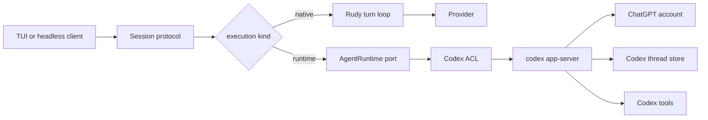

# Codex App Server runtime

- Status: approved in design session
- Date: 2026-09-26
- Minimum Codex CLI: 0.155.1
- Companion artifacts: [context map](rudy-context-map.md), [domain model](rudy-domain-model.md), [contracts](rudy-contracts.md), [ADR 0045](../adr/0045-codex-app-server-runtime.md)

## Outcome

Rudy can run a session through `codex app-server` and the user's ChatGPT
subscription. `/login` starts ChatGPT authentication inside Rudy. Codex App
Server owns the agent loop, canonical thread history, tool execution and its
upstream protocol. Rudy owns session placement, rendering, local approval
policy and durable evidence of each approval it grants.

The integration is an `AgentRuntime`, not a `Provider`. A Provider returns a
completion to Rudy's loop. An AgentRuntime owns threads and turns. Treating App
Server as a Provider would duplicate its loop, lose its approval protocol and
make either Rudy or Codex history non-canonical.

Native Provider sessions do not change.

## Boundary



`internal/provider/` remains the only home for vendor integration code. The
Codex adapter lives under it and is the only package that knows App Server
method names, request shapes or event shapes. The rest of Rudy sees runtime
domain types.

The built-in Codex runtime registers through the same
`plugin.register_runtime` capability a spawned plugin uses. The kernel has no
private registration path.

## Process lifecycle

One lazy `codex app-server` subprocess serves one Rudy kernel process. The
first account, model or thread operation starts it. Rudy resolves `codex` from
`PATH`, requires version 0.155.1 or newer, starts it with argv rather than a
shell and speaks newline-delimited JSON on stdio.

The App Server connection has its own codec and bidirectional peer. App Server
omits the JSON-RPC `jsonrpc` member. Rudy sends exactly one `initialize`, then
`initialized`, before any other method. The existing plugin protocol codec and
client are not reused because they require JSON-RPC 2.0 envelopes and reject
inbound requests.

Runtime states are `stopped`, `starting`, `ready` and `failed`. EOF fails the
active operation as ambiguous, denies every pending approval and starts one
replacement process with bounded exponential backoff when a Codex-backed
session remains attached. After restart Rudy initializes the connection,
resumes each linked thread and reads it to reconcile canonical state. Rudy
never retries `thread/start`, `thread/fork`, `turn/start` or `turn/steer` after
a lost response because App Server exposes no idempotency key and the lost
operation may have committed or run tools.

Stderr is diagnostic input, not user content. The adapter redacts bearer
tokens, authorization codes, cookies and URL query values before bounded
logging or notices. It never copies raw stderr into a session.

## Login

`/login` is a plugin-registered slash command. It does not add an OS command.
The command calls `account/read` before starting an attempt. An existing
ChatGPT account returns a notice and refreshes Codex models.

Local interactive flow:

1. Subscribe to account notifications before starting the request.
2. Call `account/login/start` with `type: "chatgpt"`.
3. Return an `AuthChallenge` with `login_id` and the HTTPS `auth_url`.
4. The TUI requires HTTPS and a host equal to or beneath `openai.com` or
   `chatgpt.com`, then opens it as one argv value with no shell.
5. Match `account/login/completed` only by `loginId` and require
   `success: true`.
6. Re-read `account/read`, require a ChatGPT account and refresh models.

If opening the browser fails or the browser attempt reports failure, Rudy
cancels that login id before starting `type: "chatgptDeviceCode"`. It publishes
a device challenge containing `login_id`, `verification_url` and `user_code`.
Remote and headless clients start device login directly because the browser
callback is hosted by the kernel-side App Server, not the client machine.

`account/updated` updates displayed account state but never completes a login
attempt because it carries no login id. A completion that races the start
response is buffered and matched once the response supplies its login id.
Challenges and completion are private to the invoking connection. Disconnect
cancels its attempt. The client sends hidden `browser` or `device` args based
on its own transport because an SSH bridge is indistinguishable at the kernel.

Rudy stores no access token, refresh token, cookie, authorization code or
client secret. Codex owns token persistence and refresh. Auth URLs and device
codes exist only in the live challenge and are not written to session logs.

## Models

Codex models use `codex:<model-id>`. The adapter pages through `model/list` and
maps model id, display name, supported effort and input modalities. App Server
does not promise pricing, context windows or output limits, so those fields are
unknown rather than fabricated. Login completion, session open, picker open
and model-not-found refresh the Codex model set. There is no timer.

`strict`, `permissive` and `off` map to App Server approval policies
`onRequest`, `unlessTrusted` and `never`. Rudy leaves App Server sandbox policy
to the operator's Codex configuration. Thinking targets `minimal`, `low`,
`medium` and `high`; an unsupported target falls to the nearest advertised
lower effort or the lowest advertised effort. Rudy does not promote `high` to
`xhigh`.

## Sessions and threads

A session chooses one execution kind at creation. The model registry records
whether each model is owned by a Provider or an AgentRuntime; the selected
model's owner decides the execution kind. A configured `codex:<model-id>` may
open an unlinked session before login or successful model discovery, so `/login`
does not depend on an existing Codex thread. A kernel with a registered runtime
and no HTTP Provider is valid.

The two execution kinds are:

- `native` runs Rudy's loop against a Provider.
- `runtime` delegates to a named AgentRuntime. The first runtime is `codex`.

For an unlinked Codex session, the first `session.submit` after authentication
calls `thread/start`, writes and fsyncs the link, then starts the turn. Rudy
writes a `CodexThreadLink` only after the response returns a thread id. A crash
between those steps may leave an orphan Codex thread, but cannot cross-link or
duplicate a turn because `turn/start` happens only after the link is durable.
Resume calls
`thread/resume` and `thread/read` with `includeTurns: true`. A fork calls
`thread/fork` and binds the returned new thread id to the new Rudy session. A
fork never inherits or reuses its parent's mutable link.

The link is `$XDG_DATA_HOME/rudy/sessions/<session-ulid>/runtime.toml`, written
atomically with mode `0600`:

```toml
runtime = "codex"
thread_id = "..."
```

Codex thread content is not copied into `entries.jsonl`. That log retains Rudy
control facts: `session_opened`, local setting changes and
`runtime_permission_decision`. The latter is required evidence at Rudy's trust
boundary, not a second conversation history.

`session.submit` maps to `turn/start`. A submitted steer while the same Codex
turn remains active maps to `turn/steer` with `expectedTurnId`. Cancel maps to
`turn/interrupt`; the request response only acknowledges the request and the
turn is not terminal until `turn/completed` reports `interrupted`.

Codex runtime sessions refuse operations without a faithful App Server
equivalent. `session.compact` and shell drafts are refused because neither can
change canonical runtime history without starting a model turn. Model, effort
and approval mode changes apply to the next turn and remain local control
facts. Closing detaches the client but does not delete the Codex thread.

## Projection

`thread/read` is the authoritative cold projection. Live projection consumes
thread, turn and item notifications. `item/completed` replaces any accumulated
deltas for that item. `turn/completed` is the terminal truth. Aggregated diff
and plan updates replace their prior live values rather than append.

Projected entry ids are deterministic hashes of the runtime name, thread id,
turn id, item id and projected kind. The same item therefore has the same Rudy
row id after resume. Projection never feeds back into a Codex request.

Rudy maps agent messages, reasoning summaries, command executions, file
changes, tool calls, plans, diffs, warnings, errors and token usage into its
client-facing transcript and state notifications. Unknown events are logged as
redacted diagnostics and ignored. An event whose thread or turn does not match
the adapter's verified binding is rejected and never routed to another
session.

## Approvals

App Server approval requests are inbound requests that block Codex tool
execution. The adapter binds each upstream JSON-RPC request id to the exact
runtime, Rudy session, Codex thread, Codex turn and item. Upstream identifiers
never choose a Rudy session.

The adapter translates command, file and permission requests into Rudy
permission questions. Before an allow response crosses back to App Server,
Rudy appends and fsyncs `runtime_permission_decision` with the full binding.
An approval App Server does send always goes through Rudy's asker path.
`acceptForSession` is sent only for an explicit
session-scoped answer.

No asker, asker disconnect, timeout, stale turn, unknown request, malformed
request, subprocess failure and shutdown all fail closed. Command and file
requests receive `decline`; permission requests receive an empty grant; user
input and MCP elicitation receive cancellation. Unsupported inbound methods
receive an immediate method error so a turn cannot hang.

Pending approval UI clears only after `serverRequest/resolved` or terminal
turn completion. Repeated or late answers are refused. Network approval text
is rendered as data and never executed or treated as a trustworthy command
preview.

## Failures

- Missing or old `codex` marks only the Codex runtime unavailable. Native
  providers keep working.
- Login failure preserves no credential material and leaves the runtime ready
  for another attempt.
- Lost non-idempotent responses surface an ambiguous runtime error. Reconcile
  canonical thread state before accepting another turn.
- Model discovery failure uses the last cached Codex models when available and
  reports the stale state.
- Malformed or cross-routed events fail the affected runtime operation and are
  never projected into another session.
- Unknown App Server error details map to a redacted runtime error. Raw vendor
  payloads do not leave the ACL.

## Verification

Fixtures are generated from the minimum supported Codex version and committed
without credentials. Tests cover initialization order, both login modes,
completion races, cancellation before fallback, pagination, thread start,
resume, fork, turn start, steer, interrupt, item projection, deterministic ids,
approval binding, durable allow ordering, fail-closed paths, redaction, process
restart and ambiguous non-retry.

The real path gate runs a fake App Server binary through the actual subprocess
transport, then drives `/login`, session creation, a turn, approval and resume
through the client protocol. An opt-in smoke test may use an installed logged-in
Codex CLI, but the default suite never reads or changes the user's account.

Drift guards require the runtime registration methods, App Server method
catalogue, `/login` command metadata and `runtime.toml` record shape to agree
between contracts and code.
