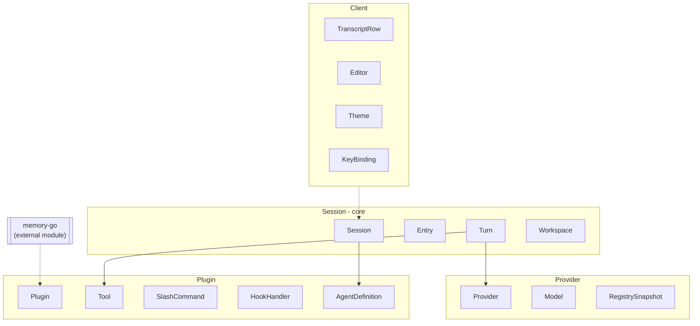
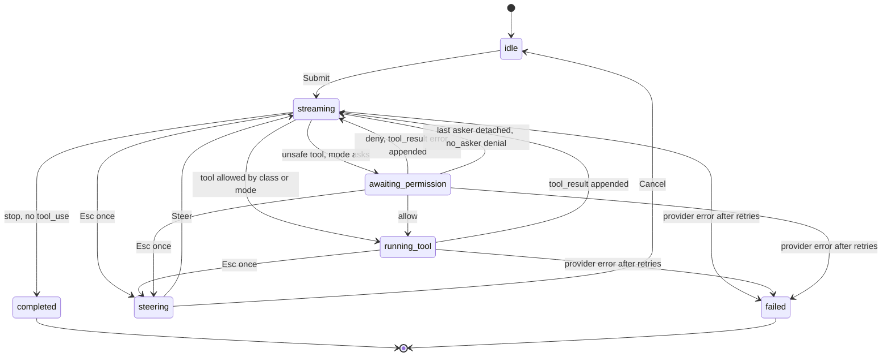
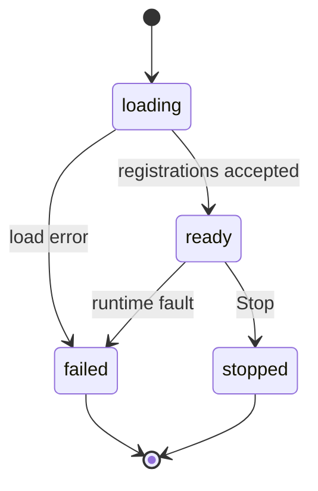
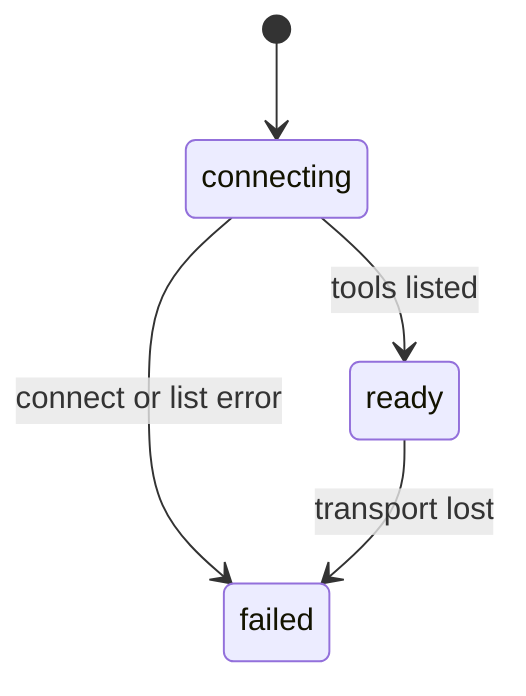
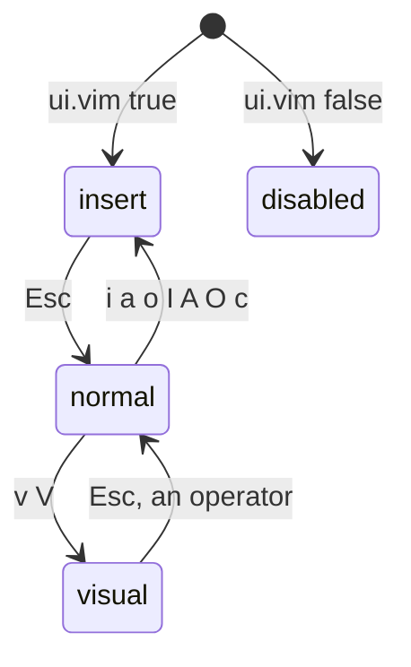
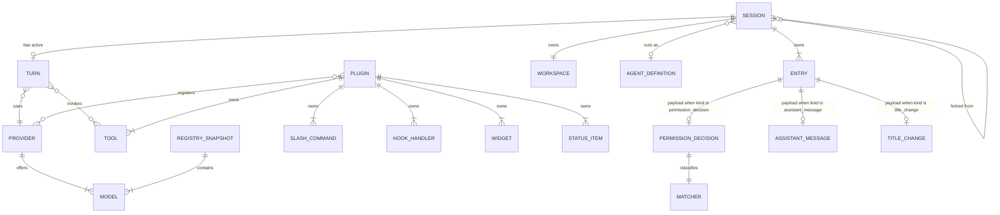
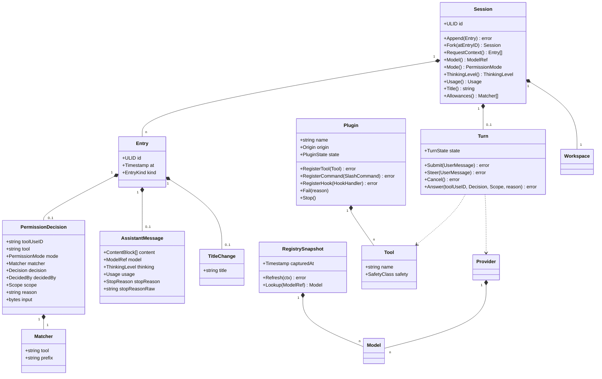

# rudy domain model

Pass 1. The objects across three contexts: Session (core), Provider, Plugin. Client is conformist and renders from the Session protocol; it holds no domain model beyond the transcript view. Memory is an external Go module imported by the memory plugin; nothing in it is modeled here.

## Contexts

Turn drives a completion through Provider and invokes Tools registered by Plugins. Session runs a child Session under an AgentDefinition for a subagent. The registry snapshot crosses from Provider into Session as the set of selectable models. Nothing else crosses.

## Session

Entity, aggregate root. One conversation over one workspace, persisted as an append-only log of Entries. All mutable state (model, mode, thinking level, title, usage) is derived from the log, never stored beside it.

### Fields

| Field | Type | Meaning |
|---|---|---|
| `id` | ULID | Identity. The directory name under the sessions root |
| `entries` | `[]Entry` | The ordered log. Append-only. For a forked session, the parent's entries precede the first local entry and are read from the parent at load, never copied |
| `parent` | `*ForkRef` | Absent on a root session. Present on a fork: the parent session id and the parent entry id forked at. Absence means this session owns all its entries |

### Behaviors

- `Append(Entry) error` writes one entry to `entries.jsonl`, fsyncs and returns. Refuses an entry whose kind or ordering violates an invariant below.
- `Fork(atEntryID) (Session, error)` creates a new Session whose first local entry is a `fork_point` naming this session and `atEntryID`.
- `RequestContext() []Entry` returns the entries the next completion sees: the newest `compaction` entry, then every entry after the last one it covers, in log order, with older compactions dropped. The entries between a compaction's `last_entry_id` and the compaction itself, the turn that was running when it happened, are kept. Every entry when there is no compaction. Derived, never stored.
- `Model() ModelRef` returns the ref from the most recent `session_opened` or `model_change`.
- `Mode() PermissionMode` returns the mode from the most recent `session_opened` or `mode_change`.
- `ThinkingLevel() ThinkingLevel` returns the level from the most recent `session_opened` or a thinking change.
- `Usage() Usage` sums the usage across all `assistant_message` and `compaction` entries, since both are provider calls the session paid for.
- `Title() string` returns the title from the most recent `title_change`; empty when none. Whether the first user message stands in is open.
- `Allowances() []Matcher` returns the matchers of every `permission_decision` with decision `allow` and scope `session`. Derived from the log, never stored separately.

### Invariants

- The first entry of a root session is `session_opened`. The first local entry of a fork is `fork_point`.
- `fork_point` appears at most once, and only as the first local entry. Any later `fork_point` is refused.
- An `assistant_message` carrying a `tool_use` block for an unsafe tool is followed by a `permission_decision` for that tool_use id before any `tool_result` for it. The gate appends and fsyncs the allow decision before the tool runs.
- Every `permission_decision` with decision `allow` is eventually paired with a `tool_result` for the same tool_use id. On load, an allow with no matching result gets a synthesized `tool_result` with outcome `lost`.
- Entry payloads that carry provider bytes (tool_use input, thinking signatures, tool result content) are stored byte-exact and never re-marshaled.
- At most one Turn is active per Session at any time.
- An allowance matches a later tool_use only on `Matcher` equality: same tool and same prefix. A looser match is refused.
- A Session with at least one child fork refuses deletion.

### States

A Session has no lifecycle state machine of its own; its state is the fold of its log. The active Turn carries the lifecycle.

### Relationships

| With | Kind | Cardinality |
|---|---|---|
| `Entry` | has-a (owned) | 1 to n, n >= 1 |
| `Turn` | has-a (owned) | 1 to 0..1 |
| `Session` (parent) | references | n to 0..1 |
| `Session` (child fork) | references | 1 to n |
| `Workspace` | has-a (owned) | 1 to 1 |
| `AgentDefinition` | references | n to 0..1 |

## Entry

Entity, immutable after append. One item in a Session log. Identity persists; content never changes. The `kind` selects exactly one payload shape from the closed set below.

### Fields

| Field | Type | Meaning |
|---|---|---|
| `id` | ULID | Identity within the log. Monotonic by append order |
| `at` | Timestamp | Wall-clock time the entry was appended |
| `kind` | `EntryKind` | Selects the payload |
| `payload` | one of the payloads below | The kind-specific body |

### Invariants

- `id` is monotonic: an entry with an id less than or equal to the last appended id is refused.
- `kind` is a member of `EntryKind`. An unknown kind is refused.

### Relationships

| With | Kind | Cardinality |
|---|---|---|
| `Session` | owned by | n to 1 |

The payload sections that follow are value objects, each owned by its Entry, each stored inline in the entry's JSONL line. None has identity of its own.

## SessionOpened

Value object, payload of a `session_opened` entry.

| Field | Type | Meaning |
|---|---|---|
| `schemaVersion` | int | The log schema version, for forward migration |
| `rudyVersion` | string | The rudy version that opened the session |
| `workspace` | `Workspace` | The workspace this session runs over |
| `model` | `ModelRef` | The model selected at open |
| `thinking` | `ThinkingLevel` | The thinking level at open |
| `mode` | `PermissionMode` | The permission mode at open |
| `agent` | string | The agent definition name this session runs under; `default` when none |
| `parentSessionID` | ULID or empty | The session whose `tool_use` opened this one; empty means a root session |
| `parentToolUseID` | string | The `tool_use` id in the parent that opened this one; empty exactly when `parentSessionID` is empty |

## ForkPoint

Value object, payload of a `fork_point` entry. Also the shape of `Session.parent`.

| Field | Type | Meaning |
|---|---|---|
| `parentSessionID` | ULID | The session forked from |
| `parentEntryID` | ULID | The entry in the parent the fork branches at. Entries after it in the parent are not visible to this fork |

## UserMessage

Value object, payload of a `user_message` entry.

| Field | Type | Meaning |
|---|---|---|
| `content` | `[]ContentBlock` | The message content: text or image blocks, at least one |
| `source` | `Source` | How the message entered: typed, queued or steer |

## AssistantMessage

Value object, payload of an `assistant_message` entry.

| Field | Type | Meaning |
|---|---|---|
| `content` | `[]ContentBlock` | Text, thinking and tool_use blocks in order. May be empty when `stopReason` is `interrupted` before any delta |
| `model` | `ModelRef` | The model that produced the message; recorded because the selection can change mid-session |
| `thinking` | `ThinkingLevel` | The thinking level in effect |
| `usage` | `Usage` | Verbatim from the provider; zeros when the provider sent none |
| `stopReason` | `StopReason` | Why generation stopped, domain classification |
| `stopReasonRaw` | string | The provider's own value; empty for `interrupted` |

## PermissionDecision

Value object, payload of a `permission_decision` entry. Records what happened, with no optional holes.

| Field | Type | Meaning |
|---|---|---|
| `toolUseID` | string | The tool_use block this decision concerns |
| `tool` | string | The tool name |
| `mode` | `PermissionMode` | The mode in force when the decision was made |
| `matcher` | `Matcher` | The Gate's classification of the input |
| `decision` | `Decision` | allow or deny |
| `decidedBy` | `DecidedBy` | Who or what decided |
| `scope` | `Scope` | once or session; `session` only ever comes from an asker allow |
| `reason` | string | Never empty. The asker's text, the hook's reason or the rule name; for `no_asker` the fixed string `no asker attached` |
| `input` | bytes | The input the tool ran with when a `before_tool` hook modified it; absent otherwise. Kept byte for byte, so the log shows exactly what the call carried when it differs from the `tool_use` block |

## Matcher

Value object, owned by `PermissionDecision`. The Gate's classification of a tool input and the key a session allowance matches on.

| Field | Type | Meaning |
|---|---|---|
| `tool` | string | The tool name |
| `prefix` | string | The leading words of the command for `bash`; empty for every other tool |

Two matchers are equal only when both fields are equal. An allowance matches on `Matcher` equality and nothing looser.

## ToolResult

Value object, payload of a `tool_result` entry.

| Field | Type | Meaning |
|---|---|---|
| `toolUseID` | string | The tool_use block this result answers |
| `content` | `[]ContentBlock` | The result content, text or image, byte-exact. Empty for `lost` |
| `outcome` | `ToolOutcome` | ok, error, killed or lost |
| `durationMS` | int | Wall-clock milliseconds the tool ran. Zero for a `lost` result synthesized on recovery |

## ModelChange

Value object, payload of a `model_change` entry.

| Field | Type | Meaning |
|---|---|---|
| `model` | `ModelRef` | The newly selected model |

## ModeChange

Value object, payload of a `mode_change` entry.

| Field | Type | Meaning |
|---|---|---|
| `mode` | `PermissionMode` | The newly selected mode |

## ThinkingChange

Value object, payload of a `thinking_change` entry.

| Field | Type | Meaning |
|---|---|---|
| `thinking` | `ThinkingLevel` | The newly selected thinking level |

## TitleChange

Value object, payload of a `title_change` entry.

| Field | Type | Meaning |
|---|---|---|
| `title` | string | The session title as set by the user or a command. Non-empty; an empty title is refused |

## Compaction

Value object, payload of a `compaction` entry. Marks a boundary: entries it covers are dropped from the request context and replaced by its summary.

| Field | Type | Meaning |
|---|---|---|
| `summary` | string | The compressed summary of the covered range |
| `firstEntryID` | ULID | First entry id covered, inclusive |
| `lastEntryID` | ULID | Last entry id covered, inclusive; not before `firstEntryID` |
| `model` | `ModelRef` | The model that wrote the summary |
| `usage` | `Usage` | What writing the summary cost, verbatim from the provider |

## TurnInterrupted

Value object, payload of a `turn_interrupted` entry.

A turn id is the id of the `user_message` entry that started the turn. Turns are not stored; that id is enough to find one in the log, and it is the `turn_id` every protocol message carries.

| Field | Type | Meaning |
|---|---|---|
| `turnID` | ULID | The turn this interruption ended or paused |
| `how` | `InterruptKind` | steer or cancel |

## TurnFailed

Value object, payload of a `turn_failed` entry.

| Field | Type | Meaning |
|---|---|---|
| `turnID` | ULID | The turn that failed |
| `class` | `ErrorClass` | The closed failure category |
| `message` | string | The provider or system message, for display |
| `retries` | int | Attempts made before giving up; 0 when not applicable |

## Note

Value object, payload of a `note` entry. Display-only; never part of a request context.

| Field | Type | Meaning |
|---|---|---|
| `plugin` | string | The plugin name that emitted the note |
| `text` | string | The note text |
| `role` | `NoteRole` | The theme role the client renders it with |

## NoteRole

Enumeration.

| Value | Means |
|---|---|
| `info` | Ordinary information |
| `muted` | Low emphasis |
| `warn` | Something to look at |
| `error` | Something failed |

## Turn

Entity, owned by Session, not stored (its progress is the tail of the log). One user message and everything the loop does until it yields. At most one Turn is active per Session.

### Fields

| Field | Type | Meaning |
|---|---|---|
| `session` | ULID | The owning session |
| `state` | `TurnState` | The current loop state |
| `pendingToolCallID` | `*string` | The tool call awaiting permission or running. Absent when the turn is streaming or idle |

### Behaviors

- `Submit(UserMessage) error` appends the user message and enters `streaming`. Refused if a Turn is already active.
- `Steer(UserMessage) error` appends a `user_message` with source `steer` and re-enters `streaming` from `steering`.
- `Cancel() error` appends `turn_interrupted{cancel}` and returns the session to idle.
- `Answer(toolUseID, Decision, Scope, reason) error` records an asker's answer: appends the `permission_decision` with `decidedBy = asker` and advances from `awaiting_permission`.

### Invariants

- Submit is refused unless `state` is idle.
- A transition not in the table below is refused.
- Entering `running_tool` for an unsafe tool is refused unless a `permission_decision` allow for `pendingToolCallID` has been appended and fsynced.
- Leaving any active state on interrupt records partials already streamed before the state changes.
- In `awaiting_permission` the question is put to every attached asker, and to an asker that attaches while it stands; the first answer decides and a later answer is refused. When the last asker detaches while the question stands, the Gate records `permission_decision{no_asker}` and the turn leaves `awaiting_permission` as a denial (ADR 0014).

### States

Anything not drawn is refused by the aggregate.

### Relationships

| With | Kind | Cardinality |
|---|---|---|
| `Session` | owned by | 1 to 1 |
| `Provider` | references | n to 1 |
| `Tool` | references | n to n |

## Workspace

Value object, owned by Session. The directory the session acts over.

### Fields

| Field | Type | Meaning |
|---|---|---|
| `root` | string | Absolute path the session operates in |
| `gitRoot` | string | Absolute path of the enclosing git root. Empty string means not a git repository, a stated value, not absence |
| `projectID` | string | Stable project identifier derived from the root, used to scope memory concepts. Empty string means no project scope |

### Relationships

| With | Kind | Cardinality |
|---|---|---|
| `Session` | owned by | 1 to 1 |

## ContentBlock

Value object, a sum. One block of message content. The variant tag selects the fields.

| Variant | Fields | Meaning |
|---|---|---|
| `text` | `text string` | Plain or markdown text |
| `image` | `mediaType string`, `sha256 string` | An image stored byte-exact as `blobs/<sha256>` in the session directory and referenced by hash. Inline image bytes never appear in the log |
| `thinking` | `text string`, `signature []byte` | A reasoning block with its provider signature, byte-exact |
| `tool_use` | `id string`, `name string`, `input []byte` | A tool call. `input` is raw provider bytes, never re-marshaled |

### Relationships

| With | Kind | Cardinality |
|---|---|---|
| `UserMessage`, `AssistantMessage`, `ToolResult` | owned by | n to 1 |

## ModelRef

Value object. Names one model at one provider.

| Field | Type | Meaning |
|---|---|---|
| `provider` | string | The provider name (matches a `Provider.name`) |
| `modelID` | string | The model id as the provider's `/v1/models` reports it |

## Usage

Value object. Token counts for one completion.

| Field | Type | Meaning |
|---|---|---|
| `inputTokens` | int | Prompt tokens |
| `outputTokens` | int | Generated tokens |
| `cacheReadTokens` | int | Tokens served from provider prompt cache |
| `cacheWriteTokens` | int | Tokens written to provider prompt cache |

## PermissionMode

Enumeration.

| Value | Means |
|---|---|
| `strict` | Unsafe tools ask the attached asker. No asker means deny. Safe tools run |
| `permissive` | Everything runs except a built-in dangerous set, which asks |
| `off` | Everything runs, nothing asks |

## Decision

Enumeration.

| Value | Means |
|---|---|
| `allow` | The tool may run |
| `deny` | The tool is refused; a `tool_result` with outcome error is appended |

## DecidedBy

Enumeration.

| Value | Means |
|---|---|
| `class` | The tool is safe; no question arose |
| `mode` | Off or permissive let it through without asking |
| `allowance` | A prior session-scope allow matched on `Matcher` equality |
| `hook` | A `before_tool` handler decided |
| `asker` | A human or client answered |
| `no_asker` | Strict mode with nobody to ask; always a deny |

## Scope

Enumeration. How long a permission answer holds.

| Value | Means |
|---|---|
| `once` | This tool_use only. Every row not from an asker allow says `once` |
| `session` | Every later tool_use with an equal `Matcher` in this session. Only an asker allow can say it |

## ToolOutcome

Enumeration.

| Value | Means |
|---|---|
| `ok` | The tool completed |
| `error` | The tool ran and returned an error, or was denied |
| `killed` | The tool was terminated by an interrupt |
| `lost` | No result was recorded before a crash; synthesized on recovery |

## TurnState

Enumeration.

| Value | Means |
|---|---|
| `idle` | No active turn |
| `streaming` | Awaiting or receiving a completion |
| `running_tool` | A tool is executing |
| `awaiting_permission` | An unsafe tool waits on a decision |
| `steering` | Interrupted once; the next message continues the turn |
| `completed` | The turn ended normally |
| `failed` | The turn ended on an error |

## Source

Enumeration.

| Value | Means |
|---|---|
| `typed` | Entered directly at the prompt |
| `queued` | Submitted from the follow-up queue |
| `steer` | Submitted while steering an interrupted turn |

## ThinkingLevel

Enumeration.

| Value | Means |
|---|---|
| `off` | No extended thinking |
| `low` | Minimal thinking budget |
| `medium` | Moderate thinking budget |
| `high` | Maximal thinking budget |

## StopReason

Enumeration.

| Value | Means |
|---|---|
| `end_turn` | The model finished |
| `tool_use` | The model requested a tool |
| `max_tokens` | The output limit was hit |
| `interrupted` | A steer or cancel cut the stream; `content` holds what streamed |
| `refused` | The model declined |
| `other` | A provider value with no domain meaning; see `stopReasonRaw` |

## InterruptKind

Enumeration.

| Value | Means |
|---|---|
| `steer` | Single interrupt; the turn continues on the next message |
| `cancel` | Double interrupt; the turn is abandoned |

## ErrorClass

Enumeration.

| Value | Means |
|---|---|
| `provider` | The provider returned an error after retries |
| `transport` | The connection failed |
| `plugin` | A plugin fault: a panic or a programming error in a tool, not a tool that ran and reported an error |
| `internal` | A rudy fault |

## EntryKind

Enumeration. The closed set of entry payloads.

| Value | Payload |
|---|---|
| `session_opened` | `SessionOpened` |
| `fork_point` | `ForkPoint` |
| `user_message` | `UserMessage` |
| `assistant_message` | `AssistantMessage` |
| `permission_decision` | `PermissionDecision` |
| `tool_result` | `ToolResult` |
| `model_change` | `ModelChange` |
| `mode_change` | `ModeChange` |
| `thinking_change` | `ThinkingChange` |
| `title_change` | `TitleChange` |
| `compaction` | `Compaction` |
| `turn_interrupted` | `TurnInterrupted` |
| `turn_failed` | `TurnFailed` |
| `note` | `Note` |

## Provider

Entity, identity by name. One LLM endpoint speaking one wire protocol.

### Fields

| Field | Type | Meaning |
|---|---|---|
| `name` | string | Identity. The provider name referenced by `ModelRef.provider` |
| `wireKind` | `WireKind` | Which wire protocol the endpoint speaks |
| `baseURL` | string | The endpoint base, up to but not including the path |
| `authRef` | string | A reference into the secret cache, resolved at call time. Empty string means no auth required, a stated value |
| `extraHeaders` | `map[string]string` | Headers added to every request, including session id and user-agent |

### Behaviors

Providers are configured, not mutated at runtime. Behavior lives on Registry and on the completion path.

### Invariants

- `name` is unique across configured providers.
- `wireKind` is a member of `WireKind`.

### Relationships

| With | Kind | Cardinality |
|---|---|---|
| `Model` | has-a | 1 to n |
| `RegistrySnapshot` | references | 1 to n |

## Model

Entity, identity by provider plus id. One model offered by one provider.

### Fields

| Field | Type | Meaning |
|---|---|---|
| `provider` | string | The owning provider name |
| `id` | string | The model id from `/v1/models` |
| `displayName` | string | Human label from `/v1/models` display_name |
| `contextWindow` | int | Max context tokens from context_window_tokens |
| `maxOutput` | int | Max output tokens from max_output_tokens |
| `inputPrice` | Decimal | Cost per input token |
| `outputPrice` | Decimal | Cost per output token |
| `cacheReadPrice` | Decimal | Cost per cached input token. Zero when the provider prices none |
| `capabilities` | `Capabilities` | What the model supports. Enriched from catwalk keyed by id; empty when no match (see open list) |

### Invariants

- The pair (`provider`, `id`) is unique within a snapshot.
- `contextWindow` greater than zero. A model reporting no window is refused into the snapshot.

### Relationships

| With | Kind | Cardinality |
|---|---|---|
| `Provider` | owned by | n to 1 |
| `RegistrySnapshot` | owned by | n to 1 |

## RegistrySnapshot

Entity, aggregate root. The set of models discovered from all providers at one point, cached on disk.

### Fields

| Field | Type | Meaning |
|---|---|---|
| `capturedAt` | Timestamp | When the snapshot was taken |
| `models` | `[]Model` | Every model across every provider |

### Behaviors

- `Refresh(ctx) error` calls each provider's `/v1/models`, rebuilds `models` and rewrites the cache. Triggered on session open, on picker open, and on a model-not-found error. Never on a timer.
- `Lookup(ModelRef) (Model, bool)` finds a model by provider and id.

### Invariants

- Two models with the same (`provider`, `id`) are refused; the later wins on refresh.

### Relationships

| With | Kind | Cardinality |
|---|---|---|
| `Model` | has-a (owned) | 1 to n |
| `Provider` | references | n to n |

## CompletionRequest

Value object. One request to a provider, in domain types. The adapter translates it to the wire.

### Fields

| Field | Type | Meaning |
|---|---|---|
| `model` | `ModelRef` | The target model |
| `context` | `[]Entry` | The request context from `Session.RequestContext` |
| `tools` | `[]Tool` | The tools offered this turn |
| `thinking` | `ThinkingLevel` | The thinking budget |
| `stream` | bool | Whether to stream. Always true in the interactive loop |

### Relationships

| With | Kind | Cardinality |
|---|---|---|
| `Turn` | owned by | n to 1 |

## StreamPart

Value object, a sum. One event from a provider stream. The adapter emits these in domain types; the two wire adapters are the only code that imports an SDK.

| Variant | Fields | Meaning |
|---|---|---|
| `text_delta` | `text string` | A chunk of assistant text |
| `thinking_delta` | `text string` | A chunk of reasoning |
| `thinking_signature` | `signature string` | The provider's signature over the thinking block that just streamed, byte-exact |
| `tool_use_start` | `id string`, `name string` | A tool call begins |
| `tool_use_delta` | `argsFragment []byte` | A fragment of tool input, byte-exact |
| `message_done` | `usage Usage`, `stopReason StopReason` | The completion ended |
| `error` | `class ErrorClass`, `message string` | The stream failed |

### Relationships

| With | Kind | Cardinality |
|---|---|---|
| `CompletionRequest` | derived-from | n to 1 |

## WireKind

Enumeration.

| Value | Means |
|---|---|
| `anthropic_messages` | The Anthropic Messages API shape |
| `openai_chat` | The OpenAI chat-completions shape |

## Capabilities

Value object. What one model supports.

| Field | Type | Meaning |
|---|---|---|
| `vision` | bool | Accepts image input |
| `toolUse` | bool | Supports tool calling |
| `reasoning` | bool | Supports extended thinking |

## Plugin

Entity, identity by name. A unit that extends the kernel, whether linked into the binary or spawned as a subprocess. It never knows which; it implements the same interface either way.

### Fields

| Field | Type | Meaning |
|---|---|---|
| `name` | string | Identity |
| `origin` | `Origin` | linked or spawned |
| `state` | `PluginState` | The lifecycle state |
| `failReason` | string | The reason when `state` is failed. Empty string in every other state, a stated value |

### Behaviors

- `RegisterTool(Tool) error` adds a tool. Refused on a duplicate name (the plugin still loads).
- `RegisterCommand(SlashCommand) error` adds a slash command.
- `RegisterHook(HookHandler) error` attaches a handler to a hook point.
- `RegisterWidget(Widget) error` adds a widget owned by this plugin.
- `RegisterStatusItem(StatusItem) error` adds a status item owned by this plugin.
- `RegisterProvider(Provider) error` adds a provider.
- `Fail(reason)` moves the plugin to failed and records the reason.
- `Stop()` moves the plugin to stopped and releases its registrations.

### Invariants

- `name` is unique across loaded plugins.
- A tool, command, widget or status item is owned by exactly one plugin; another plugin cannot clear or overwrite it.
- A duplicate tool name is refused with a notice; the registering plugin remains in ready.
- A transition not in the state diagram is refused.

### States

### Relationships

| With | Kind | Cardinality |
|---|---|---|
| `Tool` | has-a (owned) | 1 to n |
| `SlashCommand` | has-a (owned) | 1 to n |
| `HookHandler` | has-a (owned) | 1 to n |
| `Widget` | has-a (owned) | 1 to n |
| `StatusItem` | has-a (owned) | 1 to n |
| `Provider` | references | 1 to n |

## Tool

Entity, identity by name. A callable the model may invoke.

### Fields

| Field | Type | Meaning |
|---|---|---|
| `name` | string | Identity. Unique across all plugins |
| `description` | string | What the tool does, sent to the model |
| `schema` | []byte | JSON Schema of the input, byte-exact |
| `safety` | `SafetyClass` | safe or unsafe |

### Invariants

- `name` is unique across every loaded plugin.
- `safety` is a member of `SafetyClass`.

### Relationships

| With | Kind | Cardinality |
|---|---|---|
| `Plugin` | owned by | n to 1 |

## SafetyClass

Enumeration. The one switch driving both the gate and the record-before-run rule.

| Value | Means |
|---|---|
| `safe` | Read-only or otherwise harmless; runs without a decision |
| `unsafe` | May change state; requires a recorded decision before running |

## SlashCommand

Entity, identity by name. A client-facing command.

### Fields

| Field | Type | Meaning |
|---|---|---|
| `name` | string | The command word, without the leading slash |
| `description` | string | One-line help |
| `argHint` | string | Argument hint for completion. Empty string means no arguments |

### Relationships

| With | Kind | Cardinality |
|---|---|---|
| `Plugin` | owned by | n to 1 |

## HookHandler

Entity, owned by Plugin. A handler attached to one hook point.

### Fields

| Field | Type | Meaning |
|---|---|---|
| `point` | `HookPoint` | Where in the lifecycle it fires |
| `plugin` | string | The owning plugin |

### Relationships

| With | Kind | Cardinality |
|---|---|---|
| `Plugin` | owned by | n to 1 |

## HookPoint

Enumeration. The closed set of lifecycle attachment points.

| Value | Fires | Handler may return |
|---|---|---|
| `session_opened` | After a session opens, and on first attach of a resume | Context appended to the system prompt for the session |
| `before_turn` | Before a turn starts, on a typed or queued user message | System prompt additions |
| `before_request` | Before every completion request in a turn | Header mutations only in pass 1; the body is not exposed |
| `after_response` | After each assistant message is appended | Nothing |
| `before_tool` | Before the Gate sees a tool_use | pass, allow, deny or modify with input and reason. allow and deny short-circuit the Gate and are recorded with `decidedBy = hook`; modify replaces the input |
| `after_tool` | After a tool result is appended, before it reaches the next request | Replacement content the model sees; the stored entry is unchanged |
| `before_compaction` | When the Compactor decides to compact, before it asks the model | A summary; the first non-empty one is used and the model is not asked |
| `turn_completed` | After a turn ends | Nothing |
| `session_closed` | Before a session closes | Nothing |

## Widget

Entity, owned by Plugin. A rendered element the client may place in a slot.

### Fields

| Field | Type | Meaning |
|---|---|---|
| `key` | string | Identity within the owning plugin |
| `plugin` | string | The owning plugin |
| `slot` | string | The named layout slot it targets |

### Relationships

| With | Kind | Cardinality |
|---|---|---|
| `Plugin` | owned by | n to 1 |

## StatusItem

Entity, owned by Plugin. One item in the status line.

### Fields

| Field | Type | Meaning |
|---|---|---|
| `key` | string | Identity within the owning plugin |
| `plugin` | string | The owning plugin |
| `content` | string | The current text |

### Relationships

| With | Kind | Cardinality |
|---|---|---|
| `Plugin` | owned by | n to 1 |

## Skill

Value object. A discovered instruction file loaded from a standards-based skills directory.

### Fields

| Field | Type | Meaning |
|---|---|---|
| `name` | string | The skill name from its directory |
| `path` | string | Absolute path to the `SKILL.md` |
| `description` | string | The frontmatter description used for selection |

### Invariants

- Loaded only from `~/.agents/skills` and `<workspace>/.agents/skills`. No other directory is read (see open list on the workspace path).

### Relationships

| With | Kind | Cardinality |
|---|---|---|
| `Plugin` (skills loader) | referenced by | n to 1 |

## AgentDefinition

Value object. A named profile a subagent session runs under, read from `agents/<name>.md`.

### Fields

| Field | Type | Meaning |
|---|---|---|
| `name` | string | The profile name; the file stem |
| `description` | string | One line shown to the parent model in the `agent` tool's description |
| `prompt` | string | The system prompt body for the subagent |
| `tools` | []string | The tool names the subagent may use; `agent` is never among them |
| `model` | string | `provider:id`, a unique bare id, or empty to inherit the parent's |
| `thinking` | `ThinkingLevel` or empty | Empty inherits the parent's |
| `maxTurns` | int | Zero means unlimited |

### Relationships

| With | Kind | Cardinality |
|---|---|---|
| `Session` (subagent) | referenced by | 1 to n |

## MCPServer

Entity, identity by name, owned by the `mcp` plugin. One configured Model Context Protocol server whose tools the plugin registers as `mcp__<name>__<tool>`.

### Fields

| Field | Type | Meaning |
|---|---|---|
| `name` | string | Identity; the table key in `mcp.toml` |
| `scope` | `user`, `project` | Which `mcp.toml` it came from; a project entry replaces a user entry of the same name |
| `transport` | `stdio`, `http` | |
| `command` | string | Executable; empty for `http` |
| `args` | []string | Arguments; empty for `http` |
| `env` | map[string]string | Secret references added to the child environment; empty for `http` |
| `url` | string | Endpoint; empty for `stdio` |
| `headers` | map[string]string | Secret references sent on every request; empty for `stdio` |
| `state` | `connecting`, `ready`, `failed` | |
| `failReason` | string | Empty unless `failed` |

### Behaviors

- `Connect()` opens the transport, lists tools and moves to `ready`; a failure moves to `failed` with the reason and emits a notice.
- `Call(tool, input) Result` invokes one tool and maps the content to `ContentBlock`s.

### Invariants

- Exactly the fields of its transport are set; the others are empty.
- Every registered tool name is `mcp__<name>__<tool>` and carries safety `unsafe`.

### States

### Relationships

| With | Kind | Cardinality |
|---|---|---|
| `Plugin` (`mcp`) | owned by | n to 1 |
| `Tool` | has-a (owned) | 1 to n |

## InstalledPlugin

Value object. One row of `plugins.lock.toml`.

| Field | Type | Meaning |
|---|---|---|
| `name` | string | The manifest name; the checkout directory |
| `source` | string | Git URL or absolute path given to `rudy plugin install` |
| `commit` | string | Checked-out commit; empty when the source is a path outside a repository |
| `installedAt` | instant | |
| `enabled` | bool | A disabled plugin is discovered and not spawned |

## TranscriptRow

Entity, owned by the Client context. One thing on screen, derived from entries and notifications; keyed by the entry id it came from, or by tool_use id for a tool row.

### Fields

| Field | Type | Meaning |
|---|---|---|
| `key` | string | The entry id, or the `tool_use` id for a tool row |
| `kind` | `RowKind` | user, assistant, tool, prompt, marker |
| `turnID` | string | The turn the row belongs to; rows commit to scrollback together |
| `live` | bool | Streaming or pending: rendered as plain text, replaced on commit |
| `expanded` | bool | Tool rows only; the config default, toggled by the user |
| `entry` | `Entry` or empty | The committed entry; empty while live |
| `decision` | `PermissionDecision` or empty | Tool rows: absorbed by tool_use id |
| `result` | `ToolResult` or empty | Tool rows: absorbed by tool_use id |

### Behaviors

- `Absorb(entry)` folds a `permission_decision` or `tool_result` into the tool row with the same tool_use id.
- `Render(theme, config, width) []string` produces the row's lines; a tool row renders one line plus `tool_preview_lines` of preview unless expanded.

### Invariants

- A row's key is unique in the transcript; replay and reattach never duplicate.
- A prompt row exists only between `permission.requested` and the answer, in the place its tool row takes afterwards.

### Relationships

| With | Kind | Cardinality |
|---|---|---|
| `Entry` | derived-from | 1 to 1 (tool rows 1 to 3) |
| `Turn` | references (by turn id) | n to 1 |

## RowKind

Enumeration.

| Value | Means |
|---|---|
| `user` | A `user_message` |
| `assistant` | One text block of an `assistant_message` (thinking when shown) |
| `tool` | A `tool_use` with its decision and result |
| `prompt` | A pending permission question |
| `marker` | `note`, `compaction`, `turn_interrupted`, `turn_failed` |

## Slot

Enumeration. A region of the client screen with an owner, ordered top to bottom by `ui.layout.slots`.

| Value | Owner | Means |
|---|---|---|
| `header` | config or a plugin widget | Optional, once at the top |
| `transcript` | client | The rows |
| `above_editor` | plugin widgets | Between the transcript and the input |
| `input` | client | The editor and the prompt row |
| `below_editor` | plugin widgets | Between the input and the status |
| `status` | client, items from config and plugins | The status line |

## Theme

Value object. Named color roles, every one with a default.

| Field | Type | Meaning |
|---|---|---|
| `name` | string | The built-in `default` or a file under `themes/` |
| `roles` | map[role]color | `accent`, `text`, `muted`, `user`, `assistant`, `tool`, `success`, `error`, `warning`, `diff_add`, `diff_del`, `code`; a value is a hex color, another role's name, or for `code` a `chroma:<style>` |

### Invariants

- Every role resolves to a color after at most one role indirection; a cycle or an unknown role is a load error.
- No role paints a background.

## KeyBinding

Value object. One action id bound to zero or more key strings in pi's `modifier+key` grammar.

| Field | Type | Meaning |
|---|---|---|
| `action` | string | A pi action id from the closed set ADR 0013 lists |
| `keys` | []string | Empty unbinds |

### Invariants

- An action id outside the closed set is a config error naming the id.
- A key string that does not parse is a config error naming the action.

## Editor

Entity, one per client. The input textarea with its modal state.

### Fields

| Field | Type | Meaning |
|---|---|---|
| `mode` | `EditorMode` | disabled, insert, normal, visual |
| `text` | string | The buffer |
| `queue` | []string | Follow-ups queued while a turn runs, oldest first |

### States

## TurnControl

Value object on the client. What Esc does depends on it.

| State | Esc once | Esc twice within `double_press_ms` |
|---|---|---|
| idle | closes a picker or a selection | nothing more |
| streaming or running a tool | `session.interrupt steer` | `session.interrupt cancel`, queue back to the editor |
| steering, editor non-empty | submit continues the turn (Enter), Esc does nothing | cancel |
| steering, editor empty | `session.interrupt cancel` | |

## Origin

Enumeration.

| Value | Means |
|---|---|
| `linked` | Compiled into the binary; registers through the same interface as a subprocess |
| `spawned` | A subprocess speaking the protocol over stdio |

## PluginState

Enumeration.

| Value | Means |
|---|---|
| `loading` | Registering |
| `ready` | Registered and serving |
| `failed` | Load or runtime fault; `failReason` set |
| `stopped` | Cleanly shut down; registrations released |

## Everything at once

## Open, not assumed

- Dangerous set for permissive mode: the exact tools and shell patterns that ask under `permissive` are undecided.
- Capabilities for unmatched proxy models: when catwalk has no entry for a proxy model id, `Capabilities` is empty. How to fill it (probe, config, assume a floor) is undecided.
- Workspace skills path: `<workspace>/.agents/skills` is inferred as the workspace-scoped location. Confirm the exact path.
- Double-press window: 500ms for the Esc cancel window is inferred, not stated.
- Fork by reference: forks read parent entries at load rather than copying. Confirm this over a copy-on-fork alternative.
- Session title: `Title()` mechanism is undecided (first user message, model-generated or explicit rename).
- Note entries: modeled as display-only and excluded from request context. Confirm they never enter a completion.
- Skill selection: whether skills auto-inject by relevance or load only on explicit invocation is undecided.
- Migration prompt: reading only the standards path, with a first-boot offer to migrate `.claude/skills` and a command to migrate later, is a workflow decision not yet modeled as an object.
