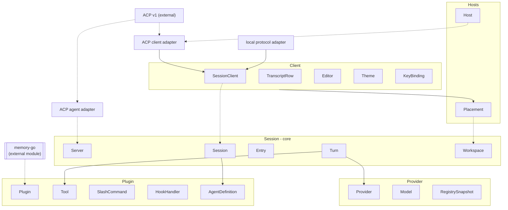
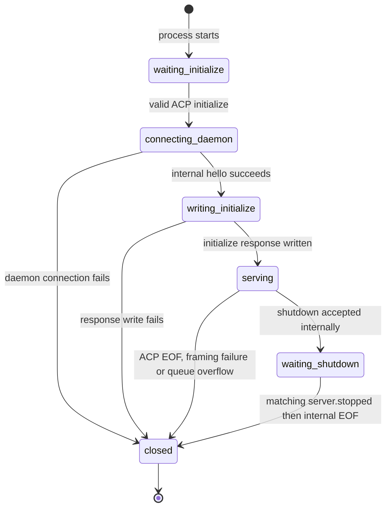
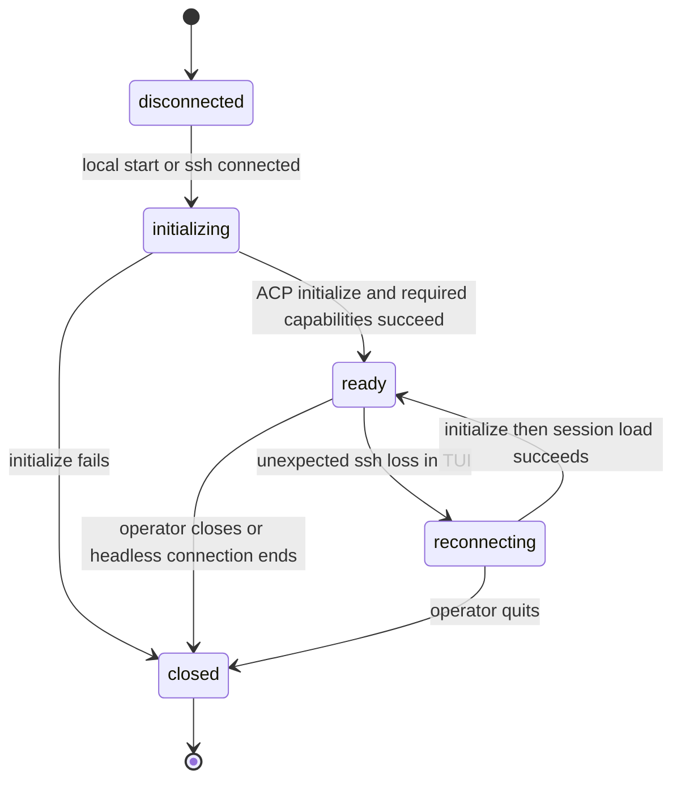
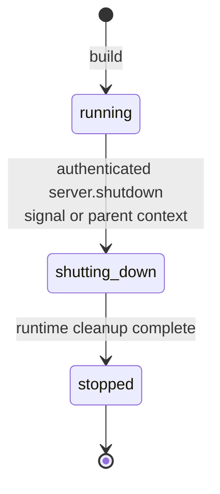
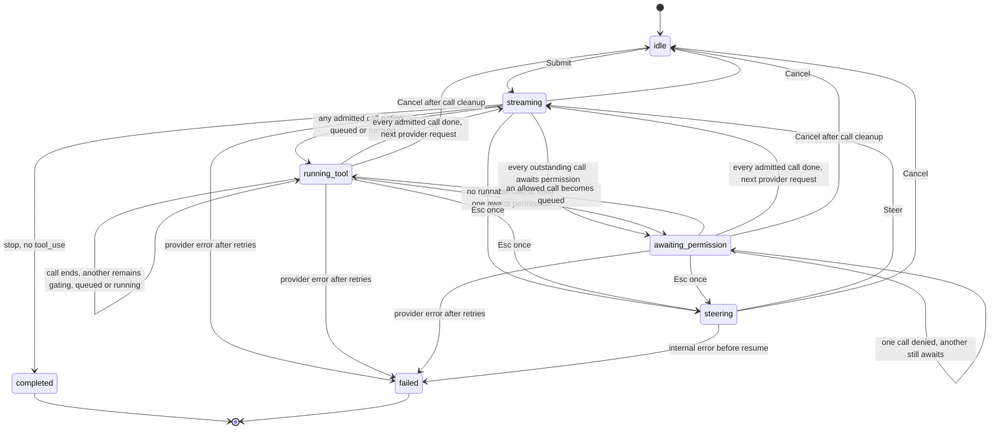
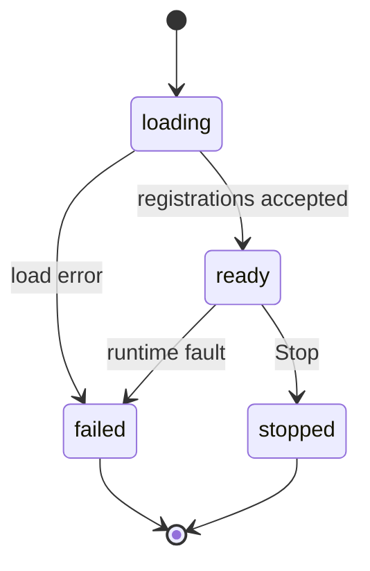
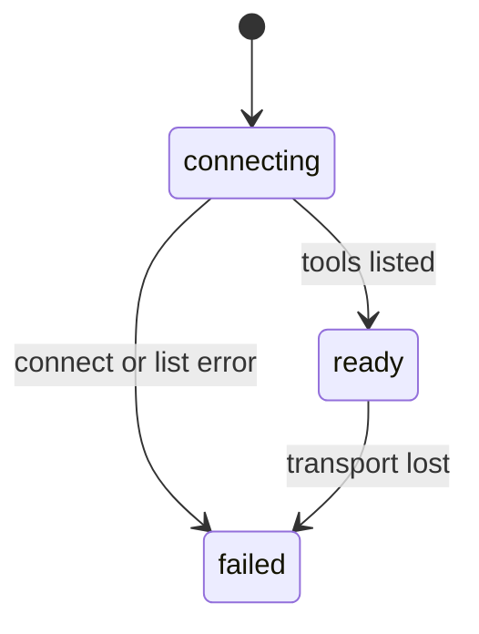
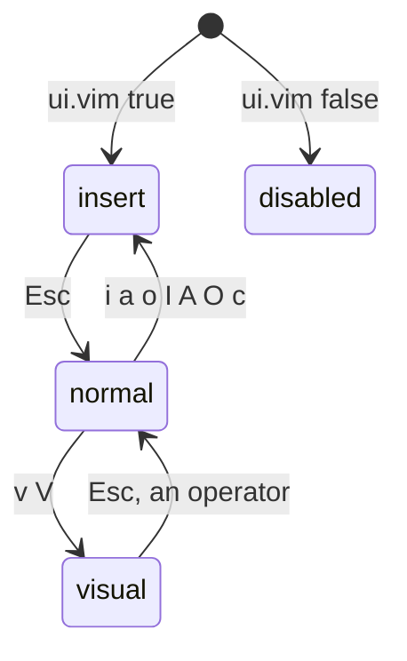
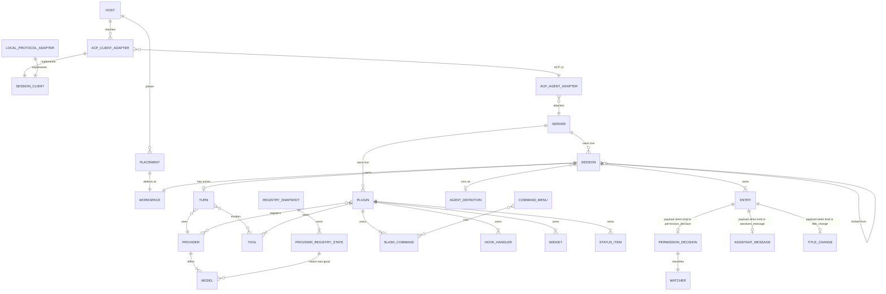
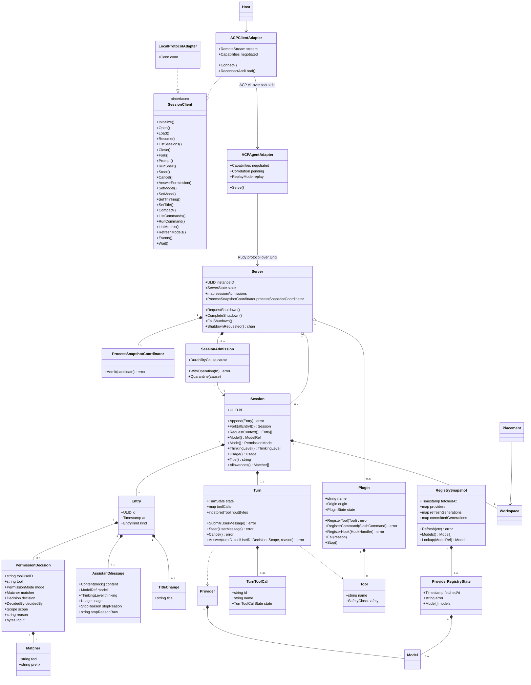

# rudy domain model

Pass 5 adds bounded ACP structural profiles, revisioned Registry snapshots, Server-owned Session
admission and bounded concurrent tool scheduling. Pass 4 puts stable ACP v1 at the remote client boundary. Pass 3 added explicit terminal proof
to the Server lifecycle for protocol-owned daemon replacement. The model still spans Session
(core), Provider, Plugin and Hosts. Client is conformist and renders through SessionClient; the
local protocol client and remote ACP client are adapters. Memory is an external Go module
imported by the memory plugin; nothing in it is modeled here.

## Contexts

Turn drives a completion through Provider and invokes Tools registered by Plugins. Server owns
the process-lifetime Session runtime. Session runs a child Session under an AgentDefinition for
a subagent. Client reaches Session through SessionClient. ACP types stop at the client and agent
adapters. Hosts never introduces Host into the kernel. The registry snapshot crosses from
Provider into Session as the set of selectable models. Nothing else crosses.

## SessionClient

Port owned by Client. It exposes session operations and events in Rudy types without naming a
transport or wire protocol.

### Operations

- initialize a client and report server version, home and process-lifetime instance identity
- open, load, resume, list, close and fork Sessions
- prompt, run an operator shell command, steer, cancel and answer permission requests
- set model, mode, thinking and title
- compact, run registered slash commands and list or refresh the model registry
- receive entries, stream parts, turn and tool state, permission requests, status, widgets,
  plugin state, registry state and notices

### Implementations

- The local implementation wraps the existing internal protocol over in-memory or Unix socket
  connections.
- The remote implementation wraps the ACP client adapter over ssh stdio.

### Invariants

- Port values contain no ACP SDK, JSON-RPC, ssh or protocol envelope types.
- Protocol owns its wire DTOs. Client owns its view values. Each adapter translates between
  them; neither package aliases the other's types.
- An implementation preserves Rudy session and entry ids exactly.
- Session listing returns one bounded page with an opaque connection-generation cursor. It never
  aggregates an unbounded store result, and a cursor is valid only with its original filter.
- `Prompt` starts one typed Turn and blocks until that Turn has both its terminal durable Entry
  and matching terminal state. Its result contains the Turn id and normalized Rudy stop reason.
  `Events` continues streaming while `Prompt` is blocked, and `Steer`, `Cancel` and
  `AnswerPermission` may run concurrently. ACP admission rejects before submission unless the
  translated internal content fits through 4 MiB and the complete public typed `user_message`
  Entry projection fits through 7 MiB, preserving an exact initial correlation carrier.
- `RunCommand` returns immediately for a command with no Turn. When a command starts a Turn, it
  blocks for the same matching terminal Entry and state as `Prompt` and returns that
  `PromptResult` with its notice or replacement Session id while `Events` remains live.
- One `Prompt` generation may stand per Session. Different Sessions remain concurrent. A
  generation binds its initial typed `user_message`, every cancellation intent and exactly one
  terminal result so a late callback cannot complete a later Turn. Admission retires before its
  terminal state is published, allowing the Client to submit a queued prompt from that event.
- A permission event carries an opaque Client-owned id unique for the `SessionClient` lifetime.
  `AnswerPermission` resolves only that exact pending id. A successful call means its selected
  outcome was accepted for delivery to the transport callback, not that the remote Gate granted
  authorization; ACP carries no reverse acknowledgment after the callback returns. A concurrent
  local claim loses with conflict, while another asker's box-side win retires this request and is
  reflected by subsequent authoritative events. Cancel, disconnect and prompt
  completion or Session close release it; another asker's decision retires it without cancelling
  the Turn. Empty reason normalizes to fixed `asker` before the durable answer. A late or duplicate
  answer cannot reach the daemon or collide after reconnect. A standing question recovered on a
  new connection replaces its pending identity with a fresh permission id and callback; the old
  id stays retired.
- Load replays durable entries and current live state. Resume attaches without replay.
- One load or resume per Session may run on a connection at a time; other Sessions remain
  concurrent.
- A slow remote ACP consumer is disconnected on queue overflow. LocalProtocolAdapter uses bounded
  lossless replay backpressure, while nonblocking live fan-out disconnects only that slow local
  consumer. Neither grows memory behind a running daemon or stalls a Turn.
- Reconnection does not create a Session. It loads or resumes the same ULID.
- Advancing a connection generation fails every old Prompt, turn-starting RunCommand and Close
  waiter with transport failure, retires old permissions without authorization and stops the old
  pump. The SessionClient event channel remains open for recovered load events and `Wait` does not
  return unless the Client closes permanently.
- Port errors preserve invalid argument, not found, no asker, conflict, unauthorized, invariant
  refusal, unavailable, cancellation, provider, transport, plugin and internal failure classes.
  Local adapters may retain safe local detail; remote adapters use only the fixed public detail
  in the ACP contract.
- Negotiated remote events carry the originating Session id and byte-exact Entry or `provider.Part`
  JSON in the versioned Rudy metadata union. The remote implementation rejects missing,
  inconsistent or malformed metadata instead of reconstructing raw values from display fields.
- A remote `turn_failed` event preserves identity, class and retry count but replaces the raw
  message with fixed public text and marks the event redacted. Provider bodies and nested errors
  remain in the box log and local durable entry.
- A terminal Turn state is emitted only after its matching terminal Entry is fsynced. A terminal
  sync failure emits no terminal state, quarantines the Session until that Server process exits
  and closes its subscribed client connections with fixed failure text. A later daemon may run
  ordinary log recovery. No Client implementation may infer terminal proof from the
  unsynchronized Entry notification.
- Every remote assistant event and streamed stop Part clears the provider's raw stop reason and
  marks the carrier redacted when a raw value existed. Provider-controlled terminal metadata
  never crosses by default.

### Relationships

| With | Kind | Cardinality |
|---|---|---|
| `LocalProtocolAdapter` | implemented by | 1 to 1 per local client |
| `ACPClientAdapter` | implemented by | 1 to 1 per remote client |

## LocalProtocolAdapter

Client edge for embedded and Unix socket operation. It implements SessionClient by calling the
existing protocol client. Its connection identity, asker bit and replay behavior remain the
internal contract.

### Invariants

- Initialize requires `bounded_session_list_v1`, `bounded_session_events_v1`,
  `bounded_process_events_v1` and `terminal_turn_durability_v1` from the live
  Server hello before the adapter exposes any Session operation. Missing capabilities fail typed
  unavailable, close the protocol client and event channel and become the cause returned by
  `Wait`; a version mismatch alone remains a notice.
- One shared 64-item, 32 MiB ledger follows each notification through the protocol queue and typed
  event handoff until the public consumer accepts it. The dedicated pump starts before Session
  calls. Lossless attach replay may backpressure through a blocking per-connection enqueue outside
  Session locks; live fan-out never blocks a Turn and disconnects only this adapter on overflow. A
  single notification over the byte cap closes the adapter and wakes pending operations.

### Relationships

| With | Kind | Cardinality |
|---|---|---|
| `SessionClient` | implements | 1 to 1 |
| `Server` | references through one internal connection | 1 to 1 while connected |

## ACPAgentAdapter

Process edge implemented by `rudy acp`. It serves stable ACP v1 over stdio and translates into
the internal protocol over a same-user Unix socket. It owns negotiated ACP capabilities,
request correlation, replay suppression and one bounded connection queue. None is durable.

### Invariants

- The Rudy Session ULID is the ACP `SessionId`; no identity map exists.
- Standard ACP methods are used when available. `_rudy` methods require version negotiation.
- Initialize is accepted exactly once. Internal hello stages the daemon connection, negotiated
  capabilities and asker bit. The adapter requires `bounded_session_list_v1`,
  `bounded_session_events_v1`, `bounded_process_events_v1` and
  `terminal_turn_durability_v1` from that hello. A successful initialize response write publishes
  them together; no Session request, extension or event reaches the peer before that commit.
- The exact shutdown-control initialize variant is non-asker, sends internal hello with
  `process_events: false` and requires none of the four edge guarantees.
  It implements ACP's mandatory baseline with fixed no-domain Session errors and no-op cancel,
  leaves optional Session methods unadvertised and makes `_rudy/server_shutdown` its only
  operational method. A bounded discard pump handles process notifications from an older daemon
  that ignores the subscription flag; it discards only status, widget, plugin, Registry and notice
  broadcasts and always routes point-to-point `server.stopped` to the control waiter. Overflow or
  response-order failure closes without success. Same-user internal identity and shutdown terminal proof are unchanged.
- Each negotiated Rudy event has one logical carrier set. Non-byte events use one standard update;
  Entry and Part events use 1 through 7 non-interleaved metadata-only fragment updates and larger
  values use one bounded oversized reference. An event with no honest ACP projection uses an
  otherwise empty session-info update, preventing silent loss without inventing a standard meaning.
- Oversized permission-decision and tool-result Entry references require the exact owning Turn id
  in addition to Entry and projected tool-call identity. Live projection receives the Turn from
  execution context; replay derives it while walking the Turn timeline. The edge recomputes the
  universal Turn-scoped projection from that Turn plus the raw stored tool-use id. Terminal Entry
  references also require their owning Turn id.
- Each carrier in a negotiated Rudy event set carries one connection-scoped sequence allocated by
  the single dispatcher in internal notification order. The sequence covers fragment carriers,
  standard carriers, permission
  requests and `_rudy/session/update`; display-only projections allocate nothing. Allocation and
  enqueue are atomic, and physical-write acknowledgment precedes successor allocation.
- ACP types never cross into Session, Provider, Plugin, Hosts or the Client port.
- The adapter advertises no auth method and never handles provider credentials.
- The adapter never calls ACP client filesystem or terminal methods.
- New, load and resume reject client-supplied MCP servers and additional directories. Plugins
  and the Session's stored Workspace remain authoritative.
- Session list applies an optional normalized primary Workspace filter before bounded keyset
  pagination over descending Session ULIDs. Authenticated cursors are connection-scoped and
  bound to the filter.
- Prompt and Rudy steer use one content translator. Extensions cannot bypass negotiated content
  capabilities.
- Prompt state is generation-scoped. A concurrent second prompt for one Session is refused before
  SDK dispatch, and request cancellation waits for the matching terminal Entry and state before
  the adapter completes the ACP request.
- Session close first installs a per-connection fence. It rejects that connection's racing
  operations and snapshots every Session-targeting operation lease admitted before the fence plus
  exact current Turn, tool and permission identities. Every permission response callback takes
  the outer attachment's operation lease before claiming its token or making a domain call. Under
  the same event-state lock, fence installation snapshots the identities and installs proof
  waiters plus the projection-mode write waiters that actually apply, seeded from retained terminal state and physical
  acknowledgments. A Turn identity committed after the snapshot by a pre-fence Prompt or
  turn-starting RunCommand lease joins that close-owned set, installs both waiters and issues
  exact-id cancel before the lease completes. Other late identities join their waiter sets without
  cancellation. A post-fence permission
  callback retires without a domain call. Close cancels only those exact Turn identities and retires only its
  close-owned permission callbacks before waiting those leases through domain completion and their
  physical response writes. It then waits for durable permission, Turn and tool results plus
  response writes for that connection's standing Prompt and turn-starting RunCommand waiters. A
  negotiated connection additionally waits for every close-owned terminal Entry or oversized
  carrier and terminal state carrier. A generic connection waits only for actual display
  projections; carrier-only Entry and state events create no waiter. It then detaches. Routing for
  an admitted close-owned frame remains installed through that acknowledgment. It does not
  wait for another connection's operation or response write. Other
  connections retain their authority.
- A gated reader prevents SDK receive until a sanitized logger is installed. Reader and writer
  wrappers reject ACP payloads above 8 MiB excluding their line feed. Before SDK input, 64 active
  requests, 64 known notifications and 64 matched responses share one 32 MiB original-frame
  budget. Request bytes release with the physical response write, notification bytes with the
  wrapped sequential handler and response bytes with the wrapped callback. Each direction also
  caps active outbound requests at 64 and 32 MiB, uses monotonic safe-integer ids plus an issued
  high-water mark for bounded late-response classification and gives its writer a 64-frame, 32 MiB queue. Outbound overflow closes before sequence allocation. A separate 32 MiB response pool is
  acquired as complete 8 MiB or 1 MiB class reservations before handler work. Peer request-id namespaces
  remain independent.
- Every inbound outer ACP frame and every complete outbound ACP frame passes the shared outer
  strict-JSON profile before SDK decode or enqueue. Reassembled negotiated Entry/Part JSON passes
  the decoded-event profile with depth 72 and 131,072 structural units, preserving headroom around
  nested inputs that legitimately reach their own limits. The public projector applies that exact
  profile before selecting fragments and uses an oversized reference on structural overflow.
  Decoded permission-input JSON passes the nested-input profile with depth 64 and 65,536 units and
  must also be one object. All three profiles retain recursive unique-key and per-container checks.
- Internal notices, plugin failure reasons and registry failures cross ACP only through explicit
  safe text or fixed fallbacks. Raw provider and plugin errors stay in the box log.
- ACP process logging is fail-closed. Log open or later write failure closes before more protocol
  work and writes only a fixed correlated diagnostic to stderr; neither kernel records nor
  captured daemon stderr becomes a fallback sink.
- A generic ACP client makes the internal connection an asker. A negotiated Rudy client sets
  the asker bit explicitly so headless remains unable to answer permission requests.
- A valid JSON-RPC error response to an outbound permission request declines only its recorded
  exact question and closes that ACP connection. It never answers or cancels the Turn; another
  asker remains eligible and the ordinary last-asker path records `no_asker`.
- Disconnect closes only the adapter's internal client connection. Server and Turns continue.
- `_rudy/server_shutdown` maps to `server.shutdown`; the Unix listener's same-user marker is
  still the authority. ACP success requires matching internal `server.stopped` followed by EOF.

### States

### Relationships

| With | Kind | Cardinality |
|---|---|---|
| `Server` | references through the internal protocol | 1 to 1 while serving |
| `ACPClientAdapter` | referenced by an ACP connection | 1 to 1 per process |

## ACPClientAdapter

Client edge used by remote TUI and headless commands. It implements SessionClient, receives a
bidirectional ssh stdio stream from Hosts and translates standard plus negotiated Rudy events
into Client values. It does not start ssh or move a workspace.

### Invariants

- ssh owns authentication, encryption and host keys. The adapter adds no token.
- `--host` failure never falls back to a local Server.
- Required Rudy capabilities are checked before a Session opens.
- Negotiated callbacks are reordered by their connection sequence before entering the Client
  event stream. A duplicate, invalid sequence or bounded-buffer overflow closes the connection;
  reconnect and load recover the view. Sequence stays private to the adapter and is absent from
  Client events.
- Pre-SDK admission allows at most 64 active request ids, 64 known queued notifications and 64
  matched responses. Their original frames share one 32 MiB Rudy budget even when the SDK retains
  a response behind a blocked notification. Outbound active requests have a separate 64-item,
  32 MiB budget. Each encoded writer queue has the same limits. Response construction has a
  32 MiB weighted reservation before result accumulation or SDK marshal.
- ACP inbound request ids accept the pinned schema's string, mathematical signed 64-bit integer
  and null variants. Null has a distinct directional active-request key; Rudy's own outbound
  requests remain positive integers.
- Permission callbacks are pending requests, not notifications. The adapter publishes one
  opaque permission id, completes the callback only from `AnswerPermission`, carries a bounded
  reason only in negotiated selected-outcome metadata and releases all pending callbacks on
  cancel or disconnect.
- Mandatory ACP filesystem and terminal callbacks fail closed because Rudy advertises neither
  capability and never performs those operations for the box.
- A TUI reconnect loads the same Session to recover missed entries. Headless reports the drop
  and exits nonzero. Reconnect fails old waiters and stops the old pump without closing the
  SessionClient event stream used by the recovered load. A standing permission recovered with
  the load replaces its pending identity with a fresh permission id and callback; the old id
  stays retired.
- Provider credentials, provider bodies and raw tool payloads never enter client errors.
- Negotiated error data carries only the closed failure kind needed by SessionClient, never raw
  provider, plugin or transport detail.
- Reordering and event delivery share 64 undelivered items and 32 MiB. A nonfragment event charges
  original frame length; fragment frames transfer into one assembly and the completed event charges
  decoded `totalBytes` until the public consumer accepts it.

### States

### Relationships

| With | Kind | Cardinality |
|---|---|---|
| `SessionClient` | implements | 1 to 1 |
| `Host` | references | 1 to 1 |
| `ACPAgentAdapter` | references through one ACP connection | 1 to 1 while connected |

## Server

Entity, aggregate root for one process-lifetime Session runtime. Its identity lets a client prove that a replacement connection reached a different runtime without persisting a process id.

### Fields

| Field | Type | Meaning |
|---|---|---|
| `instanceID` | ULID | Immutable identity generated when the Server is built and returned by `client.hello`; never stored |
| `state` | `ServerState` | `running`, `shutting_down` or `stopped` |
| `capabilities` | set of internal capability names | Sorted guarantees implemented by this Server process and returned by `client.hello`; never inferred from version |
| `sessions` | references to `Session` | Live sessions owned by this process |
| `plugins` | references to `Plugin` | Live plugin runtimes owned by this process |
| `sessionAdmissions` | map of Session ULID to `SessionAdmission` | Runtime-only per-Session operation fence plus first durability cause, retained even after detach or unload; empty in a new Server process |
| `processSnapshotCoordinator` | `ProcessSnapshotCoordinator` | Server-owned serialized admission and commit boundary shared by PluginRegistry and RegistrySnapshot |

### Behaviors

- `RequestShutdown()` moves a running Server to `shutting_down` once and wakes its process owner.
- `CompleteShutdown()` moves a shutting-down Server to `stopped` and releases the control connection to send terminal proof.
- `FailShutdown()` releases the control connection without terminal proof when cleanup fails.
- `ShutdownRequested() <-chan struct{}` lets the process owner react to the transition without a clock or signal guess.
- `WithSessionOperation(sessionID, fn) error` runs one synchronous Session read, mutation,
  append, attachment or detachment commit under that Session's admission fence after rechecking
  its retained cause. Provider I/O and transport response waits stay outside; each later commit
  must reenter. Turn, Gate, plugin Host and protocol paths receive this operation function and do
  not call a live Session directly.
- `Quarantine(sessionID, cause)` takes the same fence and atomically records the first cause
  before cancelling work and closing the subscriber set captured by that transition. When a
  fenced operation itself returns a durability cause, `WithSessionOperation` records it before
  releasing the fence.

### Invariants

- `server.shutdown` is accepted only after `client.hello`, from a non-plugin connection whose same-user identity the unix listener proved.
- `client.hello` advertises an internal capability only when the complete named invariant is
  installed. Unknown names grant no authority.
- The successful `server.shutdown` response is physically written before `RequestShutdown` begins the transition.
- The first accepted request reserves shutdown and fences new work. The Server remains `running` until its response is physically written, then starts the one-way transition. Repeats cannot reserve a second transition.
- A Server in `shutting_down` admits no new work.
- The control connection sends `server.stopped` for this instance only after the listener, client connections, turns, sessions and plugins have completed cleanup, then closes. Bare EOF proves nothing.
- Server identity and state are runtime facts. Neither is written to a pid file or another durable record.
- A terminal Entry sync failure or permission decision-batch append/sync failure quarantines only
  its Session for the lifetime of this Server process. Both use the same first-cause map, cancel
  remaining work, close subscribers and make every later Session-targeting operation unavailable.
  Detach, unload or reload cannot clear the map. A new Server starts with an empty map and performs
  ordinary log recovery before accepting work.
- Session admission and quarantine are one linearization boundary. An operation either commits
  before quarantine and is included in its cancellation or subscriber snapshot, installs the
  quarantine cause before its fence release or observes the cause and performs no read, mutation
  or attachment. Passing an earlier availability check never authorizes a later commit (ADR 0037).

### States

### Relationships

| With | Kind | Cardinality |
|---|---|---|
| `Session` | owns at runtime | 1 to 0..n |
| `Plugin` | owns at runtime | 1 to 0..n |

## ServerState

Closed enum: `running`, `shutting_down`, `stopped`. Invalid transitions are refused.

## SessionAdmission

Server-owned domain service for one Session. Its fence linearizes each immediate Session read,
mutation, append, attachment or detachment commit with the first durability-quarantine cause.
Provider I/O and transport response waits do not hold it. An admitted operation must reenter for
each later commit, so a previously returned availability result carries no authority. A commit
that returns a terminal Entry sync or permission-batch durability failure installs the first cause
before releasing the fence. Quarantine then cancels the Session's registered work and closes the
subscriber set captured at the same transition.

## ShutdownCoordinator

Domain service in Session. Owns the boundary between the protocol acknowledgement and process cleanup. It reserves admission, flushes the successful response, requests the Server transition once, interrupts connection work, closes sessions and plugins, and closes the listener. Success marks shutdown complete so the retained control writer sends `server.stopped` before EOF. Failure releases the connection without that proof.

## ProcessSnapshotCoordinator

Server-owned domain service spanning PluginRegistry and RegistrySnapshot. One admission lock covers
prospective snapshot construction, exact internal and safe public sizing and mutation commit for
every Plugin, status, widget and Registry change that contributes to connect replay. Provider
fetching happens outside the lock after assigning per-provider generations. Under the lock, the
coordinator drops superseded provider results and rebases non-overlapping deltas onto current state.
Registry cache replacement and in-memory publication are ordered inside the same commit; a failed
cache write or bound check leaves both prior snapshots intact. No contributing aggregate may mutate
replay state outside this coordinator. Every safe public event is sized with
`sequence: 9007199254740991`, the widest valid connection value.
Before sizing, the coordinator requires valid UTF-8 through 4096 bytes for the exact identity
fields status owner/key, widget owner/key, plugin name and Registry provider name, plus every
status or widget Span text. Each Span role is one of the Theme's closed role names. It refuses the
whole candidate on failure. No process identity receives a digest or fallback alias.
After a hello response is physically written, this same lock covers capture of current process
state, reservation and ordered enqueue of the complete connection snapshot and activation of live
delivery. Every committed process mutation enqueues under that ordering boundary. A new subscriber
therefore sees the mutation either in its snapshot or after the whole snapshot, never neither and
never before stale snapshot state.

## Session

Entity, aggregate root. One conversation over one workspace, persisted as an append-only log of Entries. All mutable state (model, mode, thinking level, title, usage) is derived from the log, never stored beside it.

### Fields

| Field | Type | Meaning |
|---|---|---|
| `id` | ULID | Identity. The directory name under the sessions root |
| `entries` | `[]Entry` | The ordered log. Append-only. For a forked session, the parent's entries precede the first local entry and are read from the parent at load, never copied |
| `parent` | `*ForkRef` | Absent on a root session. Present on a fork: the parent session id and the parent entry id forked at. Absence means this session owns all its entries |

### Behaviors

- `Append(Entry) error` validates and writes one entry to the buffered `entries.jsonl` writer, then returns. Permission allow decisions sync before the unsafe tool starts. Terminal Turn paths call `Sync` before publishing terminal state; a sync failure is reported to the owning Server, which quarantines the Session and closes its subscribers.
- `AppendPermissionBatch([]PermissionDecision) error` holds Session append order, writes one decision
  per frozen permission-group member in stable Turn admission order and syncs the complete batch
  when any row allows. It exposes no partial success to Turn or Gate. An append or sync failure
  quarantines the Session and no member queues, even if the file contains a durable prefix that
  recovery will later reconcile.
- `Fork(atEntryID) (Session, error)` creates a new Session whose first local entry is a `fork_point` naming this session and `atEntryID`.
- `RequestContext() []Entry` returns the entries the next completion sees: the newest `compaction` entry, then every entry after the last one it covers, in log order, with older compactions dropped. The entries between a compaction's `last_entry_id` and the compaction itself, the turn that was running when it happened, are kept. Every entry when there is no compaction. Derived, never stored.
- `Model() ModelRef` returns the ref from the most recent `session_opened` or `model_change`.
- `Mode() PermissionMode` returns the mode from the most recent `session_opened` or `mode_change`.
- `ThinkingLevel() ThinkingLevel` returns the level from the most recent `session_opened` or a thinking change.
- `Usage() Usage` sums the usage across all `assistant_message` and `compaction` entries, since both are provider calls the session paid for.
- `Title() string` returns the title from the most recent `title_change`; empty when none. Whether the first user message stands in is open.
- `Allowances() []Matcher` returns the matchers of every `permission_decision` with decision `allow` and scope `session`. Derived from the log, never stored separately.

### Invariants

- The first entry of a root session is `session_opened`. The first local entry of a fork is `fork_point`.
- `fork_point` appears at most once, and only as the first local entry. Any later `fork_point` is refused.
- An `assistant_message` carrying a `tool_use` block is followed by a `permission_decision` for
  that tool-use id before `ToolQueued` or any `tool_result` for it. A safe tool records a
  `class` allow without asking. For an unsafe tool, Gate appends and fsyncs its allow before
  `ToolQueued` can make it runnable.
- Every `tool_use` is eventually paired with exactly one `permission_decision` and one
  `tool_result`. On load, Recovery gives any unmatched tool use a fixed `invariant` denial when no
  decision exists, then gives every call without a result a synthesized `tool_result` with outcome
  `lost`. This also reconciles a durable prefix of an interrupted permission batch.
- Entry payloads that carry provider bytes (tool_use input, thinking signatures, tool result content) are stored byte-exact and never re-marshaled.
- At most one Turn is active per Session at any time.
- An allowance matches a later tool_use only on `Matcher` equality: same tool and same prefix. A looser match is refused.
- A Session with at least one child fork refuses deletion.
- New `title_change` values are valid UTF-8 from 1 through 4096 bytes. Resume projects an older
  invalid or overlong title as empty before constructing `SessionInfo`.
- A current operational ModelRef returned by resume has both fields valid UTF-8 through 4096 bytes.
  Loading an older Session whose current ModelRef violates that bound returns unavailable before
  replay or attachment; substituting a display alias would change which provider the Session uses.
- Fork derives ModelRef and title at the exact fork point before mutation. It applies the same
  ModelRef refusal and title omission as resume, so an unrepresentable operational identity creates
  no child Session and cannot poison its response.

### States

A Session has no lifecycle state machine of its own; its state is the fold of its log. The active Turn carries the lifecycle.

### Relationships

| With | Kind | Cardinality |
|---|---|---|
| `Entry` | has-a (owned) | 1 to n, n >= 1 |
| `Turn` | has-a (owned) | 1 to 0..1 |
| `Session` (parent) | references | n to 0..1 |
| `Session` (child fork) | references | 1 to n |
| `Workspace` | has-a (owned) | 1 to 1 |
| `AgentDefinition` | references | n to 0..1 |

## Entry

Entity, immutable after append. One item in a Session log. Identity persists; content never changes. The `kind` selects exactly one payload shape from the closed set below.

### Fields

| Field | Type | Meaning |
|---|---|---|
| `id` | ULID | Identity within the log. Monotonic by append order |
| `at` | Timestamp | Wall-clock time the entry was appended |
| `kind` | `EntryKind` | Selects the payload |
| `payload` | one of the payloads below | The kind-specific body |

### Invariants

- `id` is monotonic: an entry with an id less than or equal to the last appended id is refused.
- `kind` is a member of `EntryKind`. An unknown kind is refused.

### Relationships

| With | Kind | Cardinality |
|---|---|---|
| `Session` | owned by | n to 1 |

The payload sections that follow are value objects, each owned by its Entry, each stored inline in the entry's JSONL line. None has identity of its own.

## SessionOpened

Value object, payload of a `session_opened` entry.

| Field | Type | Meaning |
|---|---|---|
| `schemaVersion` | int | The log schema version, for forward migration |
| `rudyVersion` | string | The rudy version that opened the session |
| `workspace` | `Workspace` | The workspace this session runs over |
| `model` | `ModelRef` | The model selected at open |
| `thinking` | `ThinkingLevel` | The thinking level at open |
| `mode` | `PermissionMode` | The permission mode at open |
| `agent` | string | The agent definition name this session runs under; `default` when none |
| `parentSessionID` | ULID or empty | The session whose `tool_use` opened this one; empty means a root session |
| `parentToolUseID` | string | The `tool_use` id in the parent that opened this one; empty exactly when `parentSessionID` is empty |
| `tools` | `[string]` or null | The session's resolved tool set: the agent definition's list intersected with the parent's effective set, before the agent tool's own deny. Null means every tool, an empty list means none. Recorded at open time rather than recomputed on resume or fork, since the parent may be gone by then. Meaningful only from `schemaVersion` 2 on: a version 1 log has no `tools` key, which decodes the same as an explicit null, so a reader must fall back to the agent definition's own list below version 2 rather than read this field |

## ForkPoint

Value object, payload of a `fork_point` entry. Also the shape of `Session.parent`.

| Field | Type | Meaning |
|---|---|---|
| `parentSessionID` | ULID | The session forked from |
| `parentEntryID` | ULID | The entry in the parent the fork branches at. Entries after it in the parent are not visible to this fork |

## UserMessage

Value object, payload of a `user_message` entry.

| Field | Type | Meaning |
|---|---|---|
| `content` | `[]ContentBlock` | The message content: text or image blocks, at least one |
| `source` | `Source` | How the message entered: typed, queued or steer |

## AssistantMessage

Value object, payload of an `assistant_message` entry.

| Field | Type | Meaning |
|---|---|---|
| `content` | `[]ContentBlock` | Text, thinking and tool_use blocks in order. May be empty when `stopReason` is `interrupted` before any delta |
| `model` | `ModelRef` | The model that produced the message; recorded because the selection can change mid-session |
| `thinking` | `ThinkingLevel` | The thinking level in effect |
| `usage` | `Usage` | Verbatim from the provider; zeros when the provider sent none |
| `stopReason` | `StopReason` | Why generation stopped, domain classification |
| `stopReasonRaw` | string | The provider's own value; empty for `interrupted` |

## PermissionDecision

Value object, payload of a `permission_decision` entry. Records what happened, with no optional holes.

| Field | Type | Meaning |
|---|---|---|
| `toolUseID` | string | The tool_use block this decision concerns |
| `tool` | string | The tool name |
| `mode` | `PermissionMode` | The mode in force when the decision was made |
| `matcher` | `Matcher` | The Gate's classification of the input |
| `decision` | `Decision` | allow or deny |
| `decidedBy` | `DecidedBy` | Who or what decided |
| `scope` | `Scope` | once or session; `session` only ever comes from an asker allow |
| `reason` | string | Valid UTF-8 through 4096 bytes and never empty. The asker's text, the hook's reason or the rule name; for `no_asker` the fixed string `no asker attached` |
| `input` | bytes | The input the tool ran with when a `before_tool` hook modified it; absent otherwise. Kept byte for byte, so the log shows exactly what the call carried when it differs from the `tool_use` block |

## Matcher

Value object, owned by `PermissionDecision`. The Gate's classification of a tool input and the key a session allowance matches on.

| Field | Type | Meaning |
|---|---|---|
| `tool` | string | The tool name |
| `prefix` | string | For `bash`, the first simple command's first two words when their joined UTF-8 form is at most 4096 bytes; otherwise `sha256:` followed by the lowercase digest of that complete joined form. Empty for every other tool |

Two matchers are equal only when both fields are equal. An allowance matches on `Matcher` equality and nothing looser. The hash form is deterministic and keeps a pathological shell word from duplicating an entire tool input into permission state.

## ToolResult

Value object, payload of a `tool_result` entry.

| Field | Type | Meaning |
|---|---|---|
| `toolUseID` | string | The tool_use block this result answers |
| `content` | `[]ContentBlock` | The result content, text or image, byte-exact. Empty for `lost` |
| `outcome` | `ToolOutcome` | ok, error, killed or lost |
| `durationMS` | int | Wall-clock milliseconds the tool ran. Zero for a `lost` result synthesized on recovery |

## ModelChange

Value object, payload of a `model_change` entry.

| Field | Type | Meaning |
|---|---|---|
| `model` | `ModelRef` | The newly selected model |

## ModeChange

Value object, payload of a `mode_change` entry.

| Field | Type | Meaning |
|---|---|---|
| `mode` | `PermissionMode` | The newly selected mode |

## ThinkingChange

Value object, payload of a `thinking_change` entry.

| Field | Type | Meaning |
|---|---|---|
| `thinking` | `ThinkingLevel` | The newly selected thinking level |

## TitleChange

Value object, payload of a `title_change` entry.

| Field | Type | Meaning |
|---|---|---|
| `title` | string | The session title as set by the user or a command. Non-empty; an empty title is refused |

## Compaction

Value object, payload of a `compaction` entry. Marks a boundary: entries it covers are dropped from the request context and replaced by its summary.

| Field | Type | Meaning |
|---|---|---|
| `summary` | string | The compressed summary of the covered range |
| `firstEntryID` | ULID | First entry id covered, inclusive |
| `lastEntryID` | ULID | Last entry id covered, inclusive; not before `firstEntryID` |
| `model` | `ModelRef` | The model that wrote the summary |
| `usage` | `Usage` | What writing the summary cost, verbatim from the provider |

## TurnInterrupted

Value object, payload of a `turn_interrupted` entry.

A turn id is the id of the `user_message` entry that started the turn. Turns are not stored; that id is enough to find one in the log, and it is the `turn_id` every protocol message carries.

| Field | Type | Meaning |
|---|---|---|
| `turnID` | ULID | The turn this interruption ended or paused |
| `how` | `InterruptKind` | steer or cancel |

## TurnFailed

Value object, payload of a `turn_failed` entry.

| Field | Type | Meaning |
|---|---|---|
| `turnID` | ULID | The turn that failed |
| `class` | `ErrorClass` | The closed failure category |
| `message` | string | The provider or system message, for display |
| `retries` | int | Attempts made before giving up, from 0 through 2147483647; 0 when not applicable. Entry creation and Load refuse values outside the range |

## Note

Value object, payload of a `note` entry. Display-only; never part of a request context.

| Field | Type | Meaning |
|---|---|---|
| `plugin` | string | The plugin name that emitted the note |
| `text` | string | The note text |
| `role` | `NoteRole` | The theme role the client renders it with |

## NoteRole

Enumeration.

| Value | Means |
|---|---|
| `info` | Ordinary information |
| `muted` | Low emphasis |
| `warn` | Something to look at |
| `error` | Something failed |

## Turn

Entity, owned by Session, not stored (its progress is the tail of the log). One user message and everything the loop does until it yields. At most one Turn is active per Session.

### Fields

| Field | Type | Meaning |
|---|---|---|
| `session` | ULID | The owning session |
| `state` | `TurnState` | The current loop state |
| `toolCalls` | map of tool-use id to `TurnToolCall` | The calls admitted during this Turn, including name and exact state; membership permanently reserves an id through successive assistant responses until the Turn ends |
| `storedToolInputBytes` | int | Sum of exact provider tool-input bytes plus every accepted modified replacement retained by this Turn; at most 32 MiB |

### Behaviors

- `Submit(UserMessage) error` appends the user message and enters `streaming`. Refused if a Turn is already active.
- `Steer(UserMessage) error` appends a `user_message` with source `steer` and re-enters `streaming` from `steering`.
- `Cancel() error` terminalizes every admitted non-done tool call, appends
  `turn_interrupted{cancel}` and returns the session to idle. A call without an earlier decision
  first receives a fixed `interrupt` denial; every interrupted call receives a killed result.
- `Answer(turnID, toolUseID, Decision, Scope, reason) error` atomically matches the exact standing
  Session, Turn and canonical tool-use identity that was offered to the asker. A coalesced
  question's first member is its immutable canonical identity and its current member set contains
  only calls with the same matcher and exact input bytes. The Gate freezes that set plus any
  non-dangerous groups settled by Session allowance and calls `AppendPermissionBatch`. It updates
  members and re-derives coarse Turn state only after the complete batch succeeds and syncs.
  An unoffered member id and a stale answer are refused, so neither can select a successor Turn.

### Invariants

- Submit is refused unless `state` is idle.
- A transition not in the table below is refused.
- A new `TurnToolCall` starts in non-runnable `gating`. It may move to `awaiting_permission` or,
  after a Gate decision, to `queued`. An unsafe call may not move into `queued` or `running` unless
  its exact allow `permission_decision` has been appended and fsynced. Another call already
  keeping the coarse Turn in `running_tool` does not weaken this per-call guard.
- One active Turn may admit at most 64 tool-use blocks across all of its assistant responses. A
  provider result that would cross the bound fails the Turn before the assistant Entry is appended
  or any tool job is submitted. Across the Server, one
  event-driven scheduler owns 64 workers and two admission queues totaling 64 jobs. Forty-eight
  general workers serve root or child jobs and sixteen child-reserved workers serve only child
  Session jobs. The root queue holds 48 and the child queue holds 16. Turns submit with
  cancellation-aware backpressure instead of starting one goroutine per tool. A root response can
  therefore park at most 48 workers in `agent` calls while child work retains progress capacity;
  child Sessions cannot invoke `agent` recursively.
- Each provider tool-use id and name is valid UTF-8 and at most 4096 bytes. Its exact raw input is
  valid UTF-8, one JSON object with recursively unique object keys, at most 7 MiB and within the
  shared strict-JSON limits of depth 64, 65,536 structural units, 16,384 elements per array and
  4,096 members per object. A provider response carries at most 16 MiB of aggregate raw tool input,
  and provider inputs plus accepted modified replacements contribute at most 32 MiB across the
  active Turn. Its id has not appeared in any earlier assistant response in that Turn. A violating
  provider result fails before the assistant Entry, Gate event or tool job is committed, keeping
  permission notifications and retained tool input bounded and making Session, Turn and tool-use
  id a unique permission-question identity.
- A `before_tool` modification is revalidated under the same strict object, 7 MiB individual and
  32 MiB cumulative retained-input rules before it replaces the current input. An invalid,
  structurally excessive, duplicate-key, oversized or over-budget replacement becomes a fixed
  hook denial without retaining, logging or publishing the rejected bytes. Hook and asker reasons
  are valid UTF-8 through 4096
  bytes; an empty or invalid hook reason becomes fixed `hook`, and an empty asker reason becomes
  fixed `asker`. The Gate bounds a bash matcher as specified below and preflights every complete
  internal `permission.requested` notification through 8 MiB before publishing it. An unexpected
  preflight overflow publishes no question, gives the call a fixed `invariant` denial and error
  result, terminalizes its peers and fails the Turn with a bounded `turn_failed` Entry.
- Leaving any active state on interrupt records partials already streamed before the state changes.
- Calls in `awaiting_permission` with the same matcher and exact input bytes form a group of at most
  64 members. Its first member is the immutable canonical question identity put to every attached
  asker and to an asker that attaches while it stands. Only that offered identity accepts an
  answer; the first answer freezes and decides every current member and a later answer is refused.
  Group admission remains locked until the complete decision batch commits. A member arriving
  afterward therefore observes the new allowance or starts a new group. When the
  last eligible asker detaches while a question stands, the Gate records one
  `permission_decision{no_asker}` per member as one batch, marks every member done with a denial result and
  re-derives the coarse Turn state (ADR 0014). The bounded member set remains available to
  cancellation, permission cleanup and Close barriers until the group resolves.
- A permission question tracks its eligible asker connections. An ACP asker may decline only that
  exact Session, Turn and tool-use identity when its bounded wire cannot represent the input.
  Decline grants nothing and removes only that connection from the question. Repeating it while the
  question stands is harmless; after resolution it is not found. When detach and declines leave no
  eligible asker, the same durable `no_asker` denial runs.
- While tool calls are outstanding, Turn state is the coarse projection of the whole `toolCalls`
  set: `running_tool` when any call is gating, queued or running, otherwise `awaiting_permission` when any
  call awaits permission, otherwise `streaming` only after every admitted call is done and the next
  provider request begins. One result never resumes the provider while another call is outstanding.
- Steering, cancellation and Turn failure terminalize every admitted non-done call before their
  steering or terminal Entry. A call with no earlier decision receives a fixed `interrupt` denial
  for steer or cancel and a fixed `invariant` denial for failure. Its result is killed for interrupt,
  error for the call that caused failure and killed for the failure's peers. This leaves no
  unmatched `tool_use` for a later RequestContext.

### States

Anything not drawn is refused by the aggregate.

### Relationships

| With | Kind | Cardinality |
|---|---|---|
| `Session` | owned by | 1 to 1 |
| `Provider` | references | n to 1 |
| `Tool` | references | n to n |

## TurnToolCall

Runtime value owned by Turn. It represents each independently scheduled call without changing the
append-only Entry shapes.

| Field | Type | Meaning |
|---|---|---|
| `id` | string | Provider tool-use id, unique for the active Turn |
| `name` | string | Registered tool name |
| `state` | `TurnToolCallState` | `gating`, `queued`, `awaiting_permission`, `running` or `done` |

The collection contains 0 through 64 calls. Completed calls remain in the map until the Turn ends
so a later provider response cannot reuse their ids.

## TurnToolCallState

Closed enumeration: `gating`, `queued`, `awaiting_permission`, `running` and `done`. `gating` is
non-runnable and covers hook evaluation plus Gate classification. The Turn derives its
coarse public state from the complete call map, never from whichever call changed most recently.

## Workspace

Value object, owned by Session. The directory the session acts over.

### Fields

| Field | Type | Meaning |
|---|---|---|
| `root` | string | Absolute path the session operates in |
| `gitRoot` | string | Absolute path of the enclosing git root. Empty string means not a git repository, a stated value, not absence |
| `projectID` | string | Stable project identifier derived from the root, used to scope memory concepts. Empty string means no project scope |

### Relationships

| With | Kind | Cardinality |
|---|---|---|
| `Session` | owned by | 1 to 1 |

## ContentBlock

Value object, a sum. One block of message content. The variant tag selects the fields.

| Variant | Fields | Meaning |
|---|---|---|
| `text` | `text string` | Plain or markdown text |
| `image` | `mediaType string`, `sha256 string` | An image stored byte-exact as `blobs/<sha256>` in the session directory and referenced by hash. Inline image bytes never appear in the log |
| `thinking` | `text string`, `signature []byte` | A reasoning block with its provider signature, byte-exact |
| `tool_use` | `id string`, `name string`, `input []byte` | A tool call. `input` is raw provider bytes, never re-marshaled |

### Relationships

| With | Kind | Cardinality |
|---|---|---|
| `UserMessage`, `AssistantMessage`, `ToolResult` | owned by | n to 1 |

## ModelRef

Value object. Names one model at one provider.

| Field | Type | Meaning |
|---|---|---|
| `provider` | string | The provider name (matches a `Provider.name`) |
| `modelID` | string | The model id as the provider's `/v1/models` reports it |

## Usage

Value object. Token counts for one completion.

| Field | Type | Meaning |
|---|---|---|
| `inputTokens` | int | Prompt tokens |
| `outputTokens` | int | Generated tokens |
| `cacheReadTokens` | int | Tokens served from provider prompt cache |
| `cacheWriteTokens` | int | Tokens written to provider prompt cache |

## PermissionMode

Enumeration.

| Value | Means |
|---|---|
| `strict` | Unsafe tools ask the attached asker. No asker means deny. Safe tools run |
| `permissive` | Everything runs except a built-in dangerous set, which asks |
| `off` | Everything runs, nothing asks |

## Decision

Enumeration.

| Value | Means |
|---|---|
| `allow` | The tool may run |
| `deny` | The tool is refused; a `tool_result` with outcome error is appended |

## DecidedBy

Enumeration.

| Value | Means |
|---|---|
| `class` | The tool is safe; no question arose |
| `mode` | Off or permissive let it through without asking |
| `allowance` | A prior session-scope allow matched on `Matcher` equality |
| `hook` | A `before_tool` handler decided |
| `asker` | A human or client answered |
| `no_asker` | Strict mode with nobody to ask; always a deny |
| `interrupt` | A steer or cancel terminalized a call that had no decision yet; always a deny |
| `invariant` | The Server refused the call itself, such as a permission notification that could not be published inside its bound; always a deny |
| `interrupt` | Steer or cancel closed an admitted call before another decision; always a deny |
| `invariant` | Turn failure closed an admitted call before another decision; always a deny |

## Scope

Enumeration. How long a permission answer holds.

| Value | Means |
|---|---|
| `once` | This tool_use only. Every row not from an asker allow says `once` |
| `session` | Every later tool_use with an equal `Matcher` in this session. Only an asker allow can say it |

## ToolOutcome

Enumeration.

| Value | Means |
|---|---|
| `ok` | The tool completed |
| `error` | The tool ran and returned an error, or was denied |
| `killed` | The tool was terminated by an interrupt |
| `lost` | No result was recorded before a crash; synthesized on recovery |

## TurnState

Enumeration.

| Value | Means |
|---|---|
| `idle` | No active turn |
| `streaming` | Awaiting or receiving a completion |
| `running_tool` | At least one tool call is gating, queued or executing |
| `awaiting_permission` | An unsafe tool waits on a decision |
| `steering` | Interrupted once; the next message continues the turn |
| `completed` | The turn ended normally |
| `failed` | The turn ended on an error |

## Source

Enumeration.

| Value | Means |
|---|---|
| `typed` | Entered directly at the prompt |
| `queued` | Submitted from the follow-up queue |
| `steer` | Submitted while steering an interrupted turn |

## ThinkingLevel

Enumeration.

| Value | Means |
|---|---|
| `off` | No extended thinking |
| `low` | Minimal thinking budget |
| `medium` | Moderate thinking budget |
| `high` | Maximal thinking budget |

## StopReason

Enumeration.

| Value | Means |
|---|---|
| `end_turn` | The model finished |
| `tool_use` | The model requested a tool |
| `max_tokens` | The output limit was hit |
| `interrupted` | A steer or cancel cut the stream; `content` holds what streamed |
| `refused` | The model declined |
| `other` | A provider value with no domain meaning; see `stopReasonRaw` |

## InterruptKind

Enumeration.

| Value | Means |
|---|---|
| `steer` | Single interrupt; the turn continues on the next message |
| `cancel` | Double interrupt; the turn is abandoned |

## ErrorClass

Enumeration.

| Value | Means |
|---|---|
| `provider` | The provider returned an error after retries |
| `transport` | The connection failed |
| `plugin` | A plugin fault: a panic or a programming error in a tool, not a tool that ran and reported an error |
| `internal` | A rudy fault |

## EntryKind

Enumeration. The closed set of entry payloads.

| Value | Payload |
|---|---|
| `session_opened` | `SessionOpened` |
| `fork_point` | `ForkPoint` |
| `user_message` | `UserMessage` |
| `assistant_message` | `AssistantMessage` |
| `permission_decision` | `PermissionDecision` |
| `tool_result` | `ToolResult` |
| `model_change` | `ModelChange` |
| `mode_change` | `ModeChange` |
| `thinking_change` | `ThinkingChange` |
| `title_change` | `TitleChange` |
| `compaction` | `Compaction` |
| `turn_interrupted` | `TurnInterrupted` |
| `turn_failed` | `TurnFailed` |
| `note` | `Note` |

## Provider

Entity, identity by name. One LLM endpoint speaking one wire protocol.

### Fields

| Field | Type | Meaning |
|---|---|---|
| `name` | string | Identity. The provider name referenced by `ModelRef.provider` |
| `wireKind` | `WireKind` | Which wire protocol the endpoint speaks |
| `baseURL` | string | The endpoint base, up to but not including the path |
| `authRef` | string | A reference into the secret cache, resolved at call time. Empty means Rudy sends no explicit credential or auth header; the endpoint may still authenticate ambient identity such as tailnet membership |
| `extraHeaders` | `map[string]string` | Headers added to every request, including session id and user-agent |

### Behaviors

Providers are configured, not mutated at runtime. Behavior lives on Registry and on the completion path.

### Invariants

- `name` is unique across configured providers.
- `wireKind` is a member of `WireKind`.

### Relationships

| With | Kind | Cardinality |
|---|---|---|
| `Model` | has-a | 1 to n |
| `RegistrySnapshot` | references | 1 to n |

## Model

Entity, identity by provider plus id. One model offered by one provider.

### Fields

| Field | Type | Meaning |
|---|---|---|
| `provider` | string | The owning provider name |
| `id` | string | The model id from `/v1/models` |
| `displayName` | string | Human label from `/v1/models` display_name |
| `upstream` | string | Who actually serves the model when the provider is a proxy: the route from `metadata.provider.upstream`, named the way the endpoint names that route elsewhere in the same listing. Not `provider.id`, which is as often the model's vendor as the route. Comma separated when the endpoint serves the id over more than one route. Empty when it names none |
| `contextWindow` | int | Max context tokens from context_window_tokens |
| `maxOutput` | int | Max output tokens from max_output_tokens |
| `inputPrice` | string | Cost per input token. Empty when the provider supplies none |
| `outputPrice` | string | Cost per output token. Empty when the provider supplies none |
| `cacheReadPrice` | string | Cost per cached input token. Empty when the provider supplies none |
| `cacheWritePrice` | string | Cost per cache-write token. Empty when the provider supplies none |
| `capabilities` | `Capabilities` | What the model supports. Enriched from catwalk keyed by id; empty when no match (see open list) |

### Invariants

- The pair (`provider`, `id`) is unique within a snapshot. A provider may list the same pair more
  than once only when every Model field except `upstream` is byte-identical. Registry folds those
  rows into one Model whose nonempty upstream names are deduplicated, sorted lexicographically and
  joined with `, `. Any conflicting duplicate rejects that provider's complete candidate result
  into refresh failures (rudy-aol).
- Every price field is present in the Model value. Empty means its source supplied no price. A
  nonempty value preserves the provider's accepted spelling and matches
  `(?:0|[1-9][0-9]*)(?:\.[0-9]+)?(?:[eE][+-]?[0-9]+)?` exactly. A provider returning any other
  value lands in refresh failures and contributes no Models to that candidate snapshot.
- `contextWindow` and `maxOutput` are nonnegative; zero means unknown.

### Relationships

| With | Kind | Cardinality |
|---|---|---|
| `Provider` | owned by | n to 1 |
| `RegistrySnapshot` | owned by | n to 1 |

## RegistrySnapshot

Entity, aggregate root. The set of models discovered from all providers at one point, cached on disk.

### Fields

| Field | Type | Meaning |
|---|---|---|
| `fetchedAt` | Timestamp | Latest successful refresh time among all providers; a failure-only commit does not advance it |
| `providers` | map of provider name to `ProviderRegistryState` | Last committed status and last good model list for every provider |
| `revision` | uint64 | Runtime-only monotonic committed snapshot revision returned by internal Registry queries; initialized after cache load, incremented with each committed provider-state change and never exposed over ACP |
| `refreshGenerations` | map of provider name to uint64 | Runtime-only latest generation allocated before provider I/O; initialized to zero on cache load and never persisted |
| `committedGenerations` | map of provider name to uint64 | Runtime-only latest generation whose delta committed; initialized to zero on cache load and never persisted |

### Behaviors

- `Refresh(ctx) error` assigns each requested provider a generation, calls its `/v1/models`, rebases
  accepted provider deltas onto the latest committed provider map and rewrites the cache before
  publishing the in-memory snapshot. A provider error updates that provider's status but retains
  its last good models. Triggered on session open, on picker open and on a model-not-found error.
  Never on a timer.
- `Models() []Model` flattens every provider's last good list in stable provider and model order.
- `Lookup(ModelRef) (Model, bool)` finds a model in its provider's last good list.
- `ResolveAtRevision(revision, ModelRef) (Model, error)` verifies and resolves under one Registry
  read lock. A revision mismatch returns conflict before a Session or configuration mutation.

### Invariants

- Duplicate (`provider`, `id`) rows follow the Model merge invariant above; no row wins by arrival
  order.
- Every Model string is valid UTF-8 and at most 4096 bytes. Registry refresh builds the encoded
  public snapshot incrementally and commits only when its complete `registry.list` response is at
  most 4 MiB and its internal catalogue projection has depth at most 56 and contains at most 60,000 structural units. Exact
  cross-package encoder fixtures prove that this leaves at least 5,536 units and eight depth levels
  for the complete ACP result envelope, which must pass the outer structural profile.
  An overflow fails refresh and retains the prior snapshot and cache.
- Every provider name used as Registry identity is valid UTF-8 through 4096 bytes before provider
  registration or ProcessSnapshotCoordinator commit and remains exact in process events. It is
  never replaced with a display alias.
- Each requested provider receives a monotonic refresh generation before I/O. At commit, a result
  older than that provider's last committed generation becomes a superseded provider failure.
  Successful non-overlapping provider deltas rebase onto the latest snapshot under the
  ProcessSnapshotCoordinator before sizing and cache replacement.
- `fetchedAt` advances to the latest `fetchedAt` among providers whose successful delta commits.
  A request containing only provider failures may update their bounded `error` values and rewrite
  the cache but retains the prior top-level timestamp.
- `revision` advances exactly once for each committed refresh request that changes provider state,
  after cache replacement and with in-memory publication. A superseded, rejected or no-change
  request does not advance it. The models returned with an internal revision are an immutable copy.

### Relationships

| With | Kind | Cardinality |
|---|---|---|
| `ProviderRegistryState` | has-a (owned) | 1 to n |
| `Model` | has-a through provider state | 0 to n |
| `Provider` | references | n to n |

## ProviderRegistryState

Value object owned by `RegistrySnapshot` and persisted in `registry.json`.

| Field | Type | Meaning |
|---|---|---|
| `fetchedAt` | Timestamp | Last successful refresh for this provider; zero when none has succeeded |
| `error` | string | Bounded current refresh error for process replay; empty after success |
| `models` | `[]Model` | Last good models, retained when a later refresh fails |

An older overlapping generation contributes a `superseded` failure only to its caller's refresh
result and never overwrites this state. A non-superseded provider failure updates `error`, retains
`models` and participates in the same prospective cache and process-snapshot admission as a
success. If combined admission or cache replacement fails, none of that refresh request's provider
deltas commit.

## CompletionRequest

Value object. One request to a provider, in domain types. The adapter translates it to the wire.

### Fields

| Field | Type | Meaning |
|---|---|---|
| `model` | `ModelRef` | The target model |
| `context` | `[]Entry` | The request context from `Session.RequestContext` |
| `tools` | `[]Tool` | The tools offered this turn |
| `thinking` | `ThinkingLevel` | The thinking budget |
| `stream` | bool | Whether to stream. Always true in the interactive loop |

### Relationships

| With | Kind | Cardinality |
|---|---|---|
| `Turn` | owned by | n to 1 |

## StreamPart

Value object, a sum. One event from a provider stream. The adapter emits these in domain types; the two wire adapters are the only code that imports an SDK.

| Variant | Fields | Meaning |
|---|---|---|
| `text_delta` | `text string` | A chunk of assistant text |
| `thinking_delta` | `text string` | A chunk of reasoning |
| `thinking_signature` | `signature string` | The provider's signature over the thinking block that just streamed, byte-exact |
| `tool_use_start` | `id string`, `name string` | A tool call begins |
| `tool_use_delta` | `argsFragment []byte` | A fragment of tool input, byte-exact |
| `tool_use_end` | `id string` | The named tool input stream ended |
| `usage` | `usage Usage` | Provider usage observed so far |
| `stop` | `stopReason StopReason`, `stopReasonRaw string` | The completion ended; the raw provider reason remains boundary-sensitive |

### Relationships

| With | Kind | Cardinality |
|---|---|---|
| `CompletionRequest` | derived-from | n to 1 |

## WireKind

Enumeration.

| Value | Means |
|---|---|
| `anthropic_messages` | The Anthropic Messages API shape |
| `openai_chat` | The OpenAI chat-completions shape |

## Capabilities

Value object. What one model supports.

| Field | Type | Meaning |
|---|---|---|
| `vision` | bool | Accepts image input |
| `toolUse` | bool | Supports tool calling |
| `reasoning` | bool | Supports extended thinking |

## Plugin

Entity, identity by name. A unit that extends the kernel, whether linked into the binary or spawned as a subprocess. It never knows which; it implements the same interface either way.

### Fields

| Field | Type | Meaning |
|---|---|---|
| `name` | string | Identity |
| `origin` | `Origin` | linked or spawned |
| `state` | `PluginState` | The lifecycle state |
| `failReason` | string | The reason when `state` is failed. Empty string in every other state, a stated value |

### Behaviors

- `RegisterTool(Tool) error` adds a tool. Refused on a duplicate name (the plugin still loads).
- `RegisterCommand(SlashCommand) error` adds a slash command.
- `RegisterHook(HookHandler) error` attaches a handler to a hook point.
- `RegisterWidget(Widget) error` adds a widget owned by this plugin.
- `RegisterStatusItem(StatusItem) error` adds a status item owned by this plugin.
- `RegisterProvider(Provider) error` adds a provider.
- `Fail(reason)` always moves the plugin to failed. It records a valid UTF-8 reason through 4096
  bytes; for an invalid or longer reason it logs the full detail and records fixed
  `Plugin failed; see box log`.
- `Stop()` moves the plugin to stopped and releases its registrations.

### Invariants

- `name` is unique across loaded plugins.
- Plugin name, status owner/key and widget owner/key are valid UTF-8 through 4096 bytes and remain
  exact in every process event. Every status or widget Span text obeys the same scalar limit.
  Each Span role is one of `accent`, `text`, `muted`, `user`, `assistant`, `tool`,
  `success`, `error`, `warning`, `diff_add`, `diff_del` or `code`. Registration or
  update refuses the whole candidate before ProcessSnapshotCoordinator commit on failure; none of
  these fields receives an alias.
- A tool, command, widget or status item is owned by exactly one plugin; another plugin cannot clear or overwrite it.
- A duplicate tool name is refused with a notice; the registering plugin remains in ready.
- The prospective full status snapshot and each widget must fit both its complete internal
  notification and safe public process-event projection through 4 MiB before mutation. Each
  complete worst-case ACP carrier must also pass the outer structural profile. Byte or structural
  overflow retains the prior state.
- The complete replayable process snapshot contains at most 64 notifications and at most 32 MiB
  in both exact internal and safe public encoded forms. Plugin, status, widget and Registry
  mutations preflight and commit through the Server-owned ProcessSnapshotCoordinator, whose one
  admission lock prevents concurrent candidates from validating against the same stale snapshot.
  Plugin discovery reserves one state notification using the complete exact internal encoding with
  4096 ASCII NUL bytes as the worst-case escaped reason, so later failure always commits. Every live
  notice also fits both forms through 4 MiB or is logged and replaced with fixed bounded text.
- Safe public projection always replaces a failed plugin reason with fixed
  `Plugin failed; see box log`; Plugin has no caller-controlled public reason field.
- A transition not in the state diagram is refused.

### States

### Relationships

| With | Kind | Cardinality |
|---|---|---|
| `Tool` | has-a (owned) | 1 to n |
| `SlashCommand` | has-a (owned) | 1 to n |
| `HookHandler` | has-a (owned) | 1 to n |
| `Widget` | has-a (owned) | 1 to n |
| `StatusItem` | has-a (owned) | 1 to n |
| `Provider` | references | 1 to n |

## Tool

Entity, identity by name. A callable the model may invoke.

### Fields

| Field | Type | Meaning |
|---|---|---|
| `name` | string | Identity. Unique across all plugins |
| `description` | string | What the tool does, sent to the model |
| `schema` | []byte | JSON Schema of the input, byte-exact |
| `safety` | `SafetyClass` | safe or unsafe |

### Invariants

- `name` is unique across every loaded plugin.
- `safety` is a member of `SafetyClass`.

### Relationships

| With | Kind | Cardinality |
|---|---|---|
| `Plugin` | owned by | n to 1 |

## SafetyClass

Enumeration. The one switch driving both the gate and the record-before-run rule.

| Value | Means |
|---|---|
| `safe` | Read-only or otherwise harmless; requires no question, but Gate records a `class` allow before `ToolQueued` |
| `unsafe` | May change state; requires a recorded allow, fsynced before `ToolQueued` |

## SlashCommand

Entity, identity by name. A client-facing command.

### Fields

| Field | Type | Meaning |
|---|---|---|
| `name` | string | The command word, without the leading slash |
| `description` | string | One-line help |
| `argHint` | string | Argument hint for completion. Empty string means no arguments |

### Invariants

- Name, description and argument hint are valid UTF-8 and at most 4096 bytes.
- Registration preflights the complete encoded `command.list` response. A command that would make
  it exceed 4 MiB or make its worst-case complete ACP result envelope fail the outer structural
  profile is refused before registration state changes.

### Relationships

| With | Kind | Cardinality |
|---|---|---|
| `Plugin` | owned by | n to 1 |

## HookHandler

Entity, owned by Plugin. A handler attached to one hook point.

### Fields

| Field | Type | Meaning |
|---|---|---|
| `point` | `HookPoint` | Where in the lifecycle it fires |
| `plugin` | string | The owning plugin |

### Relationships

| With | Kind | Cardinality |
|---|---|---|
| `Plugin` | owned by | n to 1 |

## HookPoint

Enumeration. The closed set of lifecycle attachment points.

| Value | Fires | Handler may return |
|---|---|---|
| `session_opened` | After a session opens, and on first attach of a resume | Context appended to the system prompt for the session |
| `before_turn` | Before a turn starts, on a typed or queued user message | System prompt additions |
| `before_request` | Before every completion request in a turn | Header mutations only in pass 1; the body is not exposed |
| `after_response` | After each assistant message is appended | Nothing |
| `before_tool` | Before the Gate sees a tool_use | pass, allow, deny or modify with input and reason. allow and deny short-circuit the Gate and are recorded with `decidedBy = hook`; modify replaces the input only after object and size revalidation, otherwise the call receives a fixed hook denial |
| `after_tool` | After a tool result is appended, before it reaches the next request | Replacement content the model sees; the stored entry is unchanged |
| `before_compaction` | When the Compactor decides to compact, before it asks the model | A summary; the first non-empty one is used and the model is not asked |
| `turn_completed` | After a turn ends | Nothing |
| `session_closed` | Before a session closes | Nothing |

## Widget

Entity, owned by Plugin. A rendered element the client may place in a slot.

### Fields

| Field | Type | Meaning |
|---|---|---|
| `key` | string | Identity within the owning plugin |
| `plugin` | string | The owning plugin |
| `slot` | string | The named layout slot it targets |

### Relationships

| With | Kind | Cardinality |
|---|---|---|
| `Plugin` | owned by | n to 1 |

## StatusItem

Entity, owned by Plugin. One item in the status line.

### Fields

| Field | Type | Meaning |
|---|---|---|
| `key` | string | Identity within the owning plugin |
| `plugin` | string | The owning plugin |
| `content` | string | The current text |

### Relationships

| With | Kind | Cardinality |
|---|---|---|
| `Plugin` | owned by | n to 1 |

## Skill

Value object. A discovered instruction file loaded from a standards-based skills directory.

### Fields

| Field | Type | Meaning |
|---|---|---|
| `name` | string | The skill name from its directory |
| `path` | string | Absolute path to the `SKILL.md` |
| `description` | string | The frontmatter description used for selection |

### Invariants

- Loaded only from `~/.agents/skills` and `<workspace>/.agents/skills`. No other directory is read (see open list on the workspace path).

### Relationships

| With | Kind | Cardinality |
|---|---|---|
| `Plugin` (skills loader) | referenced by | n to 1 |

## AgentDefinition

Value object. A named profile a subagent session runs under, read from `agents/<name>.md`.

### Fields

| Field | Type | Meaning |
|---|---|---|
| `name` | string | The profile name; the file stem |
| `description` | string | One line shown to the parent model in the `agent` tool's description |
| `prompt` | string | The system prompt body for the subagent |
| `tools` | []string | The tool names the subagent may use; `agent` is never among them |
| `model` | string | `provider:id`, a unique bare id, or empty to inherit the parent's |
| `thinking` | `ThinkingLevel` or empty | Empty inherits the parent's |
| `maxTurns` | int | Zero means unlimited |

### Relationships

| With | Kind | Cardinality |
|---|---|---|
| `Session` (subagent) | referenced by | 1 to n |

## MCPServer

Entity, identity by name, owned by the `mcp` plugin. One configured Model Context Protocol server whose tools the plugin registers as `mcp__<name>__<tool>`.

### Fields

| Field | Type | Meaning |
|---|---|---|
| `name` | string | Identity; the table key in `mcp.toml` |
| `scope` | `user`, `project` | Which `mcp.toml` it came from; a project entry replaces a user entry of the same name |
| `transport` | `stdio`, `http` | |
| `command` | string | Executable; empty for `http` |
| `args` | []string | Arguments; empty for `http` |
| `env` | map[string]string | Secret references added to the child environment; empty for `http` |
| `url` | string | Endpoint; empty for `stdio` |
| `headers` | map[string]string | Secret references sent on every request; empty for `stdio` |
| `state` | `connecting`, `ready`, `failed` | |
| `failReason` | string | Empty unless `failed` |

### Behaviors

- `Connect()` opens the transport, lists tools and moves to `ready`; a failure moves to `failed` with the reason and emits a notice.
- `Call(tool, input) Result` invokes one tool and maps the content to `ContentBlock`s.

### Invariants

- Exactly the fields of its transport are set; the others are empty.
- Every registered tool name is `mcp__<name>__<tool>` and carries safety `unsafe`.

### States

### Relationships

| With | Kind | Cardinality |
|---|---|---|
| `Plugin` (`mcp`) | owned by | n to 1 |
| `Tool` | has-a (owned) | 1 to n |

## InstalledPlugin

Value object. One row of `plugins.lock.toml`.

| Field | Type | Meaning |
|---|---|---|
| `name` | string | The manifest name; the checkout directory |
| `source` | string | Git URL or absolute path given to `rudy plugins install` |
| `commit` | string | Checked-out commit; empty when the source is a path outside a repository |
| `installedAt` | instant | |
| `enabled` | bool | A disabled plugin is discovered and not spawned |

## TranscriptRow

Entity, owned by the Client context. One thing on screen, derived from entries and notifications;
keyed by the entry id it came from, or by the owning Turn plus tool-use id for a tool row.

### Fields

| Field | Type | Meaning |
|---|---|---|
| `key` | `TranscriptKey` | The entry id, or the pair `(turnID, toolUseID)` for a tool row |
| `kind` | `RowKind` | user, assistant, tool, prompt, marker |
| `turnID` | string | The turn the row belongs to; rows commit to scrollback together |
| `live` | bool | Streaming or pending: rendered as plain text, replaced on commit |
| `expanded` | bool | Tool rows only; the config default, toggled by the user |
| `entry` | `Entry` or empty | The committed entry; empty while live |
| `decision` | `PermissionDecision` or empty | Tool rows: absorbed by tool_use id |
| `result` | `ToolResult` or empty | Tool rows: absorbed by tool_use id |

### Behaviors

- `Absorb(turnID, entry)` folds a `permission_decision` or `tool_result` into the tool row with the
  same owning Turn and tool-use id. The Client adapter derives `turnID` while walking live or replay
  event order; it is not added to the durable Entry payload.
- `Render(theme, config, width) []string` produces the row's lines; a tool row renders one line plus `tool_preview_lines` of preview unless expanded.

### Invariants

- A row's key is unique in the transcript; replay and reattach never duplicate.
- A prompt row exists only between `permission.requested` and the answer, in the place its tool row takes afterwards.

### Relationships

| With | Kind | Cardinality |
|---|---|---|
| `Entry` | derived-from | 1 to 1 (tool rows 1 to 3) |
| `Turn` | references (by turn id) | n to 1 |

## TranscriptKey

Closed sum owned by Client: `{entryID}` for a non-tool row or `{turnID, toolUseID}` for a tool row.
Provider tool-use ids need be unique only within one Turn, so the pair prevents a later Turn from
replacing an older row that reused the raw id.

## RowKind

Enumeration.

| Value | Means |
|---|---|
| `user` | A `user_message` |
| `assistant` | One text block of an `assistant_message` (thinking when shown) |
| `tool` | A `tool_use` with its decision and result |
| `prompt` | A pending permission question |
| `marker` | `note`, `compaction`, `turn_interrupted`, `turn_failed` |

## Slot

Enumeration. A region of the client screen with an owner, ordered top to bottom by `ui.layout.slots`.

| Value | Owner | Means |
|---|---|---|
| `header` | config or a plugin widget | Optional, once at the top |
| `transcript` | client | The rows |
| `above_editor` | plugin widgets | Between the transcript and the input |
| `input` | client | The editor and the prompt row |
| `below_editor` | plugin widgets | Between the input and the status |
| `status` | client, items from config and plugins | The status line |

## Theme

Value object. Named color roles, every one with a default.

| Field | Type | Meaning |
|---|---|---|
| `name` | string | The built-in `default` or a file under `themes/` |
| `roles` | map[role]color | `accent`, `text`, `muted`, `user`, `assistant`, `tool`, `success`, `error`, `warning`, `diff_add`, `diff_del`, `code`; a value is a hex color, another role's name, or for `code` a `chroma:<style>` |

### Invariants

- Every role resolves to a color after at most one role indirection; a cycle or an unknown role is a load error.
- No role paints a background.

## KeyBinding

Value object. One action id bound to zero or more key strings in pi's `modifier+key` grammar.

| Field | Type | Meaning |
|---|---|---|
| `action` | string | A pi action id from the closed set ADR 0013 lists |
| `keys` | []string | Empty unbinds |

### Invariants

- An action id outside the closed set is a config error naming the id.
- A key string that does not parse is a config error naming the action.

## Editor

Entity, one per client. The input textarea with its modal state.

### Fields

| Field | Type | Meaning |
|---|---|---|
| `mode` | `EditorMode` | disabled, insert, normal, visual |
| `text` | string | The buffer |
| `queue` | []string | Follow-ups queued while a turn runs, oldest first |

### States

## CommandMenu

Value object on the client, derived from the draft. The slash completion standing between `above_editor` and `input`.

| Field | Type | Meaning |
|---|---|---|
| `commands` | [{name, description}] | What `command.list` answered, in registration order, then the client's own |
| `selected` | int | The row the keyboard is on, inside the rows the draft matches now |
| `dismissedFor` | string | The draft an Esc dismissed the menu for; any other draft opens it again |

### Invariants

- It stands only while the draft opens with `/` and carries no whitespace: a draft past the name is an argument, and arguments have no completion source.
- The editor keeps the keyboard while it stands. The menu takes the select keys, tab and Enter, and leaves every other key to the draft being typed.
- Enter completes a name that is still a prefix and submits one already whole.
- `exit` and `quit` are the client's own: they never reach the server, and they shadow a registered command of the same name. ADR 0015.

## TurnControl

Value object on the client. What Esc does depends on it.

| State | Esc once | Esc twice within `double_press_ms` |
|---|---|---|
| idle | closes a picker or a selection | nothing more |
| streaming or running a tool | `session.interrupt steer` | `session.interrupt cancel`, queue back to the editor |
| steering, editor non-empty | submit continues the turn (Enter), Esc does nothing | cancel |
| steering, editor empty | `session.interrupt cancel` | |

## Origin

Enumeration.

| Value | Means |
|---|---|
| `linked` | Compiled into the binary; registers through the same interface as a subprocess |
| `spawned` | A subprocess speaking the protocol over stdio |

## PluginState

Enumeration.

| Value | Means |
|---|---|
| `loading` | Registering |
| `ready` | Registered and serving |
| `failed` | Load or runtime fault; `failReason` set |
| `stopped` | Cleanly shut down; registrations released |

## Host

Value object, Hosts context, client side (ADR 0029). An ssh destination as the operator's
ssh config resolves it.

### Fields

| Field | Type | Meaning |
|---|---|---|
| `destination` | string | Alias or `user@name`, passed to ssh after `--` |

### Invariants

- Non-empty and does not begin with `-`. Refused at construction, never sanitised.
- Two spellings of one machine are two hosts.

### Relationships

| With | Kind | Cardinality |
|---|---|---|
| `Placement` | placed on | 1 to many |
| `ACPClientAdapter` | reached by | 1 to 0..many over time |

## Placement

Value object, Hosts context. The workspace path on a host for a local cwd.

### Fields

| Field | Type | Meaning |
|---|---|---|
| `host` | Host | Where the path is |
| `path` | string | Absolute on the host: `<host home>/<local cwd relative to the local home>`, or `--cwd` verbatim |

### Invariants

- Computed only after ACP initialize returned `_meta._rudy.home`; a cwd outside the local home
  with no `--cwd` has no placement and the command fails naming the flag.
- ACP `session/new` is sent with `path` as `cwd`; the ACP agent adapter sends internal
  `session.open`. The kernel detects the Workspace there; a Placement is never a Workspace.

### Relationships

| With | Kind | Cardinality |
|---|---|---|
| `Host` | on | many to 1 |
| `Workspace` | detected at, on the host | 1 to 1 |

## Sync

Domain service, Hosts context. Moves the tree between the local cwd and a Placement over ssh
sideband before ACP `session/new`, and back on demand. Decision table in the spec. The box is
truth whenever it holds work: a dirty or ahead placement is opened as is. ACP filesystem and
terminal methods are never part of Sync.

## Everything at once

## Open, not assumed

- Dangerous set for permissive mode: the exact tools and shell patterns that ask under `permissive` are undecided.
- Capabilities for unmatched proxy models: when catwalk has no entry for a proxy model id, `Capabilities` is empty. How to fill it (probe, config, assume a floor) is undecided.
- Workspace skills path: `<workspace>/.agents/skills` is inferred as the workspace-scoped location. Confirm the exact path.
- Double-press window: 500ms for the Esc cancel window is inferred, not stated.
- Fork by reference: forks read parent entries at load rather than copying. Confirm this over a copy-on-fork alternative.
- Session title: `Title()` mechanism is undecided (first user message, model-generated or explicit rename).
- Note entries: modeled as display-only and excluded from request context. Confirm they never enter a completion.
- Skill selection: whether skills auto-inject by relevance or load only on explicit invocation is undecided.
- Migration prompt: reading only the standards path, with a first-boot offer to migrate `.claude/skills` and a command to migrate later, is a workflow decision not yet modeled as an object.
